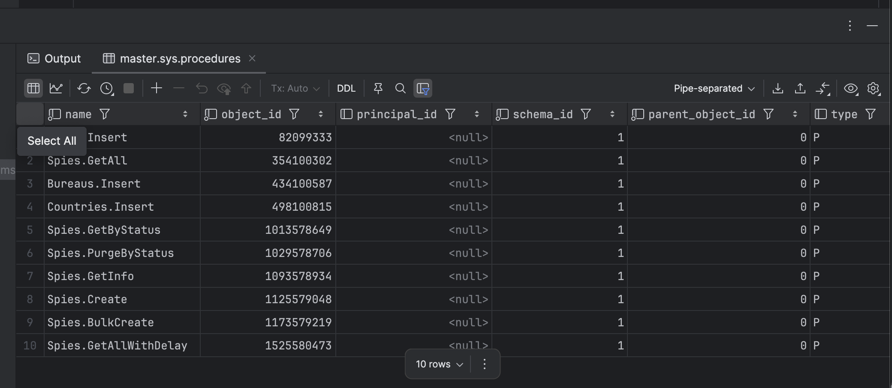
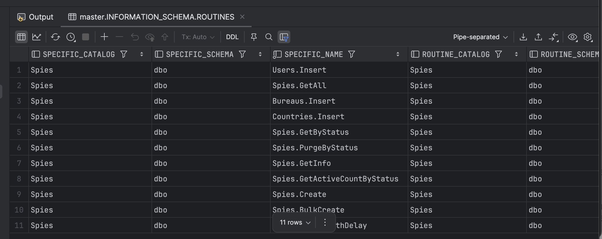
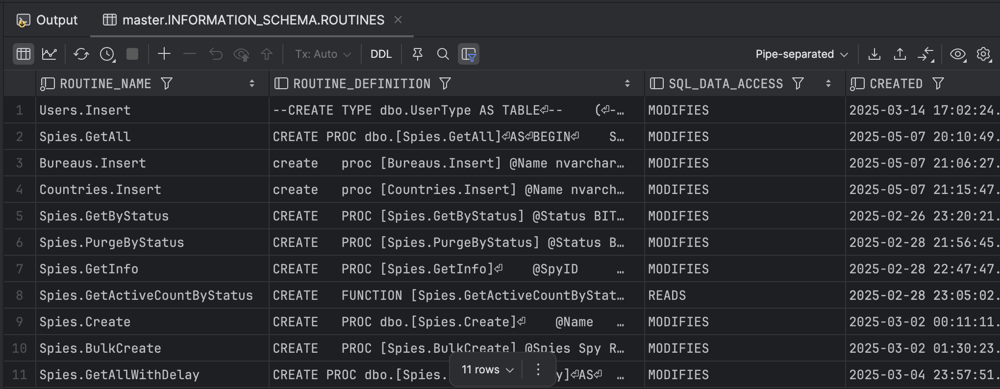
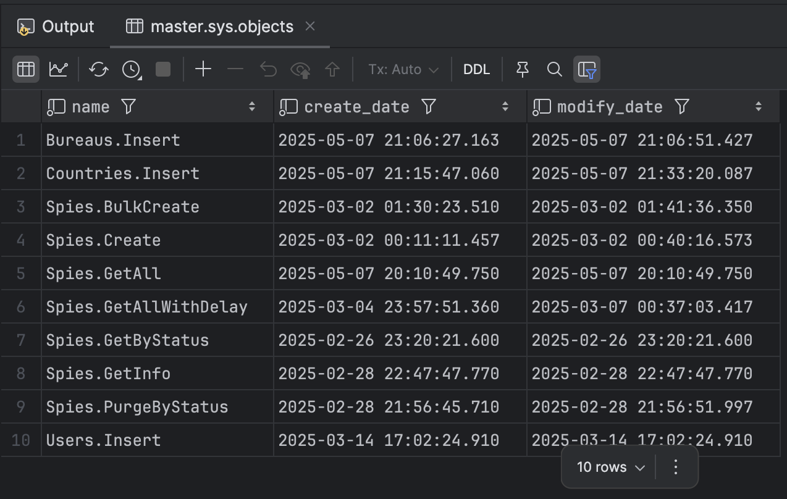
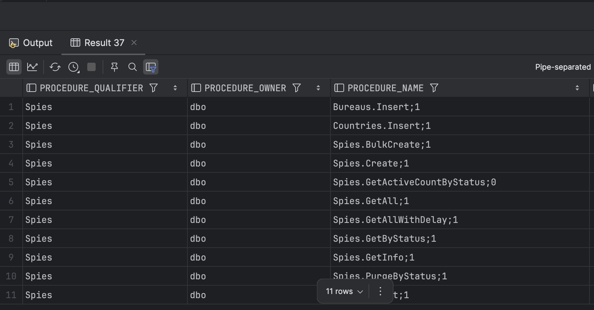
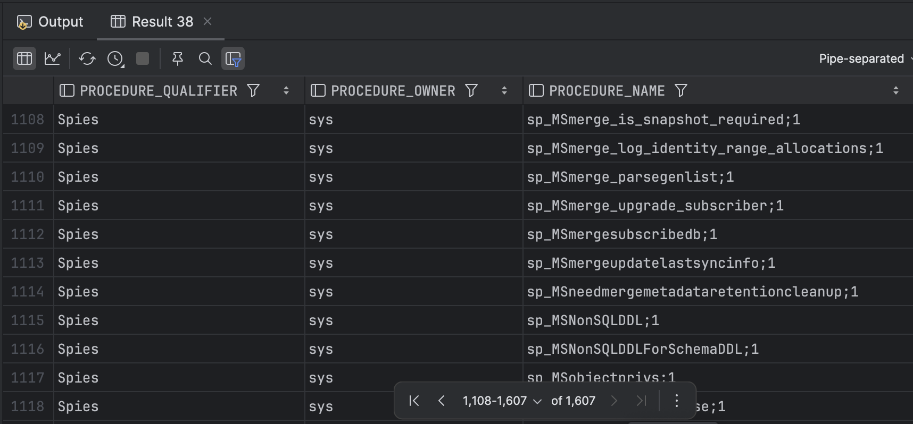

Suppose you wanted to get a list of stored procedures in your [SQL Server database](https://www.microsoft.com/en-us/sql-server).

There are several ways to achieve this:

1. `sys.procedures` system table
2. INFORMATION_SCHEMA
3. `sys.objects` system table
4. `sp_stored_procedures` procedure

This post has been written with [SQL Server 2022](https://learn.microsoft.com/en-us/sql/sql-server/what-s-new-in-sql-server-2022?view=sql-server-ver16).

## sys.procedures

SQL Server exposes a system view, `sys.procedures`, that, unsurprisingly, contains a list of **all stored procedures in the active database**.

```sql
select * from sys.procedures
```



It returns several columns in the result set.

The same query can be written as follows:

```sql
select name,
       object_id,
       principal_id,
       schema_id,
       parent_object_id,
       type,
       type_desc,
       create_date,
       modify_date,
       is_ms_shipped,
       is_published,
       is_schema_published,
       is_auto_executed,
       is_execution_replicated,
       is_repl_serializable_only,
       skips_repl_constraints
from sys.procedures
```

Typically, the most interesting columns are `name`, `create_date`, and `modify_date`.

## INFORMATION_SCHEMA

SQL Server also exposes an [information schema view](https://learn.microsoft.com/en-us/sql/relational-databases/system-information-schema-views/system-information-schema-views-transact-sql?view=sql-server-ver17), `INFORMATION_SCHEMA`, that you can interrogate.

To get a list of stored procedures, you execute the following query:

```sql
select * from INFORMATION_SCHEMA.ROUTINES
```

This will return the following:



The same query can be written as follows:

```sql
select SPECIFIC_CATALOG,
       SPECIFIC_SCHEMA,
       SPECIFIC_NAME,
       ROUTINE_CATALOG,
       ROUTINE_SCHEMA,
       ROUTINE_NAME,
       ROUTINE_TYPE,
       MODULE_CATALOG,
       MODULE_SCHEMA,
       MODULE_NAME,
       UDT_CATALOG,
       UDT_SCHEMA,
       UDT_NAME,
       DATA_TYPE,
       CHARACTER_MAXIMUM_LENGTH,
       CHARACTER_OCTET_LENGTH,
       COLLATION_CATALOG,
       COLLATION_SCHEMA,
       COLLATION_NAME,
       CHARACTER_SET_CATALOG,
       CHARACTER_SET_SCHEMA,
       CHARACTER_SET_NAME,
       NUMERIC_PRECISION,
       NUMERIC_PRECISION_RADIX,
       NUMERIC_SCALE,
       DATETIME_PRECISION,
       INTERVAL_TYPE,
       INTERVAL_PRECISION,
       TYPE_UDT_CATALOG,
       TYPE_UDT_SCHEMA,
       TYPE_UDT_NAME,
       SCOPE_CATALOG,
       SCOPE_SCHEMA,
       SCOPE_NAME,
       MAXIMUM_CARDINALITY,
       DTD_IDENTIFIER,
       ROUTINE_BODY,
       ROUTINE_DEFINITION,
       EXTERNAL_NAME,
       EXTERNAL_LANGUAGE,
       PARAMETER_STYLE,
       IS_DETERMINISTIC,
       SQL_DATA_ACCESS,
       IS_NULL_CALL,
       SQL_PATH,
       SCHEMA_LEVEL_ROUTINE,
       MAX_DYNAMIC_RESULT_SETS,
       IS_USER_DEFINED_CAST,
       IS_IMPLICITLY_INVOCABLE,
       CREATED,
       LAST_ALTERED
from INFORMATION_SCHEMA.ROUTINES
```

You would typically be interested in these:

```sql
select ROUTINE_NAME,
       ROUTINE_DEFINITION,
       SQL_DATA_ACCESS,
       CREATED,
       LAST_ALTERED
from INFORMATION_SCHEMA.ROUTINES
```

This returns the following:



## sys.objects

SQL Server exposes a system view, [sys.objects](https://learn.microsoft.com/en-us/sql/relational-databases/system-catalog-views/sys-objects-transact-sql?view=sql-server-ver17), that you can use to query for stored procedures.

You can query it as follows:

```c#
SELECT name, create_date, modify_date
FROM sys.objects
WHERE type = 'P' --SQL Stored Procedure
ORDER BY name;
```

This returns the following:



The complete columns are as follows:

```sql
SELECT name,
       object_id,
       principal_id,
       schema_id,
       parent_object_id,
       type,
       type_desc,
       create_date,
       modify_date,
       is_ms_shipped,
       is_published,
       is_schema_published
FROM sys.objects
WHERE type = 'P' --SQL Stored Procedure
ORDER BY name;
```

## sp_stored_procedures

SQL Server exposes a system stored procedure, [sp_stored_procedures](https://learn.microsoft.com/en-us/sql/relational-databases/system-stored-procedures/sp-stored-procedures-transact-sql?view=sql-server-ver17).

It takes four parameters:

- `sp_name` -  The name of the procedure used to return catalog information. If not provided, `null` is passed.
- `sp_owner` - The schema to which the procedure belongs. If not provided, `null` is passed.
- `sp_qualifer` - The name of the procedure qualifier. Typically, the database name. Defaults to `null`
- `fUsePattern` - Determines whether the underscore (`_`), percent (`%`), or brackets (`[` and `]`) are interpreted as wildcard characters. Defaults to `1`

You need to pass at least the owner, `dbo`, to get a usable result:

```sql
sp_stored_procedures null,'dbo'
```



You can run the procedure directly without any parameters, but the result will be... extensive.

```sql
sp_stored_procedures
```



This is because it will also return the many thousands of **system** stored procedures.


### TLDR

**There are four ways to query SQL Server for the stored procedures in a database.**

Happy hacking!
