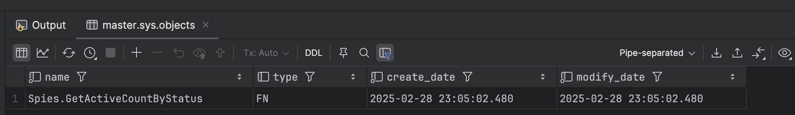
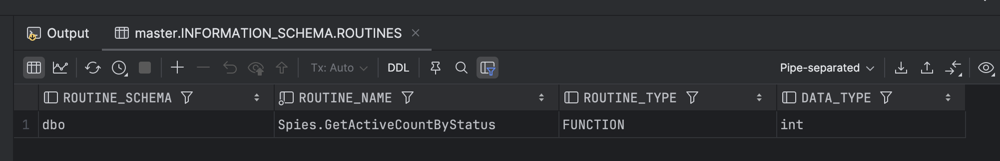

In our previous post, we looked at [Querying SQL Server For A List of Stored Procedures]().

In this post, we will look at how to query [SQL Server](https://www.microsoft.com/en-us/sql-server) for a list of functions.

There are two ways to achieve this:

1. `sys.objects` system view
2. `INFORMATION_SCHEMA`

## sys.objects

You can query the system view to get a list of all functions as follows:

```sql
SELECT name, type, create_date, modify_date
FROM sys.objects
WHERE type IN ('FN', 'IF', 'TF')  -- Scalar, Inline TVF, Multistatement TVF
ORDER BY name;
```

This will return the following:



Note that you can filter according to the [type of function that you want](https://www.scholarhat.com/tutorial/sqlserver/different-types-of-sql-server-functions):

- Scalar
- Inline table-valued functions
- Multi-statement table-valued functions

## INFORMATION_SCHEMA

You can also use the [INFORMATION_SCHEMA](https://learn.microsoft.com/en-us/sql/relational-databases/system-information-schema-views/system-information-schema-views-transact-sql?view=sql-server-ver17) system view, filtering as follows:

```sql
SELECT ROUTINE_SCHEMA, ROUTINE_NAME, ROUTINE_TYPE, DATA_TYPE
FROM INFORMATION_SCHEMA.ROUTINES
WHERE ROUTINE_TYPE = 'FUNCTION'
ORDER BY ROUTINE_NAME;
```

This returns the following:



**WARNING: This technique will not return table-valued functions**

Of interest is that for SQL Server there is **no** `sys.functions`, an equivalent of `sys.procedures`

### TLDR

**You can use `sys.objects` and `INFORMATION_SCHEMA` to retrieve a list of functions**

Happy hacking!
