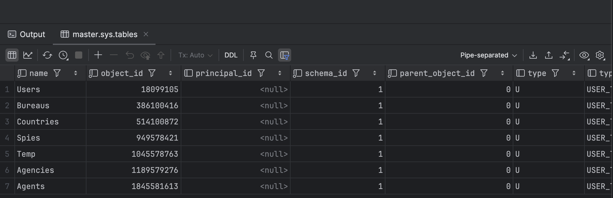
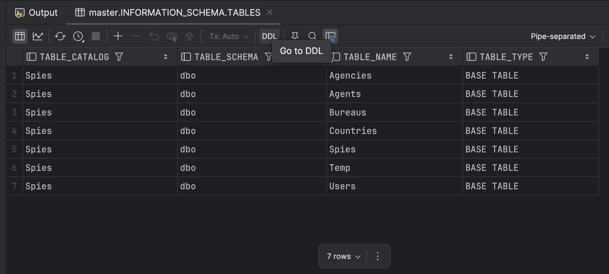
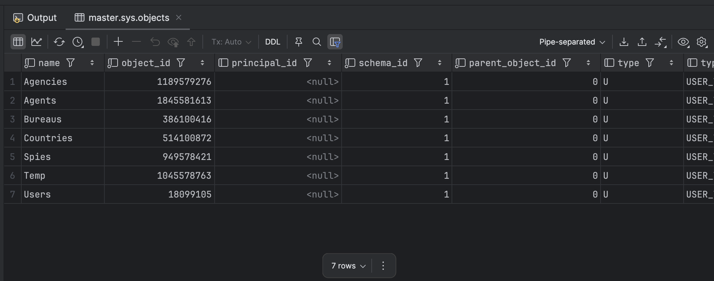
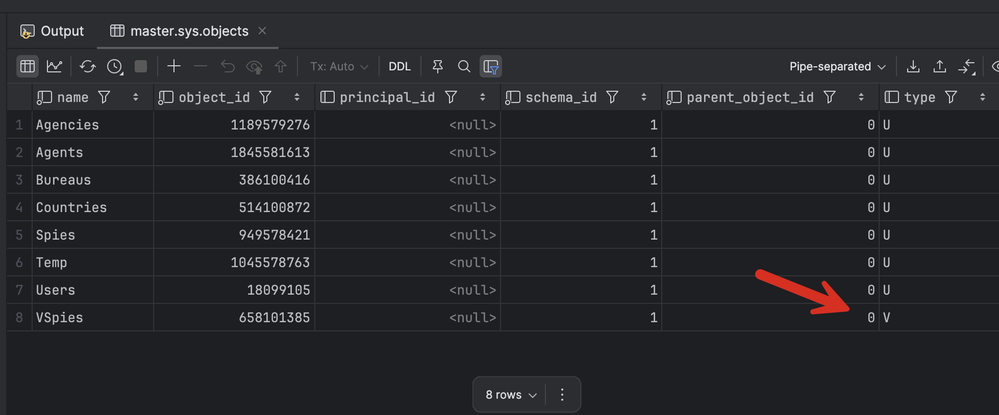
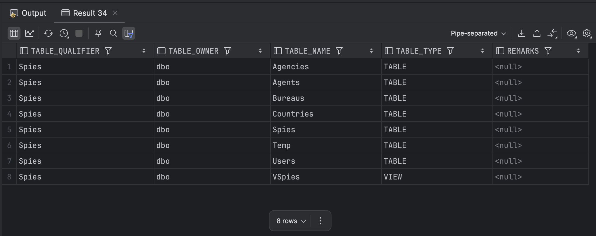
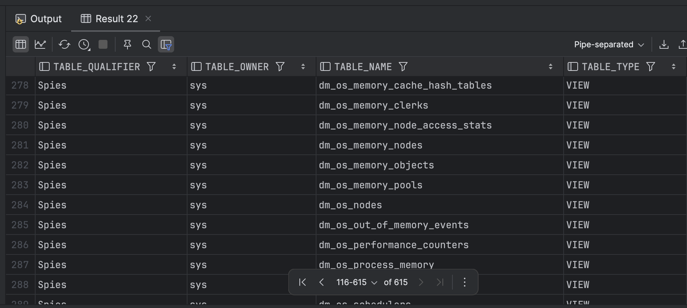

In our previous post, we looked at [Querying SQL Server For A List of Stored Functions]().

In this post, we will look at how to query [SQL Server](https://www.microsoft.com/en-us/sql-server) for a list of tables.

There are three ways to achieve this:

1. `sys.tables` system view
2. INFORMATION_SCHEMA
3. `sys.objects` system view
4. `sp_tables` procedure

## sys.tables

SQL Server exposes a system view, [sys.tables](https://learn.microsoft.com/en-us/sql/relational-databases/system-catalog-views/sys-tables-transact-sql?view=sql-server-ver17), that you can query for all the tables in the **active database**.

```sql
select * from sys.tables
```

This will return the following:



The full list of columns is as follows:

```sql
select name,
       object_id,
       principal_id,
       schema_id,
       parent_object_id,
       type,
       type_desc,
       create_date,
       modify_date,
       is_ms_shipped,
       is_published,
       is_schema_published,
       lob_data_space_id,
       filestream_data_space_id,
       max_column_id_used,
       lock_on_bulk_load,
       uses_ansi_nulls,
       is_replicated,
       has_replication_filter,
       is_merge_published,
       is_sync_tran_subscribed,
       has_unchecked_assembly_data,
       text_in_row_limit,
       large_value_types_out_of_row,
       is_tracked_by_cdc,
       lock_escalation,
       lock_escalation_desc,
       is_filetable,
       is_memory_optimized,
       durability,
       durability_desc,
       temporal_type,
       temporal_type_desc,
       history_table_id,
       is_remote_data_archive_enabled,
       is_external,
       history_retention_period,
       history_retention_period_unit,
       history_retention_period_unit_desc,
       is_node,
       is_edge,
       data_retention_period,
       data_retention_period_unit,
       data_retention_period_unit_desc,
       ledger_type,
       ledger_type_desc,
       ledger_view_id,
       is_dropped_ledger_table
from sys.tables
```

The columns you will most likely use are these:

```sql
select name,
       create_date,
       modify_date
from sys.tables
```

This technique, however, will not return [temporary tables](https://www.geeksforgeeks.org/what-is-temporary-table-in-sql/).

## INFORMATION_SCHEMA

You can also use the [INFORMATION_SCHEMA](https://learn.microsoft.com/en-us/sql/relational-databases/system-information-schema-views/system-information-schema-views-transact-sql?view=sql-server-ver17) system view, filtering as follows:

```sql
SELECT *
FROM INFORMATION_SCHEMA.TABLES
WHERE TABLE_TYPE = 'BASE TABLE'
ORDER BY TABLE_SCHEMA, TABLE_NAME;
```

This will return the following:



The columns returned are the following:

```sql
SELECT TABLE_CATALOG, 
       TABLE_SCHEMA, 
       TABLE_NAME, 
       TABLE_TYPE
FROM INFORMATION_SCHEMA.TABLES
WHERE TABLE_TYPE = 'BASE TABLE'
ORDER BY TABLE_SCHEMA, TABLE_NAME;

```

This technique will **not** return [temporary tables](https://www.geeksforgeeks.org/what-is-temporary-table-in-sql/) either.

## sys.objects

SQL Server exposes a system view, [sys.objects](https://learn.microsoft.com/en-us/sql/relational-databases/system-catalog-views/sys-objects-transact-sql?view=sql-server-ver17), that you can use to query for tables.

You can query it as follows:

```sql
SELECT *
FROM sys.objects
WHERE type = 'U' --User tables
ORDER BY name;
```

This will return the following:



The columns returned are as follows:

```sql
SELECT name,
       object_id,
       principal_id,
       schema_id,
       parent_object_id,
       type,
       type_desc,
       create_date,
       modify_date,
       is_ms_shipped,
       is_published,
       is_schema_published
FROM sys.objects
WHERE type = 'U' --User tables
ORDER BY name;
```

To include views, update the filter as follows:

```sql
SELECT *
FROM sys.objects
WHERE type in ('U','V')
ORDER BY name;
```

This will return the following:



## sp_tables

SQL Server exposes a system stored procedure, [sp_tables](https://learn.microsoft.com/en-us/sql/relational-databases/system-stored-procedures/sp-tables-transact-sql?view=sql-server-ver17).

It takes four parameters:

- `table_name` -  The name of the table used to return catalog information. If not provided, `null` is passed.
- `table_owner` - The schema to which the table belongs. If not provided, `null` is passed.
- `table_qualifier` - The name of the table qualifier. Typically, the database name. Defaults to `null`
- `fUsePattern` - Determines whether the underscore (`_`), percent (`%`), or brackets (`[` and `]`) are interpreted as wildcard characters. Defaults to `1`

To get a usable result, pass at least the owner

```sql
sp_tables null,'dbo'
```



This procedure will return [views](https://learn.microsoft.com/en-us/sql/relational-databases/views/views?view=sql-server-ver17) as well as [tables](https://learn.microsoft.com/en-us/sql/relational-databases/tables/tables?view=sql-server-ver17).

If you call the procedure without any parameters, you will get the following result:



This is because it will also return a variety of system tables and views.

### TLDR

SQL Server offers four ways to query for a list of tables.

Happy hacking!