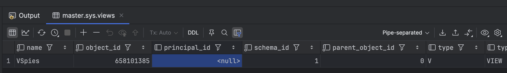
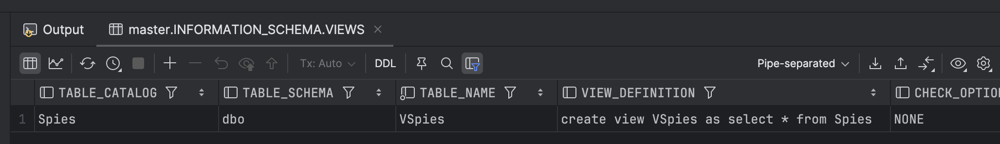
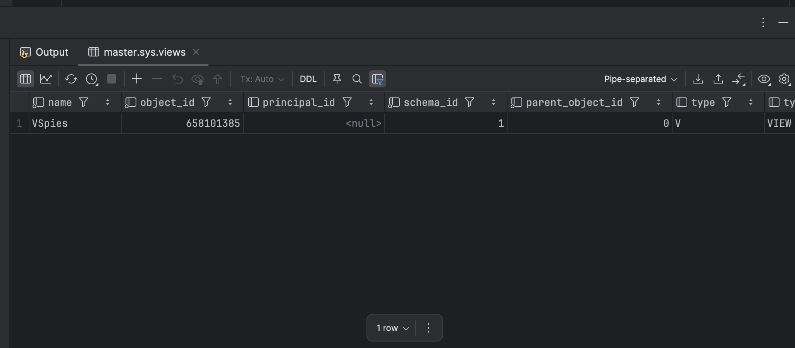

In our previous post, we looked at [Querying SQL Server For A List of Tables]().

In this post, we will look at how to query [SQL Server](https://www.microsoft.com/en-us/sql-server) for a list of views.

There are three ways to achieve this:

1. `sys.views` system view
2. INFORMATION_SCHEMA
3. `sys.objects` system view

## sys.views

SQL Server exposes a system view, [sys.views](https://learn.microsoft.com/en-us/sql/relational-databases/system-catalog-views/sys-views-transact-sql?view=sql-server-ver17), that you can query for all the views in the **active database**.

You query it as follows:

```sql
select * from sys.views
```

This will return the following:



The complete list of returned columns is as follows:

```sql
select name,
       object_id,
       principal_id,
       schema_id,
       parent_object_id,
       type,
       type_desc,
       create_date,
       modify_date,
       is_ms_shipped,
       is_published,
       is_schema_published,
       is_replicated,
       has_replication_filter,
       has_opaque_metadata,
       has_unchecked_assembly_data,
       with_check_option,
       is_date_correlation_view,
       is_tracked_by_cdc,
       has_snapshot,
       ledger_view_type,
       ledger_view_type_desc,
       is_dropped_ledger_view
from sys.views
```

## INFORMATION_SCHEMA

You can also use the [INFORMATION_SCHEMA](https://learn.microsoft.com/en-us/sql/relational-databases/system-information-schema-views/system-information-schema-views-transact-sql?view=sql-server-ver17) system view, filtering as follows:

```sql
SELECT *
FROM INFORMATION_SCHEMA.VIEWS
ORDER BY TABLE_SCHEMA, TABLE_NAME;
```

This will return the following:



The complete list of columns is as follows:

```sql
SELECT TABLE_CATALOG, 
       TABLE_SCHEMA, 
       TABLE_NAME, 
       VIEW_DEFINITION, 
       CHECK_OPTION, 
       IS_UPDATABLE
FROM INFORMATION_SCHEMA.VIEWS
ORDER BY TABLE_SCHEMA, TABLE_NAME;
```

## sys.objects

SQL Server exposes a system view, [sys.objects](https://learn.microsoft.com/en-us/sql/relational-databases/system-catalog-views/sys-objects-transact-sql?view=sql-server-ver17), that you can use to query for views.

You can query it as follows:

```sql
SELECT *
FROM sys.objects
where type = 'V'
```

This will return the following:



The complete list of returned columns is as follows:

```sql
SELECT name,
       object_id,
       principal_id,
       schema_id,
       parent_object_id,
       type,
       type_desc,
       create_date,
       modify_date,
       is_ms_shipped,
       is_published,
       is_schema_published
FROM sys.objects
where type = 'V'
```

### TLDR

**There are three ways to query SQL server for a list of views.**

Happy hacking!
