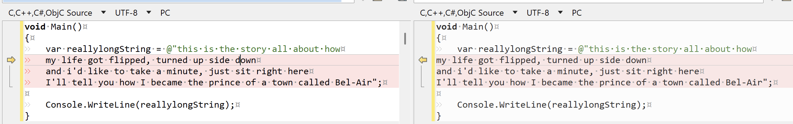

One of the truly brilliant innovations that supports developers is a new feature that supports the management and manipulation of multi-line strings.

Suppose you had these [famous lyrics](https://en.wikipedia.org/wiki/The_Fresh_Prince_of_Bel-Air):

> This is the story all about how
>
> my life got flipped, turned up side down
>
> and i'd like to take a minute, just sit right here
>
> I'll tell you how I became the prince of a town called Bel-Air

If you needed to get them into a `string` variable, you have a number of options:

The most primitive technique is this one:

```c#
void Main()
{
  var reallylongString = @"this is the story all about how
  my life got flipped, turned up side down
  and i'd like to take a minute, just sit right here
  I'll tell you how I became the prince of a town called Bel-Air";

  Console.WriteLine(reallylongString);
}
```

This is what is called a verbatim string.

At face value, it looks ok.

Until you actually run the program.

It will print the following:

```plaintext
this is the story all about how
    my life got flipped, turned up side down
    and i'd like to take a minute, just sit right here
    I'll tell you how I became the prince of a town called Bel-Air
```

Note that the last 3 lines are indented!

To fix this we must reformat our [verbatim string](https://learn.microsoft.com/en-us/dotnet/csharp/language-reference/tokens/verbatim) and outdent the lines:

```c#
void Main()
{
  var reallylongString = @"this is the story all about how
my life got flipped, turned up side down
and i'd like to take a minute, just sit right here
I'll tell you how I became the prince of a town called Bel-Air";

  Console.WriteLine(reallylongString);
}
```

When we run this, the following is printed:

```plaintext
this is the story all about how
my life got flipped, turned up side down
and i'd like to take a minute, just sit right here
I'll tell you how I became the prince of a town called Bel-Air
```

In case you are wondering what the difference is, here is a visual diff, done via [BeyondCompare](https://www.scootersoftware.com/):



The beauty of verbatim strings is that they support interpolation.

So we can do this:

```c#
var town = "Bel-Air";

var reallylongString = @$"this is the story all about how
my life got flipped, turned up side down
and i'd like to take a minute, just sit right here
I'll tell you how I became the prince of a town called {town}";

Console.WriteLine(reallylongString);
```

Now suppose the string looked like this:

```plaintext
This is the "story" all about how

my life got "flipped", turned up side down

and i'd like to take a minute, just sit right here

I'll tell you how I became the prince of a town called "Bel-Air"
```

We would have to rewrite our code a bit:

```c#
var town = "Bel-Air";

var reallylongString = @"this is the ""story"" all about how
my life got ""flipped"", turned up side down
and i'd like to take a minute, just sit right here
I'll tell you how I became the prince of a town called ""Bel-Air""";

Console.WriteLine(reallylongString);
```

Note how you have to double the quotes for the quoted words.

There is a solution for this - [raw string literals](https://learn.microsoft.com/en-us/dotnet/csharp/language-reference/tokens/raw-string).

These are string delimited by three double quotes, like this:

```c#
var reallylongString = 
"""
this is the story all about how
my life got flipped, turned up side down
and i'd like to take a minute, just sit right here
I'll tell you how I became the prince of a town called "Bel-Air"
""";

Console.WriteLine(reallylongString);
```

This will print the following:

```plaintext
This is the "story" all about how

my life got "flipped", turned up side down

and i'd like to take a minute, just sit right here

I'll tell you how I became the prince of a town called "Bel-Air"
```

This is much simpler. You can place the string as it is between the three quotes.

It will also respect indents, which means you can do the following to indent:

```c#
var reallylongString = 
$"""
this is the story all about how
  my life got flipped, turned up side down
and i'd like to take a minute, just sit right here
  I'll tell you how I became the prince of a town called "Bel-Air"
""";
```

This will print the following:

```plaintext
this is the story all about how
    my life got flipped, turned up side down
and i'd like to take a minute, just sit right here
    I'll tell you how I became the prince of a town called "Bel-Air"
```

Raw string literals also support interpolation.

Do you can do this:

```c#
var town = "Bel-Air";

var reallylongString =
$"""
this is the story all about how
  my life got flipped, turned up side down
and i'd like to take a minute, just sit right here
  I'll tell you how I became the prince of a town called "{town}"
""";

Console.WriteLine(reallylongString);
```

This will print the following:

```plaintext
this is the story all about how
    my life got flipped, turned up side down
and i'd like to take a minute, just sit right here
    I'll tell you how I became the prince of a town called "Bel-Air"
```

Which begs the question - what if the text was like this:

```plaintext
This is the "story" all about how

my life got "flipped", turned up side down

and i'd like to take a minute, just sit right here

I'll tell you how I became the prince of a town called """"Bel-Air""""
```

Note that "Bel-Air" has 4 quotes.

This will refuse to compile.

The fix for this is that the n**umber of quotes you use to delimit the string should be one more than the number of repetitions** within the string..

In other words, we can do this:

```c#
var town = "Bel-Air";

var reallylongString =
  $"""""
   this is the story all about how
    my life got flipped, turned up side down
   and i'd like to take a minute, just sit right here
    I'll tell you how I became the prince of a town called """"{town}""""
   """"";

Console.WriteLine(reallylongString);
```

### TLDR

**Raw string literals can make it much easier to manage and manipulate long strings.**

Happy hacking!
