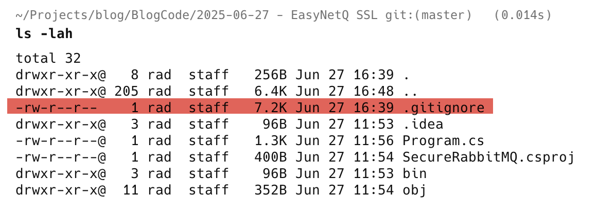
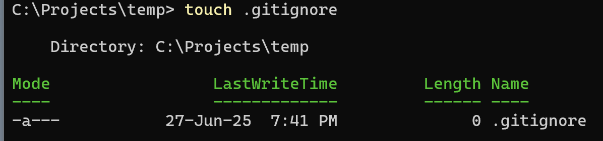

In the Linux & Unix world it is common to have hidden configuration files, whose name begins with a period, `.`

A common example that as a developer you have probably come across is a `.gitconfig`. Another is the `.gitignore`.



These are very easy to create in the console.

In the Linux & Unix world there is the touch command.

This is not present in [PowerShell](https://learn.microsoft.com/en-us/powershell/), so you will need to implement it yourself. I have outlined how to create the command and alias in this post [Touch In PowerShell]().

With this in place, you can now do the following:

```powershell
touch .gitignore
```

This will create an empty file with the specified name.



Alternatively, at least in [Windows 11](https://www.microsoft.com/en-us/windows/windows-11?r=1), most save file dialogs will allow you to save a file directly with the desired name. Windows Explorer also allows you to rename an existing file.

Happy hacking!
