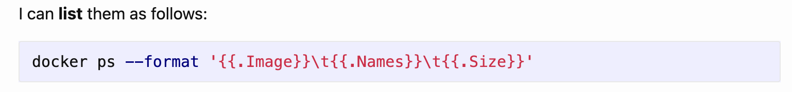

I was recently reviewing a post I'd written previously, "[Tip - Quickly Upgrade Docker Containers]()," when I noticed something.

Some code samples are being **displayed incorrectly**.

and

Which was strange.

As a reminder, I am using [Jekyll]() to write and manage this blog.

Because the source code is definitely **correct**.

and

The problem is the **double curly braces**, which [Jekyll](https://jekyllrb.com/) interprets as interpolation markers.

`Jekyll` actually warns you about this when you build the site.

The solution to this is to wrap your code in two tags: `raw` and `endraw`. Like this:

and

The site will now render correctly.

and

You can view the updated post [here]()
