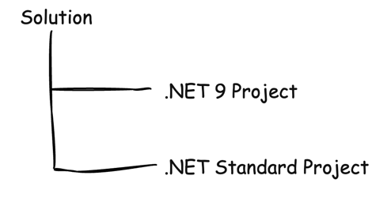

If you aren't using centralized package management, you should consider it. I've discussed this before, [here]() and [here](), where I've applied it practically.

Most of the time, after setting it up, you don't need to do anything else, because you want the same version of a package used across projects.

However, there are occasions where you want to use **different** versions of a package across projects.

I recently came across this scenario.

I have a solution set up like this, with two different projects targeting [different frameworks](https://docs.fluentvalidation.net/en/latest/upgrading-to-12.html) - one targeting .**NET 9** and the other targeting [.NET Standard](https://learn.microsoft.com/en-us/dotnet/standard/net-standard?tabs=net-standard-1-0).



Both were using the package [FluentValidation](https://www.nuget.org/packages/fluentvalidation/).

Recently, a change was made to the `FluentValidation` package, which [dropped support for some older targets](https://docs.fluentvalidation.net/en/latest/upgrading-to-12.html), including .NET Standard.

This means that the latest package, [version 12](https://www.nuget.org/packages/FluentValidation/12.0.0), is supported for the **.NET 9** project, but not for the **.NET Standard** project, which must continue to use the previous version, [version 11](https://www.nuget.org/packages/FluentValidation/11.11.0).

The solution for this is as follows:

In the main file that stores the package versions, `Directory.Packages.props`, the latest version will be reflected there:

```xml
<Project>
  <ItemGroup>
    <PackageVersion Include="FluentValidation" Version="12.0.0" />
  </ItemGroup>
</Project>
```

You will need to make a change to the `.csproj` containing the package you want to override.

```xml
<Project Sdk="Microsoft.NET.Sdk">
   	<! -- snipped here for clarity -->
    <ItemGroup>
        <PackageReference Include="FluentValidation" VersionOverride="11.11.0"/>
    </ItemGroup>
</Project>
```

The magic is the `VersionOverride` attribute, which allows you to specify the actual version that you want to use within the project.

Given that this functionality can be misused, it is possible to disable it.

To achieve this, change one of the following files:

- The project `.csproj`
- `Directory.Packages.props`
- `Directory.Build.props`

And add the following tag:

```xml
<PropertyGroup>
  <CentralPackageVersionOverrideEnabled>false</CentralPackageVersionOverrideEnabled>
</PropertyGroup>
```

With this in place, if you add the `VersionOverride` tag to a package, you will get a **compile** error.

### TLDR

**It is possible to override the package versions set using centralized package management.**

Happy hacking!


```

