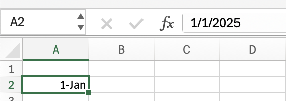

A popular method for exchanging data between systems is the use of [Microsoft Excel](https://www.microsoft.com/en-us/microsoft-365/excel) files, via the [XLSX](https://learn.microsoft.com/en-us/openspecs/office_standards/ms-xlsx/2c5dee00-eff2-4b22-92b6-0738acd4475e) or older [XLS](https://learn.microsoft.com/en-us/openspecs/office_file_formats/ms-xls/cd03cb5f-ca02-4934-a391-bb674cb8aa06) format.

At first glance, this appears to be a viable solution. The `XLSX` format is well-known, ubiquitous, and there are lots of tools that can read and write XLSX files.

However, you need to be very careful because many of Excel's features can end up inadvertently **shooting you in the foot**.

One of the biggest challenges is that Excel goes to great lengths to **type** your data as you are keying it in.

For example, I am currently entering `1 Jan` into a cell. 


Immediately, I hit Enter, Excel helpfully converts it into a **date**, and assumes it is the **current year.**



Generally, this would be a good thing; however, remember that we are exchanging data between systems. What if `1 Jan` was data in itself - for example, [New Year's Day](https://en.wikipedia.org/wiki/New_Year%27s_Day)?

We encounter a similar problem with data that is logically **text** but appears to be a **number**.

For instance, in Kenya, mobile phone numbers begin with a leading `0`.

Here I am keying in `072112345`


Once I hit enter, Excel helpfully decides that it is a **number** and **drops the zero that it now considers a leading, non-significant digit**.


Here is another problem: let's assume we have the following dates in a file, representing all the days in January.

```plaintext
1/01/2025
2/01/2025
3/01/2025
4/01/2025
5/01/2025
6/01/2025
7/01/2025
8/01/2025
9/01/2025
10/01/2025
11/01/2025
12/01/2025
13/01/2025
14/01/2025
15/01/2025
16/01/2025
17/01/2025
18/01/2025
19/01/2025
20/01/2025
21/01/2025
22/01/2025
23/01/2025
24/01/2025
25/01/2025
26/01/2025
27/01/2025
28/01/2025
29/01/2025
30/01/2025
31/01/2025
```

Let us now paste this into Excel.


So what has happened here?

Excel has examined each of the entries and determined that they are **dates in the US format** - `Month/Day/Year`.

However, when it got to `13/1/2025` it gave up as there is **no month 13**, and therefore **cannot be a date**, and decided that everything else is **plain text**. Hence the change in alignment.

You will get the same problem if you paste dates in US format into a spreadsheet that is in UK (or other) format.

Does this matter?

Yes, when doing **data interchange**.

Any code that will import data **should attempt to validate it**.

Most libraries that can read and write XLSX files leverage the fact that the data has a type, and therefore, you might find **errors being thrown** during the import process as you **try to read a date that Excel does not consider a date**.

Or even worse, if your code did this:

```vb
// Read the value
If IsDate(cell.Value) Then
  'Do your import here
End If
```

Your code would **silently skip** data.

There are two solutions to this problem, one on the **user** side and the other on **your** side.

Users should have a thorough understanding of their data, particularly any potentially problematic information. They can then tell Excel not to be clever by **explicitly formatting that data as text**.


The user can then go ahead to enter their data.

If your data is already prepared and you want to paste it, this technique won't work. **Excel will ignore your format and still attempt to coerce your data into a type**.

You need to work a bit harder.

Instead of the usual **Paste**, right-click and use the **Paste Special** menu.


When you click that you get a second dialog:


Choose text, and your data will be inserted **as-is**.


Alternatively, you can ensure that **all data is in a valid typed format**, so that all dates, which may require some massaging, are handled correctly.

The problem with this approach is that:

1. It places responsibility on your **users** to remember to do the right thing.
2. The users who even understand this is a problem are a minority.

A more robust approach will be at **ingestion** time.

The code that imports should **ignore any type information** that the XLSX file advertises and **attempt to read the data as raw text**. Once read, it can then be **parsed** into the necessary format.

### TLDR

**Using Excel for data interchange can trip you up in unexpected ways if you're not careful.**

If you need a reliable, (mostly) foolproof format for data interchange, [CSV](https://en.wikipedia.org/wiki/Comma-separated_values), implemented via [RFC4180](https://datatracker.ietf.org/doc/html/rfc4180) is a good one.

I have had a lot of success with [Josh Close's](https://github.com/joshclose) [CSVHelper](https://joshclose.github.io/CsvHelper/getting-started/).

You can read about that in the post [Correctly Processing CSV Files In C# & .NET]()

Happy hacking!
