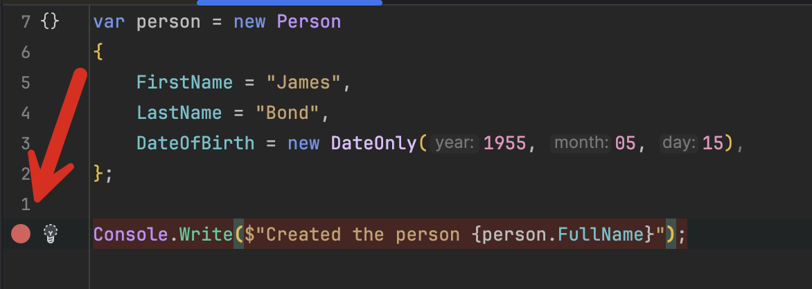
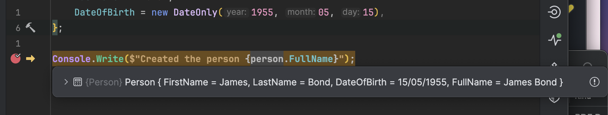
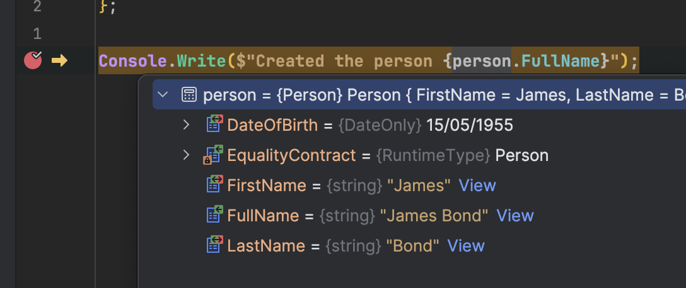
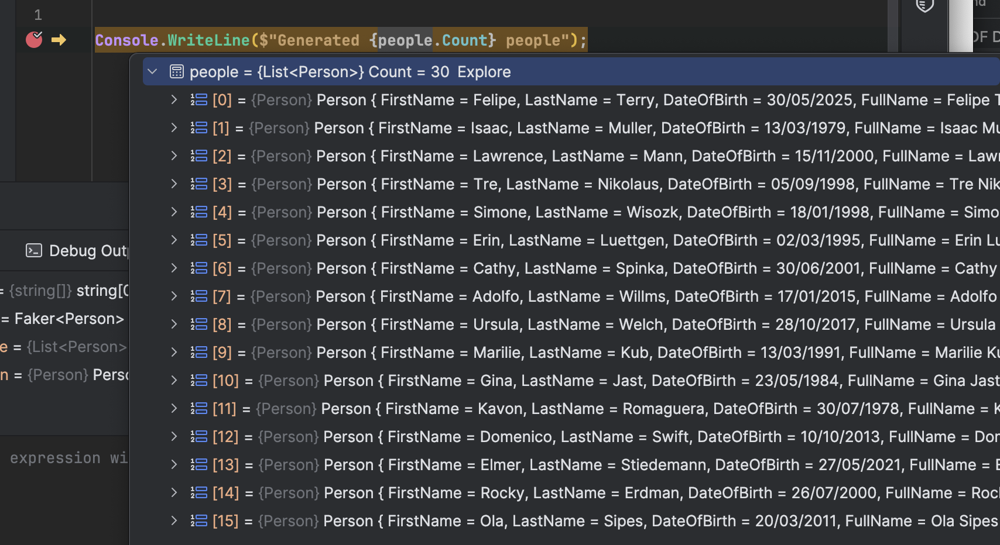
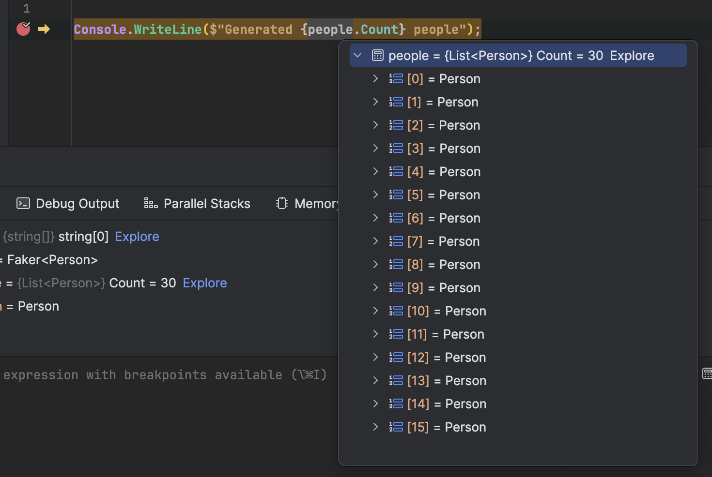
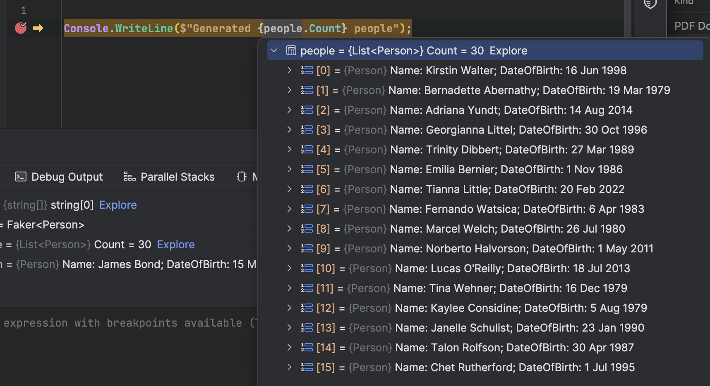

One of the most powerful tools at the disposal of the modern developer is a good [debugger](https://stackoverflow.com/questions/25385173/what-is-a-debugger-and-how-can-it-help-me-diagnose-problems).

Given that the craft of software development is by its very nature both a **science** and an art, **problems** (foreseen and otherwise) in code are **inevitable**.

Thus, it is imperative that not only do you have a good debugger, but a good **debugging experience** as well to help you both understand what is happening under the hood, but also to follow the flow of logic visually.

Let's take a simple example to illustrate this concept.

For this, I will be using the [JetBrains](https://www.jetbrains.com/) [Rider](https://www.jetbrains.com/rider/) IDE; however, this approach will still work with your editor of choice.

Assume you have the following type, `Person`:

```c#
public sealed record Person
{
    public string FirstName { get; init; }
    public string LastName { get; init; }
    public DateOnly DateOfBirth { get; init; }
}
```

And the following program:

```c#
var person = new Person
{
    FirstName = "James",
    LastName = "Bond",
    DateOfBirth = new DateOnly(1955, 05, 15),
};

Console.Write($"Created the person {person.FullName}");
```

The debugging experience can be experienced after setting a [breakpoint](https://www.bbc.co.uk/bitesize/guides/zg4j7ty/revision/5) as follows:



When you run the program, the **debugger will stop at the breakpoint,** allowing you to **inspect** various states of your objects.



You can further expand the object to view it's properties in a structured fashion.



Imagine now a situation where you have several objects.

For this, we will use [Bogus](https://www.nuget.org/packages/bogus) to generate our data.

```bash
dotnet add package Bogus
```

We then add the following code:

```c#
var faker = new Faker<Person>()
    .RuleFor(x => x.FirstName, y => y.Name.FirstName())
    .RuleFor(x => x.LastName, y => y.Name.LastName())
    // Date in the past not more than 50 years go
    .RuleFor(x => x.DateOfBirth, y => y.Date.PastDateOnly(50));

// Generate 30 people
var people = faker.Generate(30);

Console.WriteLine($"Generated {people.Count} people");
```

If we set a breakpoint at the point where we are printing the message of the number of people generated, we see the following:



It's busy, but it's possible to see what is happening.

Now, suppose we make the `Person` a [class](https://learn.microsoft.com/en-us/dotnet/csharp/fundamentals/types/classes), rather than a [record](https://learn.microsoft.com/en-us/dotnet/csharp/fundamentals/types/records).



Note that this is much more difficult to visualize. You have to **expand** each item to view the details.

This is one of the benefits of `record` - you get a relatively complete implementation of [ToString](https://learn.microsoft.com/en-us/dotnet/api/system.object.tostring?view=net-9.0) that basically lists all the properties.

Luckily, there is a solution to this - you can tell your IDE how to visualize your object using the [DebuggerDisplay](https://learn.microsoft.com/en-us/dotnet/api/system.diagnostics.debuggerdisplayattribute?view=net-9.0) attribute.

With this, you can provide a `string` of how you would like your object to be **represented**.

```c#
using System.Diagnostics;

[DebuggerDisplay("Name: {FullName}; DateOfBirth: {DateOfBirth.ToString(\"d MMM yyyy\")}")]
public sealed class Person
{
    public required string FirstName { get; init; }
    public required string LastName { get; init; }
    public required DateOnly DateOfBirth { get; init; }
    public string FullName => $"{FirstName} {LastName}";
}
```

Of note here is that to format your objects you cannot do it like this:

```c#
"{DateOfBirth:d MMM yyyy}"
```

You must actually call `ToString`, and pass it a [format string](https://learn.microsoft.com/en-us/dotnet/standard/base-types/custom-date-and-time-format-strings), as follows:

```c#
"{DateOfBirth.ToString(\"d MMM yyyy\")}"
```

If we now run our program, we see the following debugging experience:



This is much **easier to visualize** without having to expend each object looking for one in particular.

### TLDR

**The `DebuggerDisplay` attribute allows you to write debugger friendly objects that are easy to visualize.**

The code is in my GitHub.

Happy hacking!
