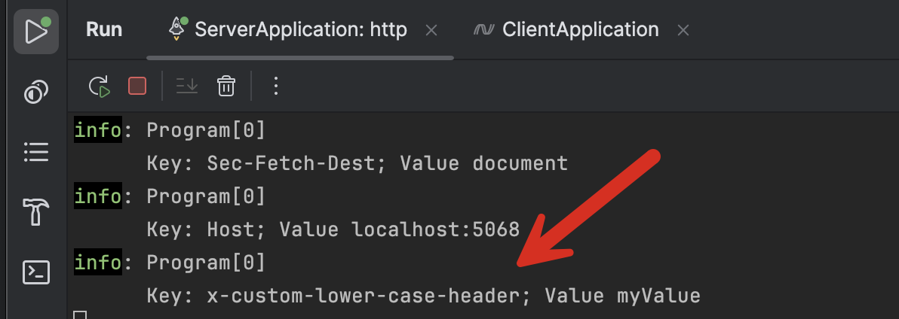

Two years ago, I wrote this post - [Fix - HttpClient Changes Case Of x-request-id Header]() that discussed some **challenges** I was having submitting some [HTTP](https://en.wikipedia.org/wiki/HTTP) headers to a server that expected them to be in a particular case.

I discussed the challenge around the fact that the [HttpClient](https://learn.microsoft.com/en-us/dotnet/api/system.net.http.httpclient?view=net-9.0) automatically '**corrects**' the case of submitted headers, and how I worked around it by **sneaking in the headers I wanted wrapped in the values of another**.

Now, many years later, I realize that there was another, **better** option I could have tried to address the same issue - rather than using the `HttpClient` directly, I could have written my own [HttpClientHandler](https://learn.microsoft.com/en-us/dotnet/api/system.net.http.httpclienthandler?view=net-9.0), and within that performed my manipulation.

```c#
public sealed class CaseSensitiveHeaderHandler :
    HttpClientHandler
{
    private readonly string _headerName;
    private readonly string _headerValue;

    public CaseSensitiveHeaderHandler(string headerName, string headerValue)
    {
        _headerName = headerName;
        _headerValue = headerValue;
    }

    protected override Task<HttpResponseMessage> SendAsync(HttpRequestMessage request,
        CancellationToken cancellationToken)
    {
        // Set our headers
        request.Headers.Add(_headerName, _headerValue);
        return base.SendAsync(request, cancellationToken);
    }
}
```

Next, a simple **Web API application** that prints the headers that were received:

```c#
var builder = WebApplication.CreateBuilder(args);
var app = builder.Build();

// Inject the request and a logger
app.MapGet("/", (HttpRequest req, ILogger<Program> logger) =>
{
    // Log all our received headers
    foreach (var header in req.Headers)
    {
        logger.LogInformation("Key: {Key}; Value {Value} ", header.Key, header.Value);
    }
});

app.Run();
```

Finally, a simple **console** application to send a request with some custom headers:

```c#
// Define (or fetch) our values

const string header = "x-custom-lower-case-header";
const string value = "myValue";

var client = new HttpClient(new CaseSensitiveHeaderHandler(header, value));

var request = new HttpRequestMessage(HttpMethod.Get, "http://localhost:5068/");
await client.SendAsync(request);
```

If we run this, we see the following returned:



Our case is **exactly as we sent it**.

Of interest is the fact that within the handler, the normal [Add](https://learn.microsoft.com/en-us/dotnet/api/system.net.http.headers.httpheaders.add?view=net-9.0#system-net-http-headers-httpheaders-add(system-string-system-string)) worked, and I did not need to use [TryAddWithoutValidation](https://learn.microsoft.com/en-us/dotnet/api/system.net.http.headers.httpheaders.tryaddwithoutvalidation?view=net-9.0).

### TLDR

**If you need to control the case of your `HTTP` request headers, write your own `HttpClientHandler`, as the default `HttpClient` will case them for you.**

The code is in my [GitHub](https://github.com/conradakunga/BlogCode/tree/master/2025-07-04%20-%20HttpClientHandler).

Happy hacking!
