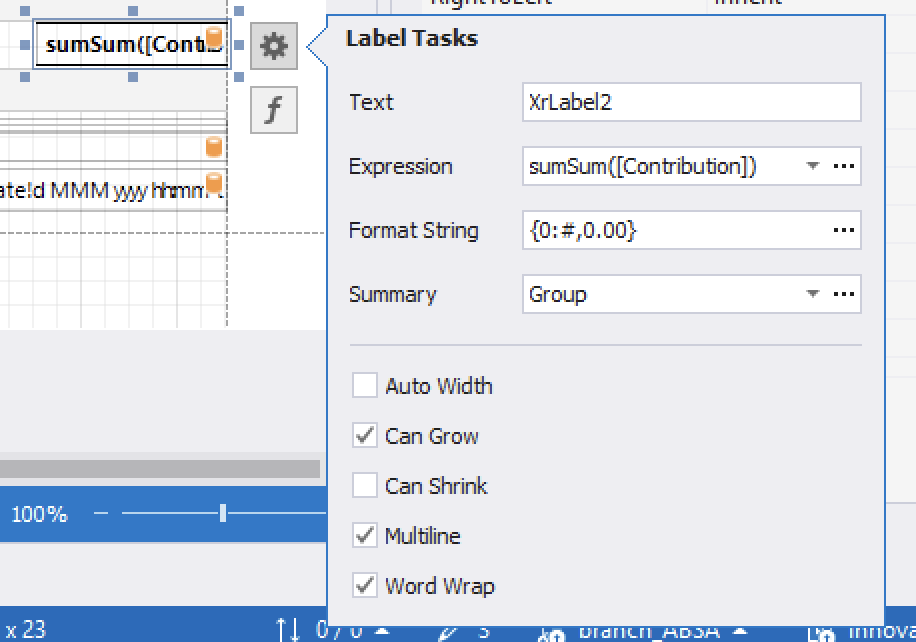
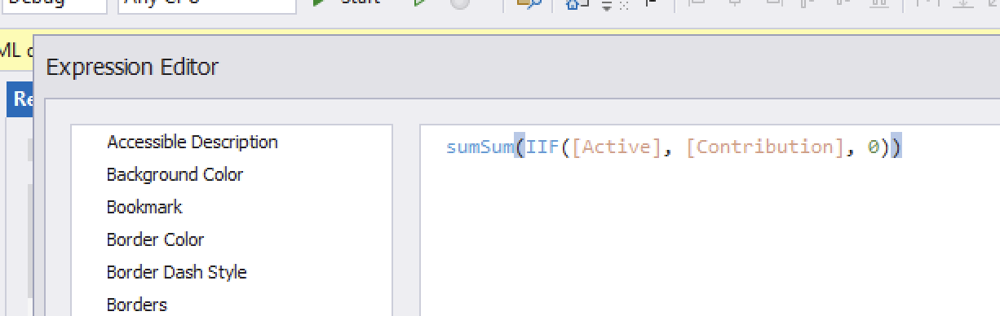

When it comes to reports and reporting, my goto has always been [DevExpress](https://www.devexpress.com/) [XtraReports](https://docs.devexpress.com/XtraReports/DevExpress.XtraReports.UI.XtraReport). It does what it says on the tin, and for more than a decade I have yet to come across a problem that I have not been able to tackle.

Today we will look at a common scenario - when your report is filtering its data, and you want a **subtotal** (or a **count**, or an **average**) of the filtered data.

Take this model:

```c#
public class Person
{
  public string FullName { get; set; }
  public string Active { get; set; }
  public decimal Contribution { get; set; }
}
```

Let us then assume we have the following data:

| FullName | Active | Contribution |
| -------- | ------ | -----------: |
| Alicia Berge | True | 1,732.00 |
| Alva Dach | True | 1,883.00 |
| Alysson Gutmann | True | 1,642.00 |
| Beaulah Homenick | False | 1,968.00 |
| Cathrine Morissette | True | 1,794.00 |
| Dock Price | True | 1,510.00 |
| Dorris Kuphal | True | 1,590.00 |
| Electa Stoltenberg | True | 1,587.00 |
| Fay Cormier | False | 1,539.00 |
| Filomena White | False | 1,611.00 |
| Gay Kunze | False | 1,482.00 |
| Jettie Sporer | False | 1,649.00 |
| Johathan Kunze | False | 1,096.00 |
| Julianne Oberbrunner | False | 1,606.00 |
| Lon Stokes | True | 1,023.00 |
| Samara Lemke | True | 1,738.00 |
| Stanford Ziemann | True | 1,035.00 |
| Telly Kessler | True | 1,789.00 |
| Tracey Tillman | False | 1,367.00 |
| Vivienne Cronin | False | 1,903.00 |

The problem here is to display only **active** clients in the report, with a **subtotal** of the contributions.

In other words, this:

| FullName | Active | Contribution |
| -------- | ------ | -----------: |
| Alicia Berge | True | 1,732.00 |
| Alva Dach | True | 1,883.00 |
| Alysson Gutmann | True | 1,642.00 |
| Cathrine Morissette | True | 1,794.00 |
| Dock Price | True | 1,510.00 |
| Dorris Kuphal | True | 1,590.00 |
| Electa Stoltenberg | True | 1,587.00 |
| Lon Stokes | True | 1,023.00 |
| Samara Lemke | True | 1,738.00 |
| Stanford Ziemann | True | 1,035.00 |
| Telly Kessler | True | 1,789.00 |
| | | **17,323.00** |

There are several ways to approach this problem.

1. **Filter at source** and do simple binding with a summary function
2. **Filter at the report level** using the [FilterString](https://docs.devexpress.com/XtraReports/DevExpress.XtraReports.UI.XtraReportBase.FilterString) property  and do simple binding with a summary function
3. **Manipulate the display of each row** perhaps using an [expression](https://docs.devexpress.com/XtraReports/120091/detailed-guide-to-devexpress-reporting/use-expressions), and have a custom summary function

The first two are the simplest. But are not always possible. 

1. You have no control of the source data
2. You have no control of the data source at the report level, and therefore cannot filter at that level
3. You are manipulating the details row directly, perhaps using a formula to show / hide rows. This is common if you expose the end user designer.
4. Other reasons

In such a situation, the default summary function **will do the wrong thing**:



This will add **all the rows** to the computation, therefore the total won't correlate with the display.

For it to do the right thing, you must **tell the summary function which rows to include in the computation**, which ideally would be the same logic you used for the detail band.

In this case we will use the [IIF](https://docs.devexpress.com/XtraReports/120104/detailed-guide-to-devexpress-reporting/use-expressions/expression-language) function as follows:

```vb
sumSum(IIF([Active], [Contribution], 0))
```

Change the function to look like this:



Here the reporting engine will only include the rows you want in the computation.

### TLDR

**Use the `IIF` function for aggregation if you are manipulating the logic on the detail band after binding that affects the display of the rows.**

Happy hacking!