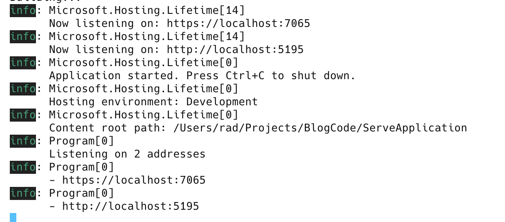

This is not exactly a common scenario, but here it is just the same.

From within a [ASP.NET](https://dotnet.microsoft.com/en-us/apps/aspnet) [WebAPI](https://dotnet.microsoft.com/en-us/apps/aspnet/apis) end point, I need to know the IP addresses and the ports that the current web application is being served on.

There may be more than one, because the server might be supporting both [HTTP](https://developer.mozilla.org/en-US/docs/Web/HTTP) and [HTTPS](https://developer.mozilla.org/en-US/docs/Glossary/HTTPS) traffic.


Luckily, this information is available via injecting the an instance of [IServer](https://learn.microsoft.com/en-us/dotnet/api/microsoft.aspnetcore.hosting.server.iserver?view=aspnetcore-9.0) into your endpoint:

```c#
app.MapGet("/", (IServer server, ILogger<Program> logger) =>
{
  //
  // Your logic in here
  // 
});

app.Run();
```

From this, we can query the [Features](https://learn.microsoft.com/en-us/dotnet/api/microsoft.aspnetcore.hosting.server.iserver.features?view=aspnetcore-9.0) property for what we are interested in, in this case, a collection of [IServerAddressesFeature](https://learn.microsoft.com/en-us/dotnet/api/microsoft.aspnetcore.hosting.server.features.iserveraddressesfeature?view=aspnetcore-9.0)

```c#
app.MapGet("/", (IServer server, ILogger<Program> logger) =>
{
  // Query the server addresses
  var addresses = server.Features.Get<IServerAddressesFeature>()?.Addresses;
  // Log the number found
  logger.LogInformation("Listening on {AddressCount} addresses", addresses?.Count ?? 0);
  // Loop through the results and log
  foreach (var address in addresses!)
      logger.LogInformation("- {Address}", address);
});
```

This will print the following to your logs:

```plaintext
info: Program[0]
      Listening on 2 addresses
info: Program[0]
      - https://localhost:7065
info: Program[0]
      - http://localhost:5195
```



With the URL and ports, you can then proceed to **use them as necessary.**

### TLDR

**You can obtain the URL and ports of the running web server from an API endpoint by injecting the `IServer` interface.**

The code is in my GitHub.

Happy hacking!
