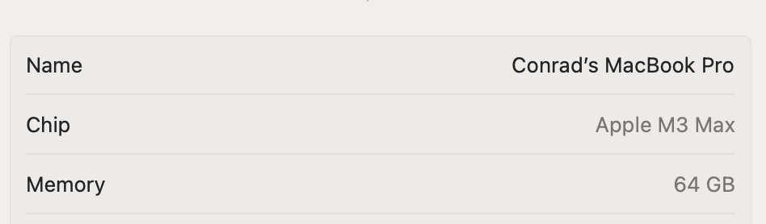

The previous post, [Determining If A Running Process Is Emulated 32 Bit In .NET On Windows]() talked about how to determine if a process is an emulated **32-bit** process running on **64-bit** Windows.

This post looks at how to determine additional information, such as the **architecture** under which the emulation is taking place.

For example, there are at least 3 valid 64-bit architectures:

- 64 bit - Intel
- 64 bit - AMD64
- 64 Bit - ARM

We can get this information using the [IsWow64Process2](https://learn.microsoft.com/en-us/windows/win32/api/wow64apiset/nf-wow64apiset-iswow64process2) method in the [Windows API](https://learn.microsoft.com/en-us/windows/win32/apiindex/windows-api-list).

First, we create a data structure to hold our result:

```c#
enum Architecture : ushort
{
	UNKNOWN = 0x0,
	I386 = 0x014c,      // 32-bit
	Intel64 = 0x020,    // Intel 64
	AMD64 = 0x8664,     // 64-bit
	ARM64 = 0xAA64      // 64-bit ARM
	// There are others here ommited for bevity
}
```

Next we setup the interop between .NET and the Windows API

```c#
[DllImport("kernel32.dll", SetLastError = true)]
private static extern bool IsWow64Process2(
    IntPtr processHandle,
    out ushort processMachine,
    out ushort nativeMachine
);
```

Finally, we **invoke the API** and interrogate the `nativeMachine` and the `processMachine`.

```c#
if (!IsWow64Process2(Process.GetCurrentProcess().Handle, out ushort processMachine, out ushort nativeMachine))
		throw new System.ComponentModel.Win32Exception();

if (processMachine == (ushort)Architecture.UNKNOWN)
{
  Console.WriteLine($"64 Bit on {(Architecture)nativeMachine}");
}
else
{
  Console.WriteLine($"32-bit (WOW64) on {(Architecture)nativeMachine}");
}
```

Running this code on a 32-bit process running in a Virtual Machine on my MacBook running macOS:



 I get the following result:

```plaintext
32-bit (WOW64) on ARM64
```

### TLDR

**The use `IsWow64Process2`  API call gives additional information about the *native* and *process* architectures of a running process.**

The code is in my GitHub.

Happy hacking!
