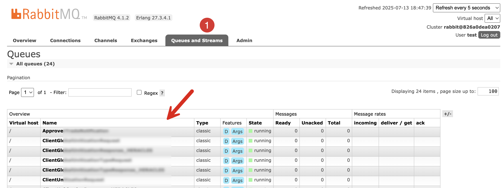
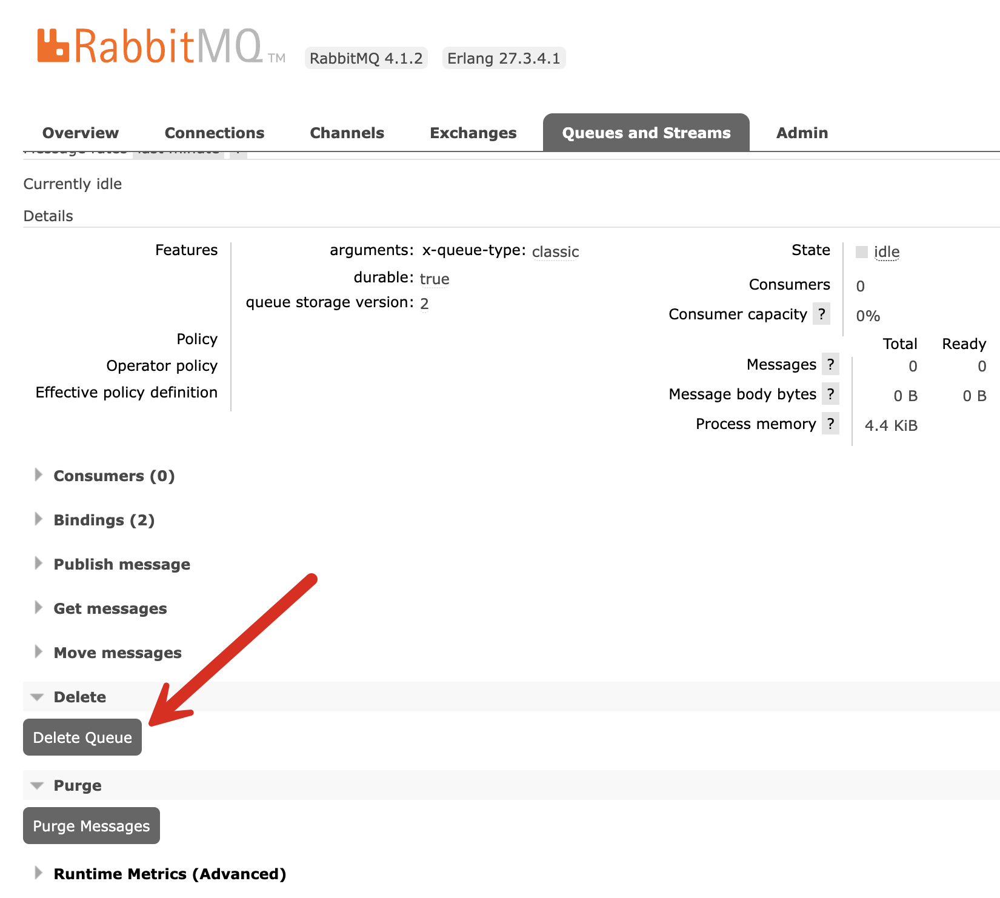

If you need a message broker in the course of developing distributed applications, [RabbitMQ](https://www.rabbitmq.com/) is hard to beat. It is **lightweight**, **versatile**, and **high-performance**.

As part of its core functionality, it makes use of **queues**, message **buffers** that store data in the form of messages for consumption by **consumers**.

You can log into your instance at any point and view the queues that are currently present, by accessing the admin interface on [http://localhost:15672/](http://localhost:15672/)



These are generally created for you by the access library, and in .NET this is either the low-level [RabbitMQ Client](https://www.nuget.org/packages/rabbitmq.client/) or the higher-level [EasyNetQ](https://www.nuget.org/packages/EasyNetQ/7.8.0).

Recently, I had a situation where the queue that was created for me had a **typo**. I corrected the typo and re-ran the code, but this, naturally, **created a second queue** with the correct name.

The original queue remained.

This can be corrected by **manually deleting** using the admin interface.

1. Click on the queue **name**.
2. In the subsequent UI, click the **Delete Queue** button.



You will get a prompt to **confirm** the action.

You can also achieve the same thing **programmatically**.

My library of choice here is `EasyNetQ`, and you will need the management interface package, [EasyNetQ.Management.Client](https://www.nuget.org/packages/EasyNetQ.Management.Client)

```bash
dotnet add package EasyNetQ.Management.Client
```

The code to delete a known queue is as follows:

```c#
	// Configure logging
	Log.Logger = new LoggerConfiguration()
		.WriteTo.Console()
		.CreateLogger();
		
// Fetch / configure access parameters
var username = "test";
var password = "test";
var hostaddress = "localhost";
var adminPort = 15672;
var queueName = "ClientUnitizationResponse_HERACLE";

Log.Information("Connecting to {Host} on Port {Port}", hostaddress, adminPort);
// Create a management client
var mc = new ManagementClient(new Uri($"http://{hostaddress}:{adminPort}"), username, password);
  // Fetch the queue from the default vHost
  var queue = await mc.GetQueueAsync("/", queueName);

  // Delete the queue
  Log.Information("Deleting {Queue} ...", queue.Name);
  await mc.DeleteQueueAsync(queue.Vhost, queue.Name);

  Log.Information("Deleted {Queue}", queue.Name);
```

This code, however, **assumes that the queue in fact exists**. This is not a valid assumption. We will need to add code to cater for the scenario where the queue **does not exist**.

```c#
// Configure logging
Log.Logger = new LoggerConfiguration()
  .WriteTo.Console()
  .CreateLogger();

// Fetch / configure access parameters
var username = "test";
var password = "test";
var hostaddress = "localhost";
var adminPort = 15672;
var queueName = "ClientUnitizationResponse_HERACLE";

Log.Information("Connecting to {Host} on Port {Port}", hostaddress, adminPort);
// Create a management client
var mc = new ManagementClient(new Uri($"http://{hostaddress}:{adminPort}"), username, password);
try
{
  // Fetch the queue from the default vHost
  var queue = await mc.GetQueueAsync("/", queueName);

  // Delete the queue
  Log.Information("Deleting {Queue} ...", queue.Name);
  await mc.DeleteQueueAsync(queue.Vhost, queue.Name);

  Log.Information("Deleted {Queue}", queue.Name);

}
catch (UnexpectedHttpStatusCodeException ex)
{
  Log.Error(ex, "Could not find queue {Queue}", queueName);
}
```

A couple of things to note:

1. If **HTTPS** secures your **RabbitMQ** instance, the URI to create the `ManagementClient` should be [HTTPS](https://www.nuget.org/packages/EasyNetQ.Management.Client) and not **HTTP**
2. The port to pass to the URI is the **admin** port, which is different from the port for **messaging**. This is typically `15672` or `15671` in the case of **HTTPS**, but can be anything as configured at setup.

### TLDR

**The `EasyNetQ.Management.Client` package allows you to delete a RabbitMQ queue by name.**

The code is in my [GitHub](https://github.com/conradakunga/BlogCode/tree/master/2025-07-11%20-%20Delete%20Queue).

Happy hacking!
