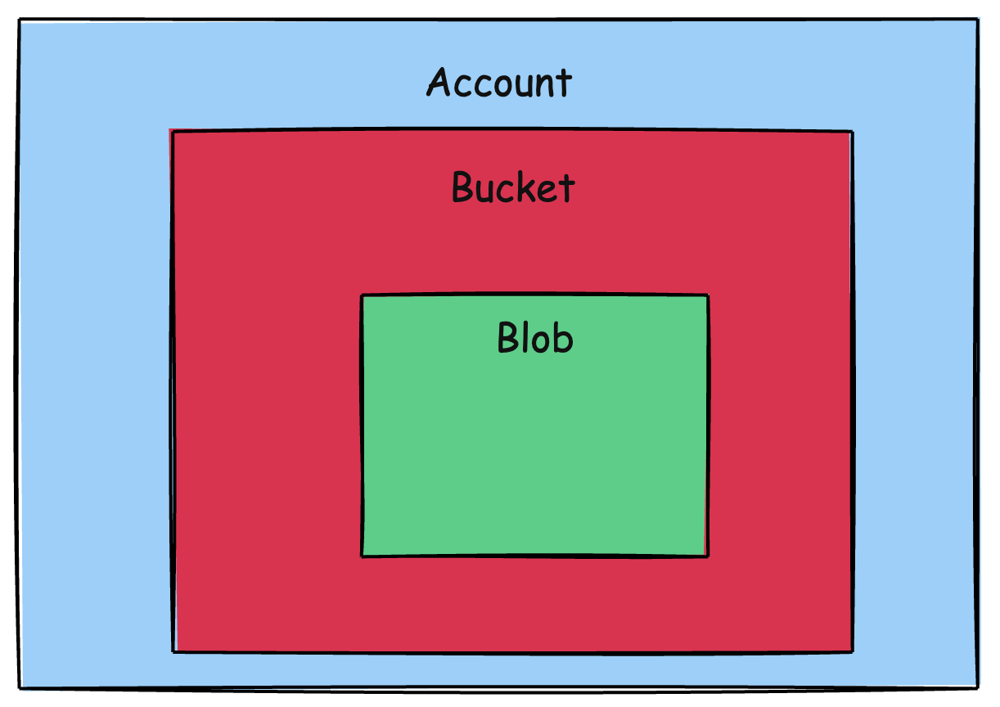

This is Part 24 of a series on Designing, Building & Packaging A Scalable, Testable .NET Open Source Component.

- [Designing, Building & Packaging A Scalable, Testable .NET Open Source Component - Part 1 - Introduction]()
- [Designing, Building & Packaging A Scalable, Testable .NET Open Source Component - Part 2 - Basic Requirements]()
- [Designing, Building & Packaging A Scalable, Testable .NET Open Source Component - Part 3 - Project Setup]()
- [Designing, Building & Packaging A Scalable, Testable .NET Open Source Component - Part 4 - Types & Contracts]()
- [Designing, Building & Packaging A Scalable, Testable .NET Open Source Component - Part 5 - Component Implementation]()
- [Designing, Building & Packaging A Scalable, Testable .NET Open Source Component - Part 6 - Mocking & Behaviour Tests]()
- [Designing, Building & Packaging A Scalable, Testable .NET Open Source Component - Part 7 - Sequence Verification With Moq]()
- [Designing, Building & Packaging A Scalable, Testable .NET Open Source Component - Part 8 - Compressor Implementation]()
- [Designing, Building & Packaging A Scalable, Testable .NET Open Source Component - Part 9 - Encryptor Implementation]()
- [Designing, Building & Packaging A Scalable, Testable .NET Open Source Component - Part 10 - In Memory Storage]()
- [Designing, Building & Packaging A Scalable, Testable .NET Open Source Component - Part 11 - SQL Server Storage]()
- [Designing, Building & Packaging A Scalable, Testable .NET Open Source Component - Part 12 - PostgreSQL Storage]()
- [Designing, Building & Packaging A Scalable, Testable .NET Open Source Component - Part 13 - Database Configuration]()
- [Designing, Building & Packaging A Scalable, Testable .NET Open Source Component - Part 14 - Virtualizing Infrastructure]()
- [Designing, Building & Packaging A Scalable, Testable .NET Open Source Component - Part 15 - Test Organization]()
- [Designing, Building & Packaging A Scalable, Testable .NET Open Source Component - Part 16 - Large File Consideration]()
- [Designing, Building & Packaging A Scalable, Testable .NET Open Source Component - Part 17 - Large File Consideration On PostgreSQL]()
- [Designing, Building & Packaging A Scalable, Testable .NET Open Source Component - Part 18 - Azure Blob Storage]()
- [Designing, Building & Packaging A Scalable, Testable .NET Open Source Component - Part 19 - Testing Azure Blob Storage Locally]()
- [Designing, Building & Packaging A Scalable, Testable .NET Open Source Component - Part 20 - Amazon S3 Storage]()
- [Designing, Building & Packaging A Scalable, Testable .NET Open Source Component - Part 21 - Testing Amazon S3 Storage Locally]()
- [Designing, Building & Packaging A Scalable, Testable .NET Open Source Component - Part 22 - Refactoring Azure Storage Engine For Initialization]()
- [Designing, Building & Packaging A Scalable, Testable .NET Open Source Component - Part 23 - Refactoring Amazon Storage Engine For Initialization]()
- **Designing, Building & Packaging A Scalable, Testable .NET Open Source Component - Part 24 - Google Cloud Storage (This Post)**

In the [last post in the series](}), we looked at how to refactor the `AmazonStorageEngine` for asynchronous initialization.

This post will implement storage on [Google Cloud Storage](https://cloud.google.com/storage?hl=en) - the `GoogleCloudStorageEngine`, completing support for all the major cloud providers - [Microsoft Azure Blob Storage](https://azure.microsoft.com/en-us/products/storage/blobs/), [Amazon S3](https://aws.amazon.com/s3/), and [Google Cloud Storage](https://cloud.google.com/storage?hl=en).

The first step is to understand the [Google Cloud](https://cloud.google.com/?hl=en) product we will use for storage: [Google Cloud Storage](https://cloud.google.com/storage?hl=en).

The main concepts we will deal with are:

1. Account
2. Bucket

### Account

This is the top level. It is accessed and manipulated using the [StorageClient](https://cloud.google.com/php/docs/reference/cloud-storage/latest/StorageClient).

### Bucket

This level is the equivalent of a directory.

An account can have more than one [bucket](https://www.techtarget.com/searchaws/definition/AWS-bucket). Objects are stored in the `buckets`.



Like our other storage engines, we will have **two** buckets - one to store the **file data**, and another to store the **file metadata**.

We will begin by implementing a class to store some preliminary settings (likely to change to factor in additional GCP concerns like authentication)

```c#
public class GoogleSettings
{
    [Required] public string ProjectID { get; set; } = null!;
    [Required] public string Location { get; set; } = null!;
}
```

Next, we begin to implement the `GoogleCloudStorageEngine`.

```C#
public sealed class GoogleCloudStorageEngine : IStorageEngine
{
  private readonly string _dataContainerName;
  private readonly string _metadataContainerName;
  private readonly StorageClient _client;

  private GoogleCloudStorageEngine(string accessToken, string dataContainerName,
  string metadataContainerName)
  {
    // Configuration for the Google client
    var credential = GoogleCredential.FromAccessToken(accessToken);

    _dataContainerName = dataContainerName;
    _metadataContainerName = metadataContainerName;
    _client = StorageClient.Create(credential);
  }
}
```

We next need to implement an `Initialization` method that will **create our buckets if they don’t already exist**. This will be run **once**, perhaps at **startup** so that the `GoogleCloudStorageEngine` will always find the buckets when it needs them.

```c#
public static async Task<GoogleCloudStorageEngine> InitializeAsync(string accessToken, GoogleSettings settings,
    string dataContainerName,
    string metadataContainerName,
    CancellationToken cancellationToken = default)
{
    var engine = new GoogleCloudStorageEngine(accessToken, dataContainerName,
        metadataContainerName);

    var client = await StorageClient.CreateAsync(GoogleCredential.FromAccessToken(accessToken));

    // Check if the metadata bucket exists
    try
    {
        await client.GetBucketAsync(metadataContainerName, cancellationToken: cancellationToken);
    }
    catch (GoogleApiException ex) when (ex.HttpStatusCode == HttpStatusCode.NotFound)
    {
        await client.CreateBucketAsync(settings.ProjectID, new Bucket
        {
            Name = metadataContainerName,
            Location = settings.Location,
            StorageClass = StorageClasses.Standard
        }, cancellationToken: cancellationToken);
    }

    // Check if the data bucket exists
    try
    {
        await client.GetBucketAsync(dataContainerName, cancellationToken: cancellationToken);
    }
    catch (GoogleApiException ex) when (ex.HttpStatusCode == HttpStatusCode.NotFound)
    {
        await client.CreateBucketAsync(settings.ProjectID, new Bucket
        {
            Name = dataContainerName,
            Location = settings.Location,
            StorageClass = StorageClasses.Standard
        }, cancellationToken: cancellationToken);
    }

    return engine;
}
```

We then go on to implement the various methods of the `IStorageEngine` interface.

First, a method that checks if a given `FileID` exists in a specified `bucket`:

```c#
private async Task<bool> FileExistsAsync(Guid fileId, string containerName,
    CancellationToken cancellationToken = default)
{
    try
    {
        await _client.GetObjectAsync(containerName, fileId.ToString(), cancellationToken: cancellationToken);
        return true;
    }
    catch (GoogleApiException ex) when (ex.HttpStatusCode == HttpStatusCode.NotFound)
    {
        return false;
    }
}
```

Next, `StoreFileAsync`:

```c#
public async Task<FileMetadata> StoreFileAsync(FileMetadata metaData, Stream data,
    CancellationToken cancellationToken = default)
{
    // Upload the data and the metadata in parallel
    await Task.WhenAll(
        _client.UploadObjectAsync(_metadataContainerName, objectName: metaData.FileId.ToString(),
            MediaTypeNames.Application.Json,
            source: new MemoryStream(Encoding.UTF8.GetBytes(JsonSerializer.Serialize(metaData))),
            cancellationToken: cancellationToken),
        _client.UploadObjectAsync(_dataContainerName, objectName: metaData.FileId.ToString(),
            null, source: data, cancellationToken: cancellationToken));
    return metaData;
}
```

Next, `GetMetadataAsync`:

```c#
public async Task<FileMetadata> GetMetadataAsync(Guid fileId, CancellationToken cancellationToken = default)
{
    //Verify file exists
    if (!await FileExistsAsync(fileId, _metadataContainerName, cancellationToken))
        throw new FileNotFoundException($"File {fileId} not found");

    // Retrieve the data
    using var memoryStream = new MemoryStream();
    await _client.DownloadObjectAsync(_metadataContainerName, fileId.ToString(), memoryStream,
        cancellationToken: cancellationToken);
    memoryStream.Position = 0;

    using var reader = new StreamReader(memoryStream);
    var content = await reader.ReadToEndAsync(cancellationToken);
    return JsonSerializer.Deserialize<FileMetadata>(content) ?? throw new FileNotFoundException();
}
```

Next, `GetFileAsync`:

```c#
public async Task<Stream> GetFileAsync(Guid fileId, CancellationToken cancellationToken = default)
{
    //Verify file exists
    if (!await FileExistsAsync(fileId, _dataContainerName, cancellationToken))
        throw new FileNotFoundException($"File {fileId} not found");

    var memoryStream = new MemoryStream();
    await _client.DownloadObjectAsync(_dataContainerName, fileId.ToString(), memoryStream,
        cancellationToken: cancellationToken);
    memoryStream.Position = 0;
    return memoryStream;
}
```

Next, `DeleteFileAsync`:

```c#
public async Task DeleteFileAsync(Guid fileId, CancellationToken cancellationToken = default)
{
  //Verify file exists
  if (!await FileExistsAsync(fileId, _dataContainerName, cancellationToken))
      throw new FileNotFoundException($"File {fileId} not found");

  // Delete metadata and data in parallel
  await Task.WhenAll(
      _client.DeleteObjectAsync(_metadataContainerName, fileId.ToString(), cancellationToken: cancellationToken),
      _client.DeleteObjectAsync(_dataContainerName, fileId.ToString(), cancellationToken: cancellationToken));
}
```

In our next post, we will look at how to **test this locally**.

**Note, however, we have not yet tested against the actual Google Cloud Storage, which will likely require some modifications to our configuration of the client, as well as authentication.**

### TLDR

**In this post, we implemented a storage engine for Google Cloud Storage, `GoogleCloudStorageEngine`**

The code is in my [GitHub](https://github.com/conradakunga/UploadFileManager).

Happy hacking!
