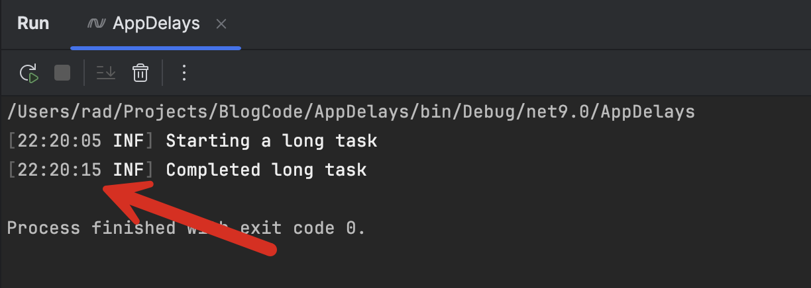
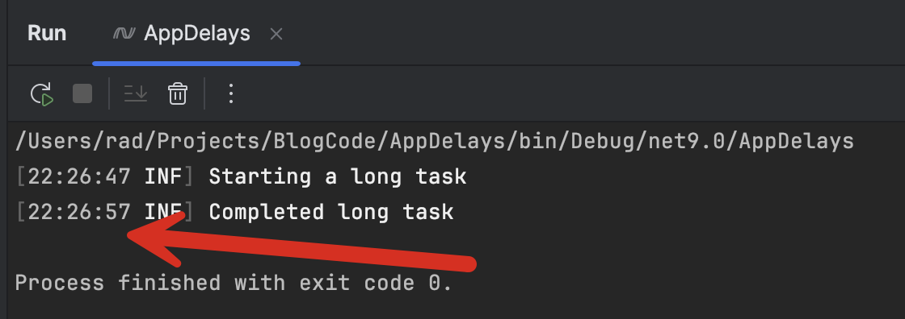

In the course of building applications, it is common to have scenarios where you want your code to wait for a certain duration before proceeding.

There are various reasons why you would want to do this:

1. To control the rate at which a computation takes place. For example, you want at least 30 seconds to elapse before the next attempt.
2. You want to retry an operation after a transient failure. For example, if an API invocation fails, you want to wait briefly before retrying.
3. For GUI applications, you want to give the UI thread time to update.

There are two ways to achieve this, which are similar yet also distinct.

1. Synchronously
2. Asynchronously

## Synchronously

In this dispensation, we use the [Sleep](https://learn.microsoft.com/en-us/dotnet/api/system.threading.thread.sleep?view=net-9.0) method of the [Thread](https://learn.microsoft.com/en-us/dotnet/api/system.threading.thread?view=net-9.0) class.

```c#
using Serilog;

Log.Logger = new LoggerConfiguration().WriteTo.Console().CreateLogger();

// Start fake task
Log.Information("Starting a long task");
// Sleep for 10 seconds
Thread.Sleep(TimeSpan.FromSeconds(10));
Log.Information("Completed long task");
```

If we run this code, we see the following:

```plaintext
[22:20:05 INF] Starting a long task
[22:20:15 INF] Completed long task

Process finished with exit code 0.
```



We can see that 10 seconds have elapsed, as requested.

## Asynchronously

To achieve the same result asynchronously, we use the [Delay](https://learn.microsoft.com/en-us/dotnet/api/system.threading.tasks.task.delay?view=net-9.0) method of the [Task](https://learn.microsoft.com/en-us/dotnet/api/system.threading.tasks.task?view=net-9.0).

```c#
// Start fake task
Log.Information("Starting a long task");
// Sleep for 10 seconds asynchronously
await Task.Delay(TimeSpan.FromSeconds(10));
Log.Information("Completed long task");
```

If we run this code, we get the following result:

```plaintext
/Users/rad/Projects/BlogCode/AppDelays/bin/Debug/net9.0/AppDelays
[22:26:47 INF] Starting a long task
[22:26:57 INF] Completed long task

Process finished with exit code 0.
```

We can see that here as well, there is a 10-second delay



A bonus of the `Task.Delay` method is that you can pass it a [CancellationToken](https://learn.microsoft.com/en-us/dotnet/api/system.threading.cancellationtoken?view=net-9.0) if you want to be able to cancel the operation. This is useful if the Delay is in the context of other operations that have passed down the `CancellationToken`.

```c#
Log.Information("Starting a long task");
// Create a cancellation token source
var cts = new CancellationTokenSource();
// Invoke method, and pass delay and token
await ComplexOperation(10, cts.Token);
Log.Information("Completed long task");
return;

// Complex method here that has a delay within
async Task ComplexOperation(int delayInSeconds, CancellationToken token)
{
    await Task.Delay(TimeSpan.FromSeconds(delayInSeconds), token);
}
```

At this point, you might be wondering what the **difference** is.

The main one is the fact that `Thread.Sleep` is **blocking**. This means the current thread **pauses execution and waits**, but during this waiting period, nothing else can be done.

`Task.Delay` is **non-blockin**g. This means that **the thread is returned to the pool,** and the **operating system can use it for other tasks** until the wait period elapses. This leads to a more responsive system.

Another difference is that you cannot use `Task.Delay` if you are in a **synchronous** method, or **anywhere up the call chain** has a synchronous method.

You can, however call `Thread.Sleep` from an asynchronous method. However, there is **no reason to do this,** as you can achieve the same result with `Task.Delay` and have a more responsive system.

### TLDR

**You can instruct your application to wait using either `Thread.Sleep` or Task.Delay, depending on whether your code is async or not. Wherever possible, use `Task.Delay`.**

**The code is in my GitHub.**

Happy hacking!
