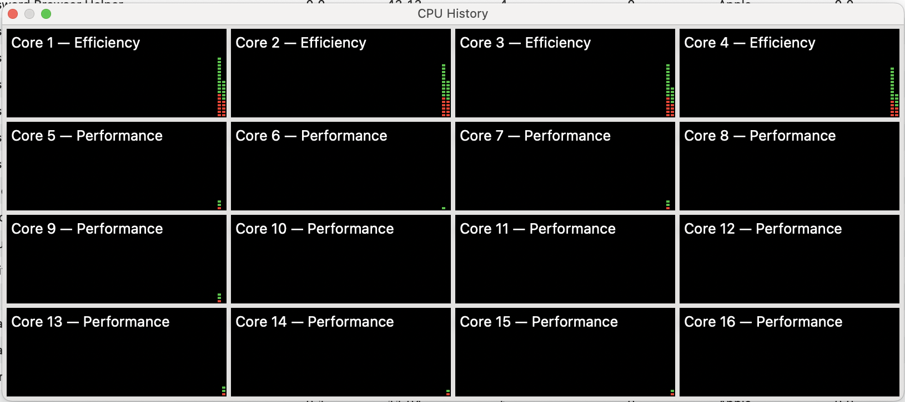

If you are doing any sort of parallel work, perhaps using [Parallel.ForEach](https://learn.microsoft.com/en-us/dotnet/api/system.threading.tasks.parallel.foreach?view=net-9.0), [Parallel.For](https://learn.microsoft.com/en-us/dotnet/api/system.threading.tasks.parallel.for?view=net-9.0), [Parallel.Invoke](https://learn.microsoft.com/en-us/dotnet/api/system.threading.tasks.parallel.invoke?view=net-9.0) or just a collection of plain old [Task](https://learn.microsoft.com/en-us/dotnet/api/system.threading.tasks.task?view=net-9.0) objects, you will might want to know how many CPUs are available.

The same would apply for the async equivalents - [Parallel.ForAsync](https://learn.microsoft.com/en-us/dotnet/api/system.threading.tasks.parallel.forasync?view=net-9.0) and [Parallel.ForEachAsync](https://learn.microsoft.com/en-us/dotnet/api/system.threading.tasks.parallel.foreachasync?view=net-9.0) 

This is available via the [ProcessorCount](https://learn.microsoft.com/en-us/dotnet/api/system.environment.processorcount?view=net-9.0) property of the [Environment](https://learn.microsoft.com/en-us/dotnet/api/system.environment?view=net-9.0) class.

```c#
var processorCount = Environment.ProcessorCount;

Console.WriteLine($"There are {processorCount} processors available on this machine");
```

This prints the following on my console:

```plaintext
There are 16 processors available on this machine
```

If I verify this empirically:



Which **tallies** with the result.

Notably, if the underlying machine has CPUs with multiple **cores**, this **count** is the result that will be returned.

Additionally, this number is determined at the **application's start**. If it subsequently changes - perhaps it is a **virtualized environment** that allows the change at runtime, or **native hardware with hot-swappable CPUs**, the count **will not be updated**.

### TLDR

**The `Environment.ProcessorCount` property will return the number of CPUs (or CPU cores) available to your application.**

Happy hacking!
