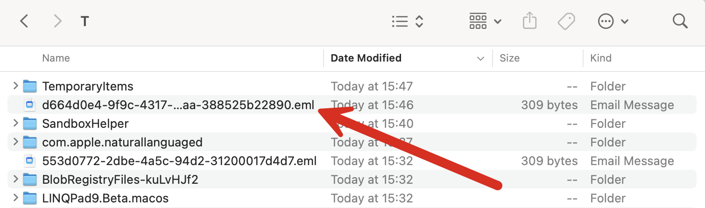

This is Part 2 of a series on sending email.

- [Sending Email in C# & .NET  - Part 1 - Introduction]()
- **Sending Email in C# & .NET  - Part 2 - Delivery (this post)**
- [Sending Email in C# & .NET - Part 3 - Using Gmail]()
- [Sending Email In C# & .NET - Part 4 - Using Office 365 & MS Graph API]()
- [Sending Email In C# & .NET - Part 5 - Using Google Cloud API]()
- [Sending Email In C# & .NET - Part 6 - Testing SMTP Locally Using PaperCut]()
- [Sending Email In C# & .NET - Part 7 - Sending Inline Images Using SMTP]()
- [Sending Email In C# & .NET - Part 8 - Sending HTML Email Using SMTP]()
- [Sending Email In C# & .NET - Part 9 - Sending Multiple Format Email Using SMTP]()

In our [previous post](), we looked at how to create email messages and configure various properties and parameters.

In this post, we will explore how to actually **deliver** the email.

The backbone of email delivery is the [SmtpClient](https://learn.microsoft.com/en-us/dotnet/api/system.net.mail.smtpclient?view=net-9.0) class, found in the [System.Net.Mail](https://learn.microsoft.com/en-us/dotnet/api/system.net.mail?view=net-9.0) namespace.

It can be configured in the following ways.

## Using A Pickup Directory

For testing without actually putting data into the ether, we can use a **pickup directory.**

This means that the email, rather than going to the internet, will be deposited in a **designated file system folder**, with the email itself persisted in the [eml](https://en.wikipedia.org/wiki/Email#Filename_extensions) format.

The first step is to select a folder for pickup. In my case, I will use the `Temp` folder, which I can retrieve using the [Path.GetTempPath()](https://learn.microsoft.com/en-us/dotnet/api/system.io.path.gettemppath?view=net-9.0&tabs=windows) method.

Next is to configure the `SmtpClient` to deliver using the method by setting the [DeliveryMethod](https://learn.microsoft.com/en-us/dotnet/api/system.net.mail.smtpclient.deliverymethod?view=net-9.0) property and setting the [PickupDirectoryLocation](https://learn.microsoft.com/en-us/dotnet/api/system.net.mail.smtpclient.pickupdirectorylocation?view=net-9.0#system-net-mail-smtpclient-pickupdirectorylocation) to the folder specified earlier.

```c#
// Get the temp folder
var pickupFolder = Path.GetTempPath();

Console.Eri

// Setup the SMTP client
var smtpClient = new SmtpClient
{
  DeliveryMethod = SmtpDeliveryMethod.SpecifiedPickupDirectory,
  PickupDirectoryLocation = Path.GetTempPath()

};

// Create and send email
var mail = new MailMessage
{
  From = new MailAddress("your-email@gmail.com"),
  Subject = "Test Email",
  Body = "This is a test email",
};

mail.To.Add("recipient@example.com");

try
{
  smtpClient.Send(mail);
  Console.WriteLine("Email sent successfully.");
}
catch (Exception ex)
{
  Console.WriteLine($"Failed to send email: {ex.Message}");
}
```

If we run this code, it should print the following:

```planitext
Setting delivery location to directory /var/folders/q8/cdslzt2s6p1djnhp_y3ksc280000gn/T/
Email sent successfully.
```

If we check the actual folder, we should see an `eml` file within.



Given that `eml` is actually a text file, you can open the contents in any editor.

```plaintext
X-Sender: your-email@gmail.com
X-Receiver: recipient@example.com
MIME-Version: 1.0
From: your-email@gmail.com
To: recipient@example.com
Date: 20 Jul 2025 15:32:56 +0300
Subject: Test Email
Content-Type: text/plain; charset=us-ascii
Content-Transfer-Encoding: quoted-printable

This is a test email

```

## Using a SMTP Server

The other, and probably the method you use most of the time, is to set the SMTP client to use an [actual SMTP server](https://aws.amazon.com/what-is/smtp/).

For this, you will need to know the following things:

1. The address of the server
2. The port to use
3. Credentials to access the server

The server could be something you run on your own network or a third-party service, such as Gmail or Office 365.

We will look at how to access each of these in upcoming posts in this series.

The code would look like this:

```c#
smtpClient = new SmtpClient
{
  Host = "102.168.0,67",
  Port = 24,
  Credentials = new NetworkCredential("your-email@domain.com", "your-password"),
  EnableSsl = true
};
```

In a scenario where you are using your **already logged-in credentials**, you would do it like this:

```c#
smtpClient = new SmtpClient
{
  Host = "102.168.0.67",
  Port = 24,
  Credentials = CredentialCache.DefaultNetworkCredentials,
  EnableSsl = true
};
```

In our next post, we will look at how to send email through [Gmail](https://www.gmail.com).

### TLDR

**The `SmtpClient` is the class tasked with doing the actual delivery of email, and can do so either using a pickup folder or using a SMTP server.**

The code is in my [GitHub](https://github.com/conradakunga/BlogCode/tree/master/2025-07-18%20-%20Delivering%20Email).

Happy hacking!
