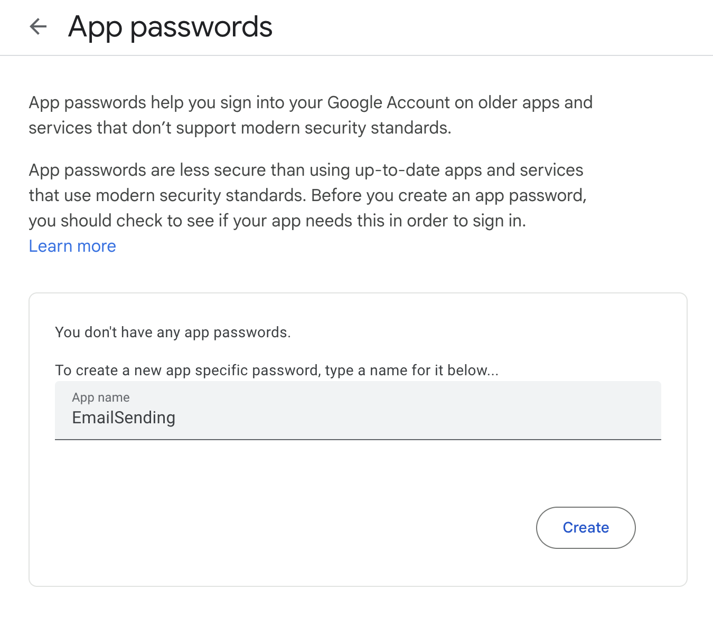
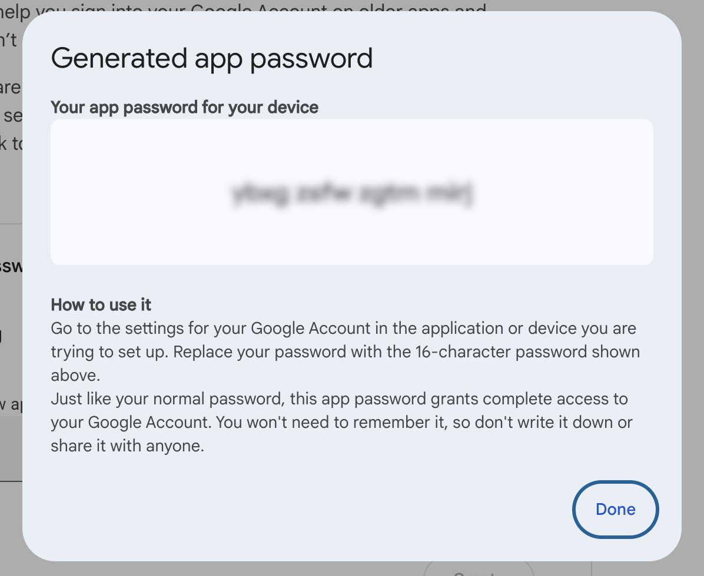
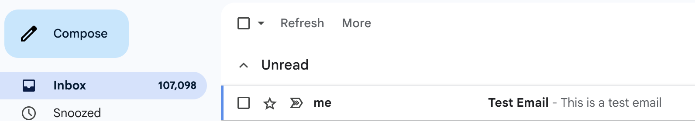
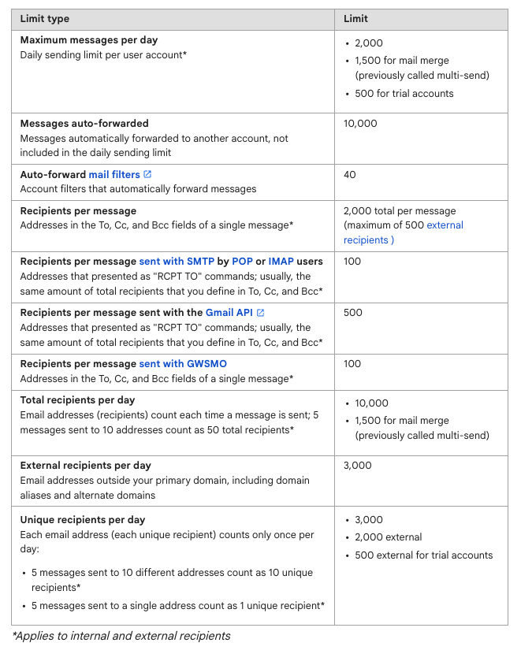

This is Part 3 of a series on sending email.

- [Sending Email in C# & .NET  - Part 1 - Introduction]()
- [Sending Email in C# & .NET - Part 2 - Delivery]()
- **Sending Email in C# & .NET - Part 3 - Using Gmail (This post)**
- [Sending Email In C# & .NET - Part 4 - Using Office 365 & MS Graph API]()
- [Sending Email In C# & .NET - Part 5 - Using Google Cloud API]()
- [Sending Email In C# & .NET - Part 6 - Testing SMTP Locally]()

In our [last post](), we looked at how to deliver email using a [SmtpClient](https://learn.microsoft.com/en-us/dotnet/api/system.net.mail.smtpclient?view=net-9.0).

In this post, we will look at how to send email using [Gmail](https://gmail.com).

The first issue to consider is authentication. How will we authenticate ourselves to Gmail?

To address this, we need to create an app password.

To do this, you need to visit this link ~> https://myaccount.google.com/apppasswords



You will be asked to provide a **name** for your **app-specific** password.

This means that you can create **several**, each for a **different application**, and **revoke** them as and when necessary. This is useful in situations where you **retire** an app or an app's **password is compromised**. You can **delete** or **regenerate** a new one under those circumstances.

When you click create, you get the following screen:



This is the password you will use, NOT your **Gmail user password** that you use to log in.

Once this is ready, you can proceed to write your code.

```c#
using System.Net;
using System.Net.Mail;

const string fromAddress = "conradakunga@gmail.com";
const string fromPassword = "YOUR APP PASSWORD";

// Setup the SMTP server
var smtpClient = new SmtpClient
{
    Host = "smtp.gmail.com",
    Port = 587,
    EnableSsl = true,
    DeliveryMethod = SmtpDeliveryMethod.Network,
    UseDefaultCredentials = false,
    Credentials = new NetworkCredential(fromAddress, fromPassword)
};

// Create and send email
var mail = new MailMessage
{
    From = new MailAddress(fromAddress),
    Subject = "Test Email",
    Body = "This is a test email",
};

mail.To.Add("conradakunga@gmail.com");

try
{
    smtpClient.Send(mail);
    Console.WriteLine("Email sent successfully.");
}
catch (Exception ex)
{
    Console.WriteLine($"Failed to send email: {ex.Message}");
}
```

If you run this code, you should see the following:

```plaintext
Email sent successfully.

Process finished with exit code 0.
```

You can then log in to Gmail to verify the same:



The email itself:


This flexibility, as with all things, is liable to be **abused**, so Gmail has put in place some limits to **throttle usage**:



These are outlined in detail in this [Gmail support post](https://support.google.com/a/answer/166852?sjid=14094088538818961824-EU).

In our next post, we will look at how to send email using [Office 365]().

### TLDR

**You can use the SMTPClient to send email through Gmail.**

The code is in my [GitHub](https://github.com/conradakunga/BlogCode/tree/master/2025-07-19%20-%20Sending%20To%20Gmail).

Happy hacking!
