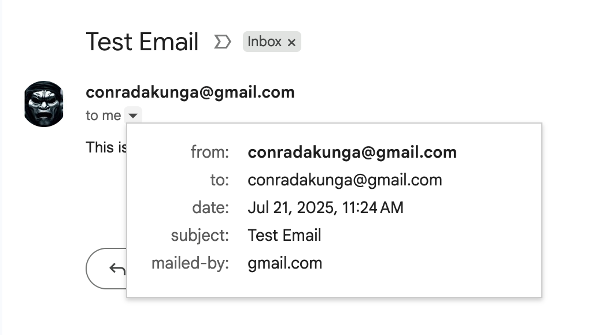

This is Part 3 of a series on sending email.

- [Sending Email in C# & .NET  - Part 1 - Introduction]()
- [Sending Email in C# & .NET - Part 2 - Delivery]()
- **Sending Email in C# & .NET - Part 3 - Using Gmail (This post)**

In our [last post](), we looked at how to deliver email using a [SmtpClient](https://learn.microsoft.com/en-us/dotnet/api/system.net.mail.smtpclient?view=net-9.0).

In this post, we will look at how to send email using [Gmail](https://gmail.com).

The first issue to consider is authentication. How will we authenticate ourselves to Gmail?

To address this, we need to create an app password.

To do this, you need to visit this link ~> https://myaccount.google.com/apppasswords


You will be asked to provide a name for you app-specific password.

This means that you can create several for serveral different applications, and revoke the same as and when necessary. 

When you click create, you get the following screen:


This is the password you will use, NOT your gmail password.

Once this is ready, you can proceed to write your code.

```c#
using System.Net;
using System.Net.Mail;

const string fromAddress = "conradakunga@gmail.com";
const string fromPassword = "YOUR APP PASSWORD";

// Setup the SMTP server
var smtpClient = new SmtpClient
{
    Host = "smtp.gmail.com",
    Port = 587,
    EnableSsl = true,
    DeliveryMethod = SmtpDeliveryMethod.Network,
    UseDefaultCredentials = false,
    Credentials = new NetworkCredential(fromAddress, fromPassword)
};

// Create and send email
var mail = new MailMessage
{
    From = new MailAddress(fromAddress),
    Subject = "Test Email",
    Body = "This is a test email",
};

mail.To.Add("conradakunga@gmail.com");

try
{
    smtpClient.Send(mail);
    Console.WriteLine("Email sent successfully.");
}
catch (Exception ex)
{
    Console.WriteLine($"Failed to send email: {ex.Message}");
}
```

If you run this code you should see the following:

```plaintext
Email sent successfully.

Process finished with exit code 0.
```

You can then login to Gmail to verify the same:


The email itself:



This flexibiality, as with all things, is liable to be absued, so Gmail has put in place some limits to throttle usage:

| **Limit type**                                               | **Limit**                                                    |
| :----------------------------------------------------------- | :----------------------------------------------------------- |
| **Maximum messages per day** Daily sending limit per user account* | 2,0001,500 for mail merge (previously called multi-send)500 for trial accounts |
| **Messages auto-forwarded** Messages automatically forwarded to another account, not included in the daily sending limit | 10,000                                                       |
| **Auto-forward [mail filters](https://support.google.com/mail/answer/6579)** Account filters that automatically forward messages | 40                                                           |
| **Recipients per message** Addresses in the To, Cc, and Bcc fields of a single message* | 2,000 total per message (maximum of 500 [external recipients )](https://support.google.com/a/answer/166852#external-recipients) |
| **Recipients per message [sent with SMTP](https://support.google.com/a/answer/2956491) by [POP](https://support.google.com/a/answer/12103) or [IMAP](https://support.google.com/a/answer/12103) users** Addresses that presented as "RCPT TO" commands; usually, the same amount of total recipients that you define in To, Cc, and Bcc* | 100                                                          |
| **Recipients per message sent with the [Gmail API](https://developers.google.com/gmail/api)** Addresses that presented as "RCPT TO" commands; usually, the same amount of total recipients that you define in To, Cc, and Bcc* | 500                                                          |
| **Recipients per message [sent with GWSMO](https://support.google.com/a/users/answer/172993)** Addresses in the To, Cc, and Bcc fields of a single message* | 100                                                          |
| **Total recipients per day** Email addresses (recipients) count each time a message is sent; 5 messages sent to 10 addresses count as 50 total recipients* | 10,0001,500 for mail merge (previously called multi-send)    |
| **External recipients per day** Email addresses outside your primary domain, including domain aliases and alternate domains | 3,000                                                        |
| **Unique recipients per day** Each email address (each unique recipient) counts only once per day:5 messages sent to 10 different addresses count as 10 unique recipients*5 messages sent to a single address count as 1 unique recipient* | 3,0002,000 external500 external for trial accounts           |

These are outlined in detail in this [Gmail support post](https://support.google.com/a/answer/166852?sjid=14094088538818961824-EU)

### TLDR

You can use the SMTPClient to send email through Gmail.

**The code is in my GitHub.**

Happy hacking!
