This is Part 4 of a series on sending email.

- [Sending Email in C# & .NET  - Part 1 - Introduction]()
- [Sending Email in C# & .NET - Part 2 - Delivery]()
- [Sending Email in C# & .NET - Part 3 - Using Gmail]()
- **Sending Email In C# & .NET - Part 4 - Using Office 365 & MS Graph API (This Post)** 
- [Sending Email In C# & .NET - Part 5 - Using Google Cloud API]()
- [Sending Email In C# & .NET - Part 6 - Testing SMTP Locally Using PaperCut]()
- [Sending Email In C# & .NET - Part 7 - Sending Inline Images Using SMTP]()
- [Sending Email In C# & .NET - Part 8 - Sending HTML Email Using SMTP]()
- [Sending Email In C# & .NET - Part 9 - Sending Multiple Format Email Using SMTP]()

In our [last post](), we looked at how to send email using [Gmail](https://mail.google.com/mail/).

In this post, we will look at how to send email using [Office 365](https://www.office.com/).

Historically, it was possible to send email through [SMTP](https://aws.amazon.com/what-is/smtp/). However, Microsoft is deprecating this and recommending the use of the [Graph API](https://learn.microsoft.com/en-us/graph/use-the-api).

It requires quite a bit more legwork, as outlined below. 

First, register an app in the [Azure Portal](https://portal.azure.com/). You will need to create an [Azure](https://azure.microsoft.com/en-us/) account if you do not already have one.

Once logged in, search for **app registrations**.

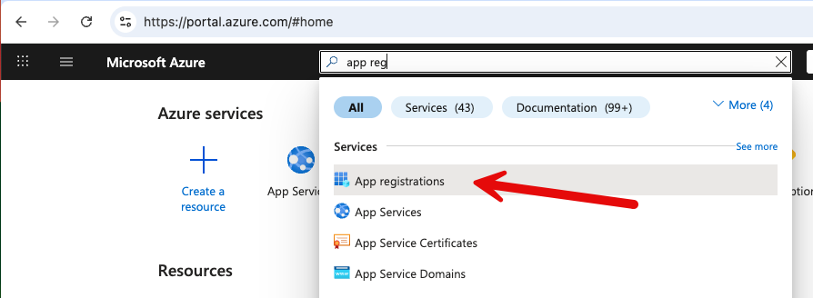

This will take you to a listing of all your registered applications, if any.

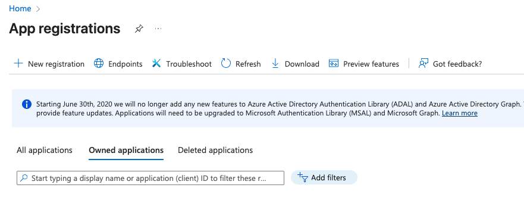

The next step is to register an application.

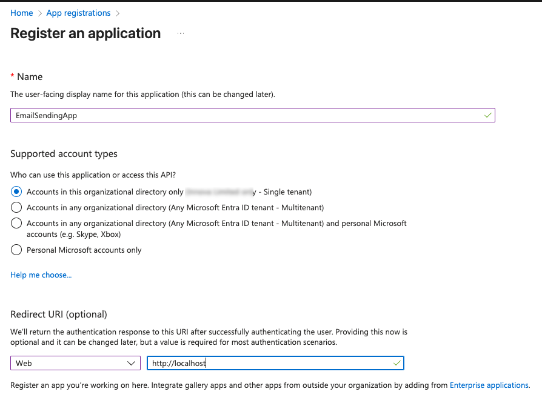

It is probably a good idea to set the **redirect URL** for the application. Note that the URL is http://localhost

You typically want a **single-tenant** application, at least for the purposes of this demo. You can later return to this screen and expand the scope if needed.

Once you save, you will be taken to the following screen.

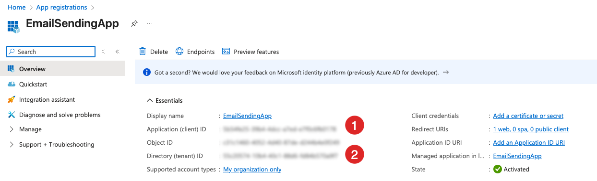

From here, you will need two things:

1. The **application** (or **client**) ID
2. The **directory** (or **tenant**) ID

The next step is to navigate to the API permissions.

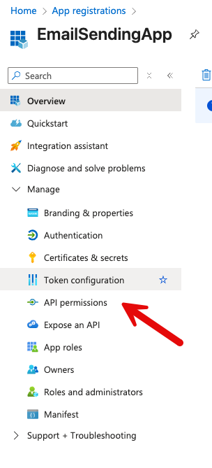

This will take you to a listing of the granted permissions. Typically, there will be at least one automatically granted - `User.Read`.

Click on **Add Permission**

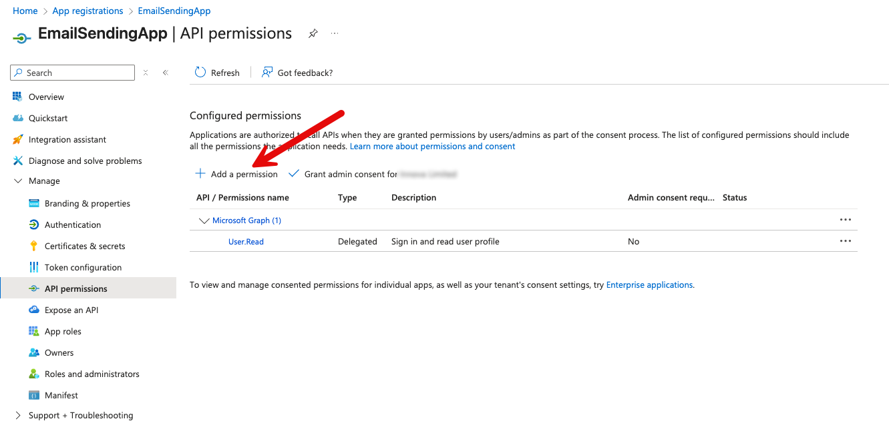

This will take you to a screen where you can select permissions from multiple applications.

We want the first one, [Microsoft Graph](https://learn.microsoft.com/en-us/graph/overview).

In the next screen, we can define the **type** of permissions we want, as well as the specific permissions.

In this case, we want **Application Permissions**.

We then search for the permission we need, which is `Mail.Send`.

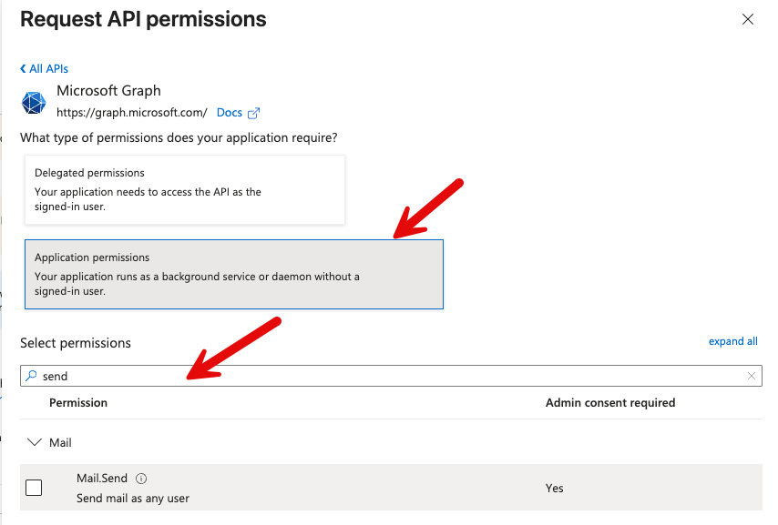

There is one more step in the permissions setup - you need to **Grant Admin Consent** for the application

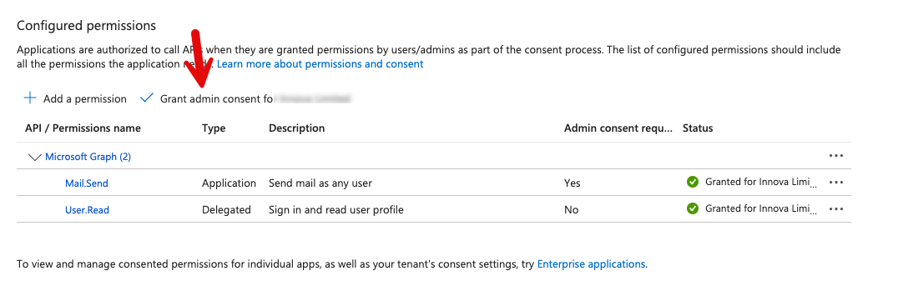

The final step is to generate the **client secret** from the overview screen. This is part of the information that you will need to provide to **authenticate** your application.

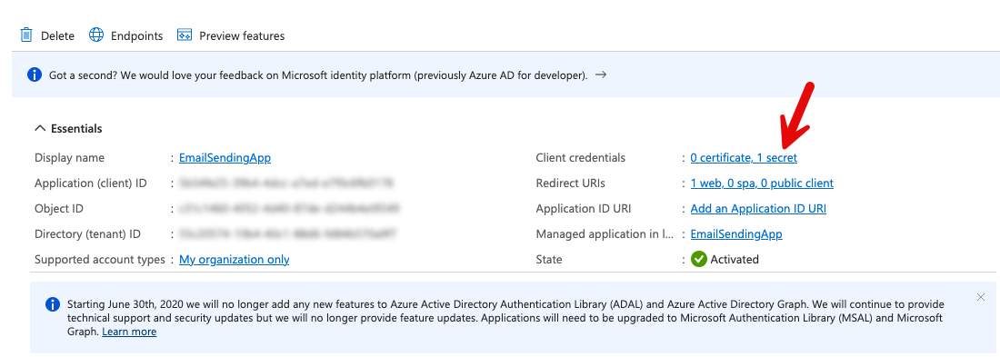

The next screen will list your client's current secrets.

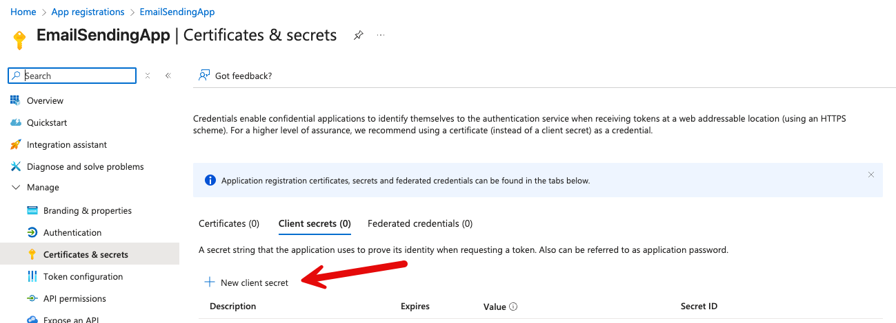

Click on **New Client Secret**.

The next screen will allow you to configure your secret, typically a name and an expiry.

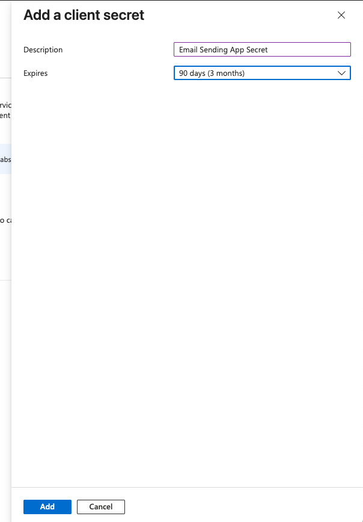

Upon adding, you will return to the listing screen, which displays two tokens: the **Secret ID** `(1) `and the **Value** `(2)`.

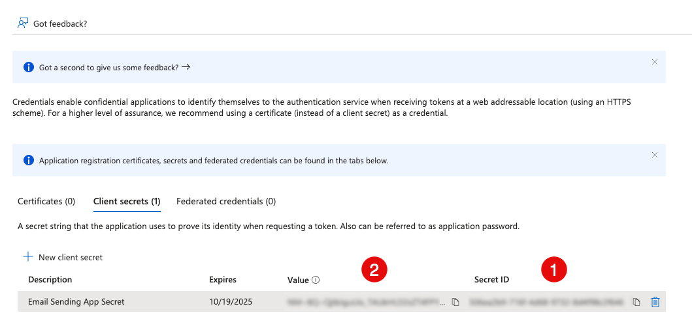

What we need is the `Value`.

Finally, we are ready to write the code.

This process was **surprisingly difficult because a lot of the documentation and samples online are either incorrect or out of date.**.

Install the following package - [Microsoft.Graph](https://www.nuget.org/packages/Microsoft.Graph/). **Make sure the version is version 5 or above**. **Version 4** will give you **problems**.

At the time of writing this, the latest version is 5.86

```bash
dotnet add package Microsoft.Graph --version 5.86.0
```

Next, add the [Azure.Identity](https://www.nuget.org/packages/Azure.Identity/) package. This has been necessary since the introduction of version `5` of the Graph API.

```bash
dotnet add package Azure.Identity --version 1.14.2
```

Next is to write the code that sends the email, which is composed of these steps:

1. Define the [scope](https://learn.microsoft.com/en-us/entra/identity-platform/scopes-oidc) for the application
2. Create a [ClientSecretCredential](https://learn.microsoft.com/en-us/dotnet/api/azure.identity.clientsecretcredential?view=azure-dotnet) from
    1. `TenantID`
    2. `ClientID`
    3. `ClientSecret`
3. Create a `GraphServiceClient`
4. Create a `Message` (email)
5. Send the email

The code is as follows:

```c#
using Azure.Identity;
using Microsoft.Graph;
using Microsoft.Graph.Models;
using Microsoft.Graph.Users.Item.SendMail;

const string applicationID = "APPLICATION_ID";
const string tenantID = "TENANT_ID";
const string secretValue = "CLIENT_SECRET";
const string fromAddress = "cakunga@innova.co.ke";
const string toAddress = "conradakunga@gmail.com";

try
{
    // Set our scopes to the default
    var scopes = new[] { "https://graph.microsoft.com/.default" };

    // Create TokenCredential
    var credential = new ClientSecretCredential(tenantID, applicationID, secretValue);

    // Create Graph client
    var graphClient = new GraphServiceClient(credential, scopes);

    // Build email
    var message = new Message
    {
        Subject = "Test Email",
        Body = new ItemBody
        {
            ContentType = BodyType.Text,
            Content = "Test email"
        },
        ToRecipients =
        [
            new Recipient
            {
                EmailAddress = new EmailAddress
                {
                    Address = toAddress
                }
            }
        ]
    };

    // Send email
    await graphClient.Users[fromAddress].SendMail.PostAsync(new SendMailPostRequestBody
    {
        Message = message
    });
    
    Console.WriteLine("Message sent");
}
catch (Exception ex)
{
    Console.WriteLine(ex.Message);
}
```

If we run this code, it should print the following:

```plaintext
"/Users/rad/Projects/BlogCode/2025-07-17 - Sending To Office365/bin/Debug/net9.0/SendingEmail"
Message sent

Process finished with exit code 0.
```

And our inbox should have the email:

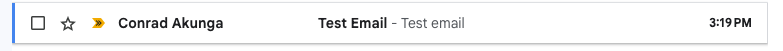

An important consideration to keep in mind is that there are **throttling limits** in place to prevent **abuse of this API** and **denial-of-service degradation** from code with inadvertent bugs, such as a loop with a bug in the exit clause.

You can view these limits [here](https://learn.microsoft.com/en-us/graph/throttling-limits).

The most pertinent ones are these:

1. **150** requests per **15** minutes
2. **10,000** requests per **24 hours**

There are per-tenant limits.

This means that each tenant can send at most **150** emails every **15** minutes, and over a 12-hour period, at most **10,000** emails.

This means that this solution will not work for mass email situations. We will look at how to achieve that in later posts.

In our [next post](), we will look at how to send email using the [Google Cloud API]().

### TLDR

**The recommended way to send email using Office 365 is to use the `Graph API`**

The code is in my [GitHub](https://github.com/conradakunga/BlogCode/tree/master/2025-07-20%20-%20Sending%20To%20Office365).

Happy hacking!
