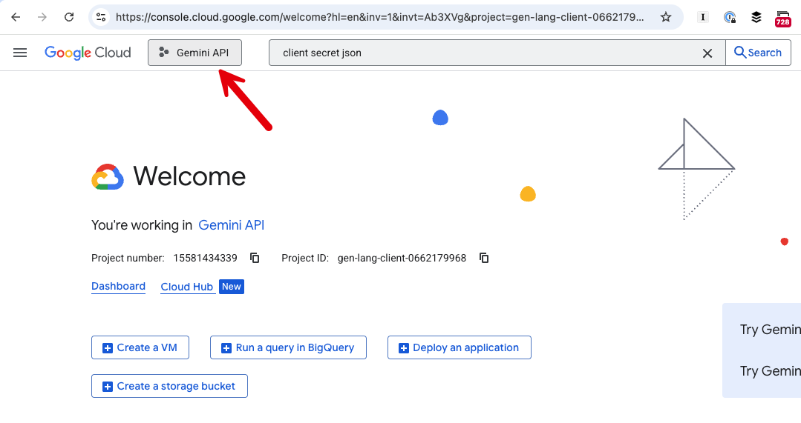
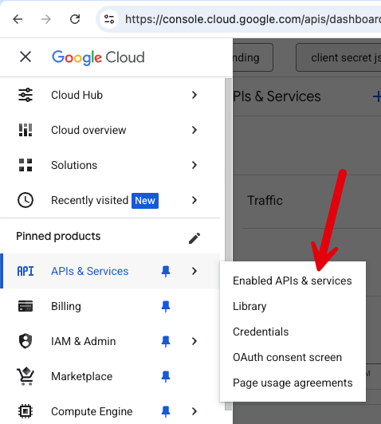
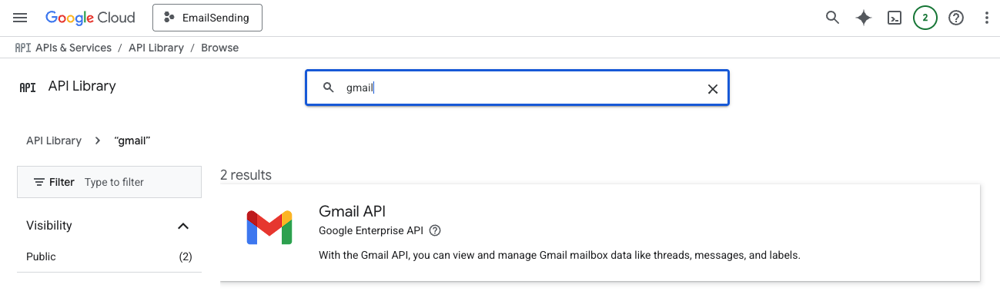
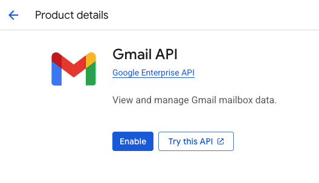

This is Part 5 of a series on sending email.

- [Sending Email in C# & .NET  - Part 1 - Introduction]()
- [Sending Email in C# & .NET - Part 2 - Delivery]()
- [Sending Email in C# & .NET - Part 3 - Using Gmail]()
- [Sending Email In C# & .NET - Part 4 - Using Office 365 & MS Graph API]()
- **Sending Email In C# & .NET - Part 5 - Using Google Cloud API (This Post)**
- [Sending Email In C# & .NET - Part 6 - Testing SMTP Locally Using PaperCut]()
- [Sending Email In C# & .NET - Part 7 - Sending Inline Images Using SMTP]()
- [Sending Email In C# & .NET - Part 8 - Sending HTML Email Using SMTP]()
- [Sending Email In C# & .NET - Part 9 - Sending Multiple Format Email Using SMTP]()

In our [previous post](), we explored how to create and configure an application on [Azure](https://azure.microsoft.com/en-us/) to send email and how to utilize the [Microsoft Graph API](https://learn.microsoft.com/en-us/graph/use-the-api) for email sending.

In an earlier post, we had looked at how to use the [SmtpClient](https://learn.microsoft.com/en-us/dotnet/api/system.net.mail.smtpclient?view=net-9.0) to send email using the Google SMTP server. 

In this post, we will look at how to use the [Google Cloud API](https://cloud.google.com/?hl=en) to send email.

The first step is to **create an account** if you don't already have one, at [https://console.cloud.google.com/](https://console.cloud.google.com/).


Once you are logged in, click on the **project picker** indicated below.



This will list the current projects for you and provide an option to **create a new one**.


Go ahead and click that, and provide a **name** for your project.


Once done, click on **APIs & Services**, and then **Credentials**.


You will see a message on configuring the consent screen.

Click on that.

You will be taken to a screen to configure the **Google Auth platform.**


First, give your app a name, and provide a **support email**.


Next, specify your **audience**.


For consumer **Gmail accounts, you must choose external**. But if you have a [Google Workspace account](https://workspace.google.com/), you can choose either.

Finally specify your **contact** information.


The next step is to create an **Oauth Client**.


Click on the button and you will be taken to this screen:


The name is anything you want, but the application type for our example is **Desktop app**. 

On completion, you should see your client listed.


Next, navigate to **APIs & Services** > **Enabled APIs & Services**.



This will take you to a screen with an option to **Enable APIs and services**.


From here, search for **Gmail**


You should see a result screen listing the matches.



Click on **Gmail API**.



From here you can click **Enable** so that this API is available to your project.

Finally, we need to configure the **audience** allowed to access this API.

The top of the screen has a search box


Type **audience** and then search.


Select the first result, and scroll down to **Test Users**.

From here, click **Add users**.

**You will have to add yourself here**, so that Google will allow you to access the application and APIs.


Finally, we can write the code to send the email.

You will need two packages from Google - [Google.Apis.Gmail.v1](https://www.nuget.org/packages/Google.Apis.Gmail.v1) and [Google.Apis.Auth](https://www.nuget.org/packages/Google.Apis.Auth)

```bash
dotnet add package Google.Apis.Auth
dotnet add package Google.Apis.Gmail.v1
```

To make it easier to manipulate some of the lower level constructs, we use the [MimeKit](https://www.nuget.org/packages/MimeKit) library

```c#
dotnet add package MimeKit
```

Next, you will need to create a JSON file that contains the **parameters required to authenticate your application**. This file will be in the **root** of your project.


The file is structured as follows:

```json
{
  "installed": {
    "client_id": "YOUR-CLIENT-ID",
    "project_id": "YOUR-PROJECT_ID",
    "auth_uri": "https://accounts.google.com/o/oauth2/auth",
    "token_uri": "https://oauth2.googleapis.com/token",
    "auth_provider_x509_cert_url": "https://www.googleapis.com/oauth2/v1/certs",
    "client_secret": "YOUR-CLIENT-SECRET",
    "redirect_uris": [
      "urn:ietf:wg:oauth:2.0:oob",
      "http://localhost"
    ]
  }
}
```

**Replace as appropriate**, and save the file as `client_secrets.json`.

To ensure that this file is copied  to the build folder, add the following  `XML` tag to the `.csproj`.

```xml
<ItemGroup>
    <None Update="client_secrets.json">
        <CopyToOutputDirectory>Always</CopyToOutputDirectory>
    </None>
</ItemGroup>
```

It should now look like this:

```xml
<Project Sdk="Microsoft.NET.Sdk">
    <PropertyGroup>
        <OutputType>Exe</OutputType>
        <TargetFramework>net9.0</TargetFramework>
        <ImplicitUsings>enable</ImplicitUsings>
        <Nullable>enable</Nullable>
    </PropertyGroup>

    <ItemGroup>
        <PackageReference Include="Google.Apis.Auth" Version="1.70.0"/>
        <PackageReference Include="Google.Apis.Gmail.v1" Version="1.70.0.3833"/>
        <PackageReference Include="MimeKit" Version="4.13.0"/>
    </ItemGroup>
    <ItemGroup>
        <None Update="client_secrets.json">
            <CopyToOutputDirectory>Always</CopyToOutputDirectory>
        </None>
    </ItemGroup>
</Project>

```

Finally, we write the code that **sends the email**.

```c#
using System.Text;
using Google.Apis.Auth.OAuth2;
using Google.Apis.Gmail.v1;
using Google.Apis.Gmail.v1.Data;
using Google.Apis.Services;
using MimeKit;

// Setup our parameters
const string applicationName = "EmailAppDesktopClient";
const string fromAddress = "conradakunga@gmail.com";
const string toAddress = "cakunga@innova.co.ke";

try
{
    // Set our desired scopes
    var scopes = new[] { GmailService.Scope.GmailSend };

    // Read our credentials from JSON
    UserCredential credential;
    await using (var stream = new FileStream("client_secrets.json", FileMode.Open, FileAccess.Read))
    {
        credential = await GoogleWebAuthorizationBroker.AuthorizeAsync(GoogleClientSecrets.FromStream(stream).Secrets,
            scopes, "user", CancellationToken.None
        );
    }

    // Initialize the service
    var service = new GmailService(new BaseClientService.Initializer
    {
        HttpClientInitializer = credential,
        ApplicationName = applicationName
    });

    // Create a MIME message
    var email = new MimeMessage();
    email.From.Add(new MailboxAddress(fromAddress, fromAddress));
    email.To.Add(new MailboxAddress(toAddress, toAddress));
    email.Subject = "Test Subject";
    email.Body = new TextPart("plain")
    {
        Text = "Test Email"
    };

    // Encode the message
    using var memoryStream = new MemoryStream();
    email.WriteTo(memoryStream);
    var rawMessage = Convert.ToBase64String(memoryStream.ToArray())
        .Replace('+', '-').Replace('/', '_').Replace("=", "");

    // Create a message
    var message = new Message
    {
        Raw = rawMessage,
    };

    // Send the message
    await service.Users.Messages.Send(message, "me").ExecuteAsync();

    Console.WriteLine("Message sent");
}
catch (Exception ex)
{
    Console.WriteLine(ex.Message);
}
```

If we run the code, your browser will open with an OAUTH prompt:


Select the account that you added earlier to **Test Users**, or login with that account.

You will get this second screen:


Click continue.


The next screen is a **confirmation of the requested security scope** - **sending** email.

Click **continue**.

The final screen will inform you that your application is now **authenticated** and **authorized**.


Your email should now be sent.

```plaintext
"/Users/rad/Projects/BlogCode/2025-07-21 - Sending Via Google Cloud/bin/Debug/net9.0/SendingEmail"
Message sent

Process finished with exit code 0.

```

As with all the other messaging APIs, there are **throttling limits in place to prevent abuse**. You can read the limits [here](https://developers.google.com/workspace/gmail/api/reference/quota).

In the [next post](), we will look at how to test SMTP email delivery locally.

### TLDR

**You can also use the Google Cloud APIs to send email and access additional Gmail functionality.**

The code is in my [GitHub](https://github.com/conradakunga/BlogCode/tree/master/2025-07-21%20-%20Sending%20Via%20Google%20Cloud).

Happy hacking!
