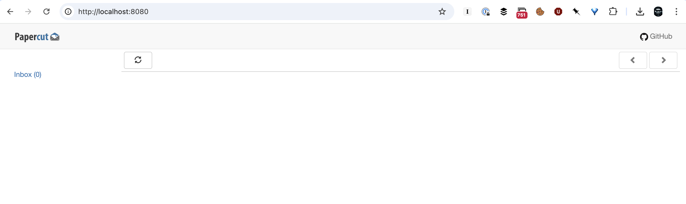
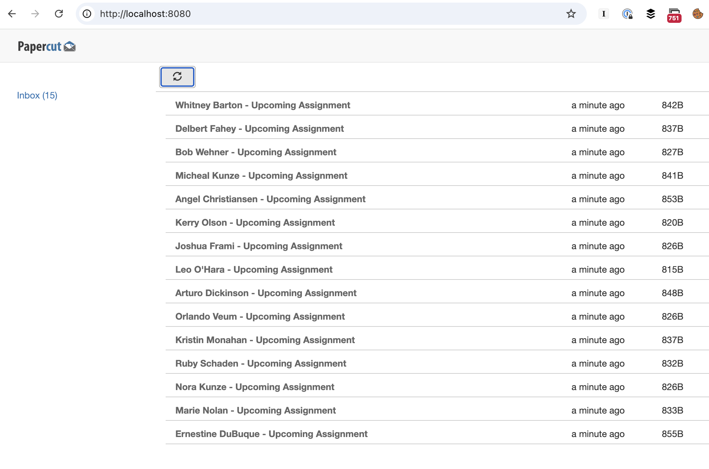
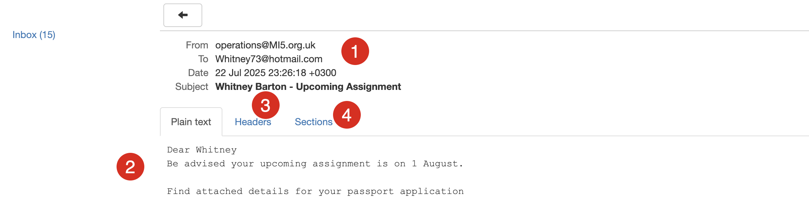
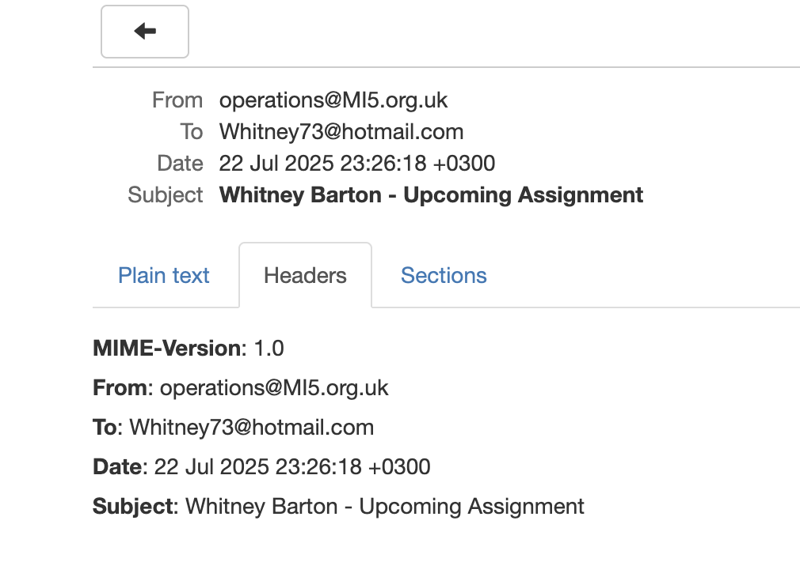
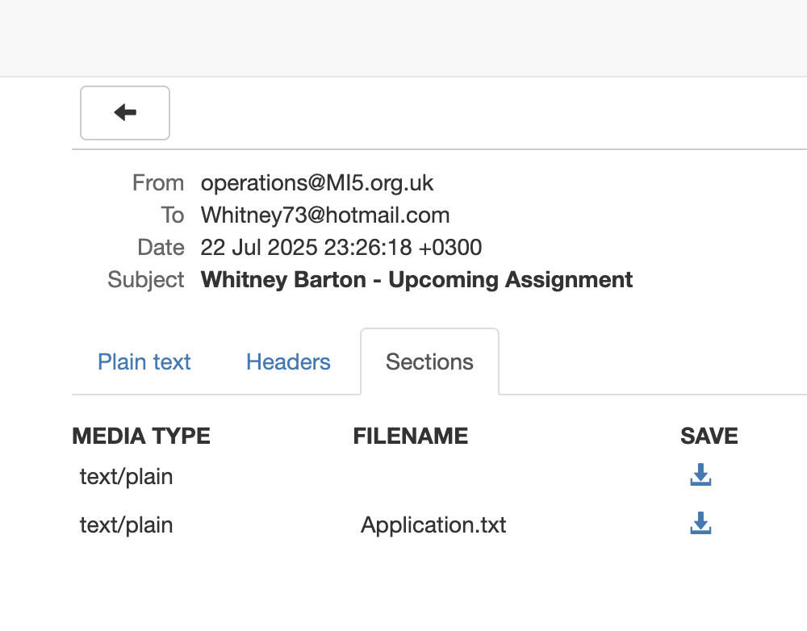

This is Part 6 of a series on sending email.

- [Sending Email in C# & .NET  - Part 1 - Introduction]()
- [Sending Email in C# & .NET - Part 2 - Delivery]()
- [Sending Email in C# & .NET - Part 3 - Using Gmail]()
- [Sending Email In C# & .NET - Part 4 - Using Office 365 & MS Graph API]()
- [Sending Email In C# & .NET - Part 5 - Using Google Cloud API]()
- **Sending Email In C# & .NET - Part 6 - Testing SMTP Locally  Using PaperCut (This post)**
- [Sending Email In C# & .NET - Part 7 - Sending Inline Images Using SMTP]()
- [Sending Email In C# & .NET - Part 8 - Sending HTML Email Using SMTP]()
- [Sending Email In C# & .NET - Part 9 - Sending Multiple Format Email Using SMTP]()
- [Sending Email In C# & .NET - Part 10 - Sending Plain Text Email Using MailKit]()
- [Sending Email In C# & .NET - Part 11 - Sending HTML Email Using MailKit]()
- [Sending Email In C# & .NET - Part 12 - Sending Email With Attachments Using MailKit]() 
- [Sending Email In C# & .NET - Part 13 - Sending Email With Inline Attachments Using MailKit]()
- [Sending Email In C# & .NET - Part 14 - Sending Multiple Format Email Using MailKit]()
- [Sending Email In C# & .NET - Part 15 - Sending Calendar Invites Using MailKit]()
- [Sending Email In C# & .NET - Part 16 - Testing SMTP Locally Using Mailpit]()

In the post [Sending Email In C# & .NET - Part 2 - Delivery]() we discussed how to deliver email, and mentioned that there were two methods:

- A pickup **folder**
- Sending to a **SMTP server**

In the age of spam and bots, it is very difficult to find an open [SMTP relay](https://www.mailjet.com/blog/email-best-practices/what-is-an-smtp-relay/).

Also, perhaps you **don't want to send an actual email** over the internet to the recipient, but instead **simulate the experience**, perhaps in a **test** environment, to confirm that your email is generated and sent as you expect.

One way is to **install and configure your own SMTP software**, like [sendmail](https://en.wikipedia.org/wiki/Sendmail). This, however, is probably overkill.

A much simpler option is to use the [PaperCut](https://github.com/ChangemakerStudios/Papercut-SMTP) [docker](https://www.docker.com/) [image](https://hub.docker.com/r/changemakerstudiosus/papercut-smtp).

This consists of an **SMTP server** and a **user interface** that allows you to see exactly how your email was delivered.

Let us create a scenario where we need to send a number of emails.

We have a list of 15 `Spy` entities. We would like to notify them of an upcoming mission on August 1 by email. Attached to this email will be a text file containing the `Spy` name, age, and gender that they will use to apply for a cover passport.

The `Spy` entity looks like this:

```c#
public sealed record Spy
{
    public string Firstname { get; init; }
    public string Surname { get; init; }
    public Gender Gender { get; init; }
    public string EmailAddress { get; init; }
    public DateOnly DateOfBirth { get; set; }
}
```

The `Gender` `enum` looks like this:

```c#
public enum Gender
{
    Male,
    Female
}
```

Next, we write code to generate 15 `Spy` entities using [Bogus](https://www.nuget.org/packages/bogus).

```c#
using Bogus;
using Bogus.DataSets;

var faker = new Faker<Spy>()
    // Use a fixed seed
    .UseSeed(0)
    // Pick a random gender
    .RuleFor(spy => spy.Gender, faker => faker.PickRandom<Gender>())
    // Configure first name, gender-specific
    .RuleFor(spy => spy.Firstname,
        (faker, spy) => faker.Name.FirstName(spy.Gender == Gender.Male
            ? Name.Gender.Male
            : Name.Gender.Female))
    // Configure surname
    .RuleFor(spy => spy.Surname, faker => faker.Person.LastName)
    // Configure email
    .RuleFor(spy => spy.EmailAddress, (faker, spy) => faker.Internet.Email(spy.Firstname, spy.Surname))
    // Set date of birth is 50 years in the past max
    .RuleFor(spy => spy.DateOfBirth, t => DateOnly.FromDateTime(t.Date.Past(50)));

// Generate 15
var spies = faker.Generate(15);
```

Before we write the code to generate the email, we run the PaperCut docker container.

```bash
docker run -d -p 8080:80 -p 25:25 changemakerstudiosus/papercut-smtp:latest
```

This will run the SMTP server on port `25`, and the email UI on `8080`.

If we navigate to the admin UI, we should see the following:



You can see that there are no emails present.

Finally, we generate the emails.

```c#
// Create SMTPClient
var smtpClient = new SmtpClient
{
    Host = "localhost",
    Port = 25,
    Credentials = CredentialCache.DefaultNetworkCredentials
};

const string fromAddress = "operations@MI5.org.uk";

// Create emails in a loop
foreach (var spy in spies)
{
    var email = new MailMessage
    {
        From = new MailAddress(fromAddress),
        To = { new MailAddress(spy.EmailAddress) },
        Subject = $"{spy.Firstname} {spy.Surname} - Upcoming Assignment",
        Body = $"""
                Dear {spy.Firstname} 
                Be advised your upcoming assignment is on 1 August.

                Find attached details for your passport application
                """
    };

    // Prepare the attachment
    var details = $"""
                   First Name: {spy.Firstname}
                   Surname: {spy.Surname}
                   Date of Birth: {spy.DateOfBirth}
                   gender: {spy.Gender}
                   """;
    var stream = new MemoryStream(Encoding.UTF8.GetBytes(details));
    email.Attachments.Add(new Attachment(stream, "Application.txt", MediaTypeNames.Text.Plain));

    // Send the email
    try
    {
        Log.Information("Sending email to {Recipient}", spy.EmailAddress);
        smtpClient.Send(email);
        Log.Information("Email sent");
    }
    catch (Exception ex)
    {
        Log.Error(ex, "Error sending email to {Recipient}", spy.EmailAddress);
    }
}
```

The complete code is as follows:

```c#
using System.Net;
using System.Net.Mail;
using System.Net.Mime;
using System.Text;
using Bogus;
using Bogus.DataSets;
using Serilog;

// Setup logging
Log.Logger = new LoggerConfiguration().WriteTo.Console().CreateLogger();

var faker = new Faker<Spy>()
    // Use a fixed seed
    .UseSeed(0)
    // Pick a random gender
    .RuleFor(spy => spy.Gender, faker => faker.PickRandom<Gender>())
    // Configure first name, gender-specific
    .RuleFor(spy => spy.Firstname,
        (faker, spy) => faker.Name.FirstName(spy.Gender == Gender.Male
            ? Name.Gender.Male
            : Name.Gender.Female))
    // Configure surname
    .RuleFor(spy => spy.Surname, faker => faker.Person.LastName)
    // Configure email
    .RuleFor(spy => spy.EmailAddress, (faker, spy) => faker.Internet.Email(spy.Firstname, spy.Surname))
    // Set date of birth is 50 years in the past max
    .RuleFor(spy => spy.DateOfBirth, t => DateOnly.FromDateTime(t.Date.Past(50)));

// Generate 15
var spies = faker.Generate(15);

// Create SMTPClient
var smtpClient = new SmtpClient
{
    Host = "localhost",
    Port = 25,
    Credentials = CredentialCache.DefaultNetworkCredentials
};

const string fromAddress = "operations@MI5.org.uk";

// Create emails in a loop
foreach (var spy in spies)
{
    var email = new MailMessage
    {
        From = new MailAddress(fromAddress),
        To = { new MailAddress(spy.EmailAddress) },
        Subject = $"{spy.Firstname} {spy.Surname} - Upcoming Assignment",
        Body = $"""
                Dear {spy.Firstname} 
                Be advised your upcoming assignment is on 1 August.

                Find attached details for your passport application
                """
    };

    // Prepare the attachment
    var details = $"""
                   First Name: {spy.Firstname}
                   Surname: {spy.Surname}
                   Date of Birth: {spy.DateOfBirth}
                   gender: {spy.Gender}
                   """;
    var stream = new MemoryStream(Encoding.UTF8.GetBytes(details));
    email.Attachments.Add(new Attachment(stream, "Application.txt", MediaTypeNames.Text.Plain));

    // Send the email
    try
    {
        Log.Information("Sending email to {Recipient}", spy.EmailAddress);
        smtpClient.Send(email);
        Log.Information("Email sent");
    }
    catch (Exception ex)
    {
        Log.Error(ex, "Error sending email to {Recipient}", spy.EmailAddress);
    }
}
```

If we run this code, the console should read as follows:

```plaintext
"/Users/rad/Projects/BlogCode/2025-07-22 - SMTPMail/bin/Debug/net9.0/SMTPMail"
[23:26:18 INF] Sending email to Ernestine.DuBuque@hotmail.com
[23:26:18 INF] Email sent
[23:26:18 INF] Sending email to Marie.Nolan52@hotmail.com
[23:26:18 INF] Email sent
[23:26:18 INF] Sending email to Nora_Kunze25@hotmail.com
[23:26:18 INF] Email sent
[23:26:18 INF] Sending email to Ruby_Schaden46@yahoo.com
[23:26:18 INF] Email sent
[23:26:18 INF] Sending email to Kristin41@yahoo.com
[23:26:18 INF] Email sent
[23:26:18 INF] Sending email to Orlando28@yahoo.com
[23:26:18 INF] Email sent
[23:26:18 INF] Sending email to Arturo.Dickinson53@hotmail.com
[23:26:18 INF] Email sent
[23:26:18 INF] Sending email to Leo2@yahoo.com
[23:26:18 INF] Email sent
[23:26:18 INF] Sending email to Joshua53@hotmail.com
[23:26:18 INF] Email sent
[23:26:18 INF] Sending email to Kerry5@gmail.com
[23:26:18 INF] Email sent
[23:26:18 INF] Sending email to Angel.Christiansen@hotmail.com
[23:26:18 INF] Email sent
[23:26:18 INF] Sending email to Micheal.Kunze87@gmail.com
[23:26:18 INF] Email sent
[23:26:18 INF] Sending email to Bob.Wehner48@gmail.com
[23:26:18 INF] Email sent
[23:26:18 INF] Sending email to Delbert71@hotmail.com
[23:26:18 INF] Email sent
[23:26:18 INF] Sending email to Whitney73@hotmail.com
[23:26:18 INF] Email sent

Process finished with exit code 0.
```

And if we refresh the PaperCut UI, we should see the following:



You can **see every email that has been sent via PaperCut using this interface in a single view** (as opposed to individual mailboxes for each of the 'users'.)

The value of this is apparent when we open one of the emails.



1. The basics - from, to, date, subject
2. The plain text body
3. The email headers
4. The email sections

The headers are as follows:



And the sections are as follows:



Here, there are two:

1. The email **body**
2. The **attachment**, here specified with it's corresponding file name.

You can download them using the **Save** button to inspect them.

Thus, we can send as many emails as we want without the risk of being **flagged as spam** or encountering **throttling** bottlenecks by the main email providers.

In the next post, we will look more closely at how **PaperCut** enables the detailed testing of generated email.

### TLDR

**PaperCut is a dockerized container that allows for testing of email.**

The code is in my [GitHub](https://github.com/conradakunga/BlogCode/tree/master/2025-07-22%20-%20SMTPMail).

Happy hacking!
