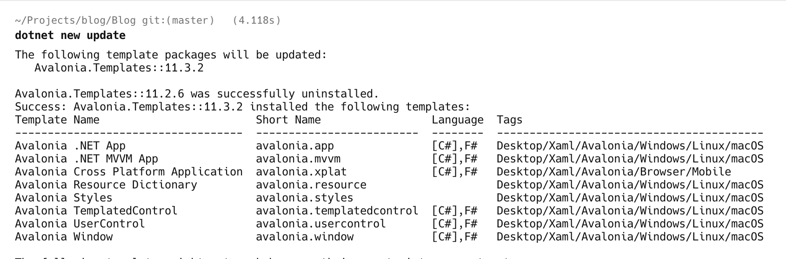
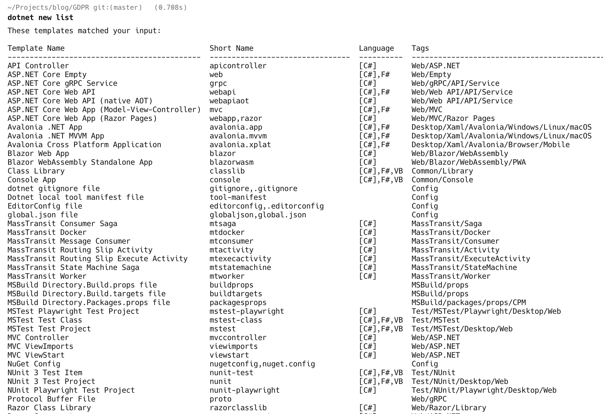

When creating a new project, you typically would do it like this in C#:

```bash
dotnet new console -o MyProject
```

This would create a new C# project (C# is assumed to be the default).

If you wanted a F# project, you would do it like so:

```bash
dotnet new console -o MyFSharpProject -lang F#
```

These are console projects.

You can do the same for WebProjects as follows:

```bash
dotnet new web -o MyWebProject
dotnet new web -o MyWebFSharpProject -lang F#
```

What is happening behind the scenes is that templates are used to generate your project on disk, referencing the appropriate SDKs and [Nuget](https://www.nuget.org/) packages.

These templates are occasionally updated by the creators, and you may wonder how to update yours.

The command to achieve this is the [dotnet new update](https://learn.microsoft.com/en-us/dotnet/core/tools/dotnet-new-update) command:

```bash
dotnet new update
```

You will see something similar to this if there are in fact updates to your installed templates.



Here, you can see that my [Avalonia](https://avaloniaui.net/) templates were outdated and have been updated.

If there is no change, you will see the following:


If you want to just check if there are updates, but not update them, you run the following command:

```bash
dotnet new update --check-only
```

You can list your currently installed templates and view their versions using the [dotnet new list](https://learn.microsoft.com/en-us/dotnet/core/tools/dotnet-new-list) command:

```c#
dotnet new list
```



### TLDR

**You can check whether your installed .NET templates are outdated and update them using the `dotnet new update` command**

Happy hacking!
