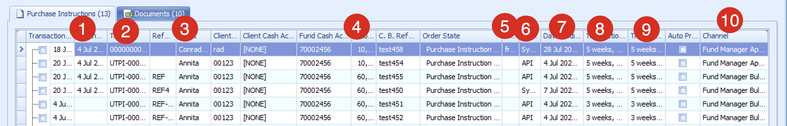
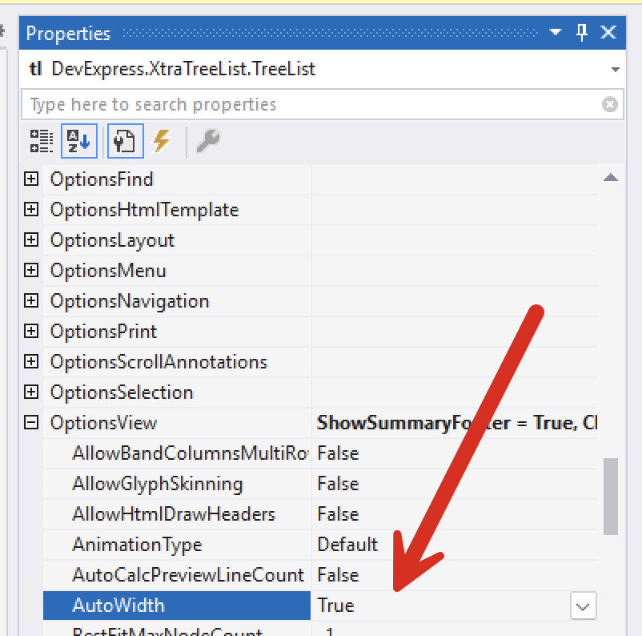
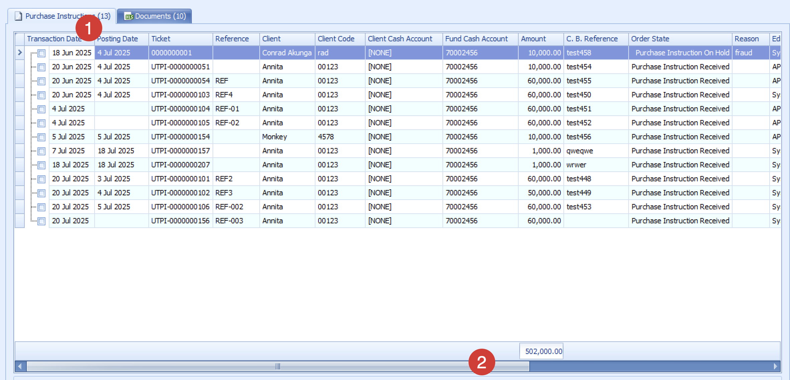

If you are using the [DevExpress](https://www.devexpress.com/) [XtraTreeList](https://docs.devexpress.com/WindowsForms/DevExpress.XtraTreeList.TreeList) to present data, you might run into the following situation:

Here we can see that many columns are not **wide enough to accommodate their contents.**

You would think calling the [BestFitColumns()](https://docs.devexpress.com/WindowsForms/DevExpress.XtraTreeList.TreeList.BestFitColumns) method of the grid would resolve this issue.

It does not.

You need to do two things:

1. Set the [AutoWidth](https://docs.devexpress.com/WindowsForms/DevExpress.XtraTreeList.TreeListOptionsView.AutoWidth) property of the [OptionsView](https://docs.devexpress.com/WindowsForms/DevExpress.XtraTreeList.TreeList.OptionsView) to false.
2. Call the `BestFitColumns()` method of the `XtraTreeList`.

If we re-run this application, we should see the following:

Here we can see the following:

1. All the **columns have been resized** to accommodate their contents
2. A **scrollbar has been added** so as to be able to navigate to the columns not visible in the current view.

### TLDR

**To auto-fit the contents of `XtraTreeList` columns, set the `AutoWidth` in the `OptionsView` to false and then call `BestFitColumns()`**

Happy hacking!
