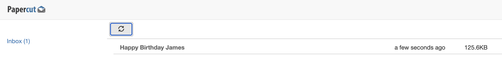
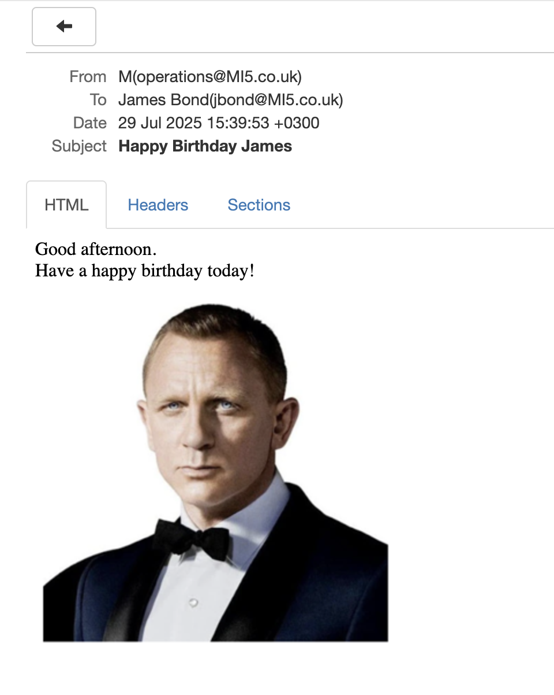
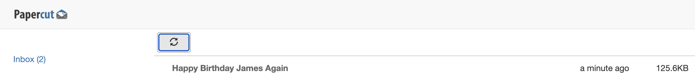
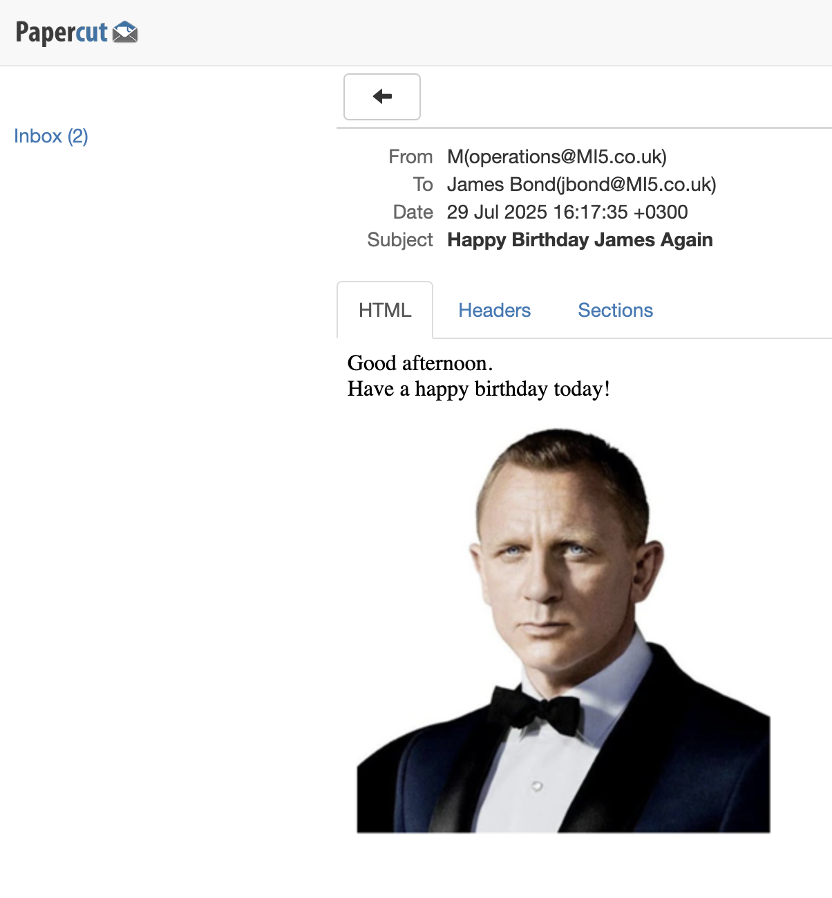

This is Part 7 of a series on sending email.

- [Sending Email in C# & .NET  - Part 1 - Introduction]()
- [Sending Email in C# & .NET - Part 2 - Delivery]()
- [Sending Email in C# & .NET - Part 3 - Using Gmail]()
- [Sending Email In C# & .NET - Part 4 - Using Office 365 & MS Graph API]()
- [Sending Email In C# & .NET - Part 5 - Using Google Cloud API]()
- [Sending Email In C# & .NET - Part 6 - Testing SMTP Locally  Using PaperCut]()
- **Sending Email In C# & .NET - Part 7 - Sending Inline Images Using SMTP (This Post)**
- [Sending Email In C# & .NET - Part 8 - Sending HTML Email Using SMTP]()
- [Sending Email In C# & .NET - Part 9 - Sending Multiple Format Email Using SMTP]()
- [Sending Email In C# & .NET - Part 10 - Sending Plain Text Email Using MailKit]()

Our last post in the series, [Sending Email In C# & .NET - Part 6 - Testing SMTP Locally Using PaperCut](), we looked at how to use [PaperCut](https://github.com/ChangemakerStudios/Papercut-SMTP) to test our email generation and sending.

In this post, we will look at how to send **inline images** in an email.

An inline image is one where the **image is rendered within the email**, and **not** as an **attachment**.

For this option, the email will have to be **HTML**. For obvious reasons, you cannot do plain text with inline images.

We shall look at two scenarios:

1. The image is on the **file system**
2. The image is retrieved from **elsewhere**, e.g., object storage, database, etc.

## Image From File System

The steps are as follows:

1. Create a [MailMessage](https://learn.microsoft.com/en-us/dotnet/api/system.net.mail.mailmessage?view=net-9.0).
2. Create the email body in HTML.
3. Create an [AlternateView](https://learn.microsoft.com/en-us/dotnet/api/system.net.mail.alternateview?view=net-9.0) with the HTML.
4. Create a [LinkedResource](https://learn.microsoft.com/en-us/dotnet/api/system.net.mail.linkedresource?view=net-9.0) with an identifier.
5. Link the alternate view HTML with the `LinkedResource`.
6. Add the `AlternateView` to the email.
7. Send email

```c#
using System.Net;
using System.Net.Mail;
using System.Net.Mime;
using Serilog;

// Setup logging
Log.Logger = new LoggerConfiguration().WriteTo.Console().CreateLogger();

var mail = new MailMessage();
mail.From = new MailAddress("operations@MI5.co.uk", "M");
mail.To.Add(new MailAddress("jbond@MI5.co.uk", "James Bond"));
mail.Subject = "Happy Birthday James";

// HTML body with image reference to linked resource by ID
const string htmlBody = """
                        <html><body>
                        Good afternoon.
                        <br>
                        Have a happy birthday today!
                        <br>
                        <br>
                        
                        </body></html>
                        """;

// AlternateView for HTML with linked image
var htmlView = AlternateView.CreateAlternateViewFromString(htmlBody, null, MediaTypeNames.Text.Html);

// Load image and link it to the HTML view
var passPortPhoto = new LinkedResource("jamesBond.png", MediaTypeNames.Image.Jpeg)
{
    ContentId = "Image1",
    ContentType = new ContentType("image/jpeg"),
    TransferEncoding = TransferEncoding.Base64
};

htmlView.LinkedResources.Add(passPortPhoto);
mail.AlternateViews.Add(htmlView);

// Create SMTPClient
var smtpClient = new SmtpClient
{
    Host = "localhost",
    Port = 25,
    Credentials = CredentialCache.DefaultNetworkCredentials
};

// Send the email
try
{
    Log.Information("Sending email");
    smtpClient.Send(mail);
    Log.Information("Email sent");
}
catch (Exception ex)
{
    Log.Error(ex, "Error sending email");
}
```

The `ContentID` here is what you will use to link the `LinkedResource` to the HTML body, where the image source is specified using `cid:<ID>`:

```html
<html><body>
Good afternoon.
<br>
Have a happy birthday today!
<br>
<br>

</body></html>
```


For the SMTP server, we will use **PaperCut**.

If we send this email, we should see the following in **PaperCut**:



If we open this, we should see the following:



We can see here that the image is rendered **within the email body.**

## Image From Elsewhere

If your image is not sourced from the file system, we can construct a linked resource like this:

```c#
var bytes = File.ReadAllBytes("jamesBond.png");
var stream = new MemoryStream(bytes);
// Load image and link it to the HTML view
var passPortPhoto = new LinkedResource(stream, MediaTypeNames.Image.Png)
{
    ContentId = "Image1",
    ContentType = new ContentType(MediaTypeNames.Image.Png),
    TransferEncoding = TransferEncoding.Base64
};
```

The email should be sent successfully.



And the details are as expected:



When using a `Stream`, **ensure that the stream is not disposed of prior to sending the email**.

The code is in my [GitHub](https://github.com/conradakunga/BlogCode/tree/master/2025-07-26%20-%20Inline%20Email).

Happy hacking!
