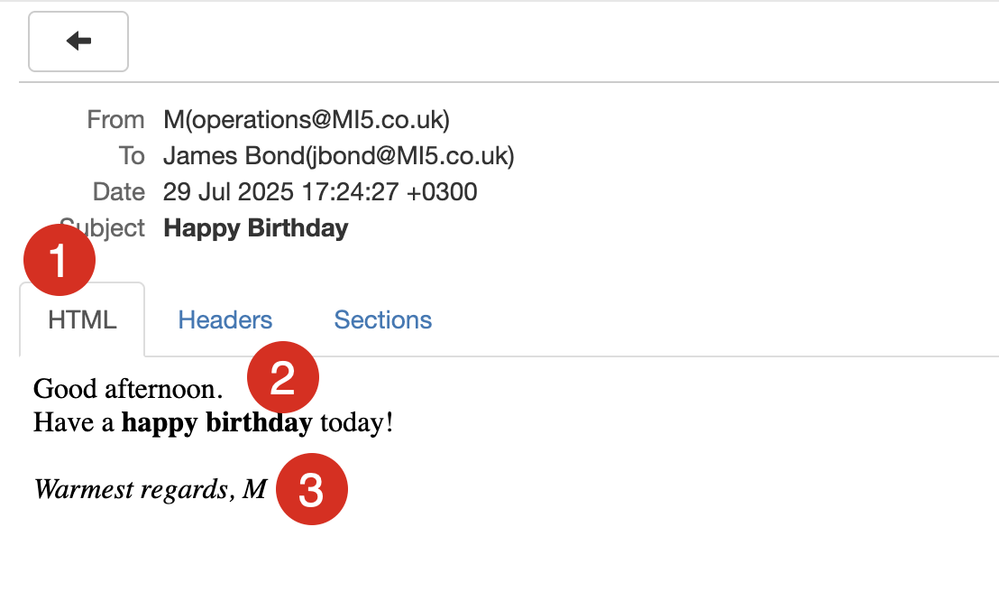

This is Part 8 of a series on sending email.

- [Sending Email in C# & .NET - Part 1 - Introduction]()
- [Sending Email in C# & .NET - Part 2 - Delivery]()
- [Sending Email in C# & .NET - Part 3 - Using Gmail]()
- [Sending Email In C# & .NET - Part 4 - Using Office 365 & MS Graph API]()
- [Sending Email In C# & .NET - Part 5 - Using Google Cloud API]()
- [Sending Email In C# & .NET - Part 6 - Testing SMTP Locally  Using PaperCut]()
- [Sending Email In C# & .NET - Part 7 - Sending Inline Images Using SMTP]()
- **Sending Email In C# & .NET - Part 8 - Sending HTML Email Using SMTP (This post)**
- [Sending Email In C# & .NET - Part 9 - Sending Multiple Format Email Using SMTP]()
- [Sending Email In C# & .NET - Part 10 - Sending Plain Text Email Using MailKit]()
- [Sending Email In C# & .NET - Part 11 - Sending HTML Email Using MailKit]()
- [Sending Email In C# & .NET - Part 12 - Sending Email With Attachments Using MailKit]() 
- [Sending Email In C# & .NET - Part 13 - Sending Email With Inline Attachments Using MailKit]()
- [Sending Email In C# & .NET - Part 14 - Sending Multiple Format Email Using MailKit]()
- [Sending Email In C# & .NET - Part 15 - Sending Calendar Invites Using MailKit]()
- [Sending Email In C# & .NET - Part 16 - Testing SMTP Locally Using Mailpit]()

In our last post in the series, [Sending Email In C# & .NET - Part 7 - Sending Inline Images Using SMTP](), we discussed how to send email with inline images over SMTP.

In this post, we will look at **how to send an [HTML email](https://en.wikipedia.org/wiki/HTML_email)**.

There are two ways to do it:

1. Directly on the [MailMessage](https://learn.microsoft.com/en-us/dotnet/api/system.net.mail.mailmessage?view=net-9.0) object
2. Using an [AlternateView](https://learn.microsoft.com/en-us/dotnet/api/system.net.mail.alternateview?view=net-9.0).

## Direct HTML

In this scenario, we can set the [IsBodyHTML](https://learn.microsoft.com/en-us/dotnet/api/system.net.mail.mailmessage.isbodyhtml?view=net-9.0) property directly on the `MailMessage` object.

```c#
// Setup logging
Log.Logger = new LoggerConfiguration().WriteTo.Console().CreateLogger();

var mail = new MailMessage();
mail.From = new MailAddress("operations@MI5.co.uk", "M");
mail.To.Add(new MailAddress("jbond@MI5.co.uk", "James Bond"));
mail.Subject = "Happy Birthday";
mail.Body = """
            <html><body>
            Good afternoon.
            <br>
            Have a <B>happy birthday</B> today!
            <br>
            <br>
            <i>Warmest regards, M<i/>
            </body></html>
            """;

// Set the body format as HTML
mail.IsBodyHtml = true;

// Create SMTPClient
var smtpClient = new SmtpClient
{
    Host = "localhost",
    Port = 25,
    Credentials = CredentialCache.DefaultNetworkCredentials
};

// Send the email
try
{
    Log.Information("Sending email");
    smtpClient.Send(mail);
    Log.Information("Email sent");
}
catch (Exception ex)
{
    Log.Error(ex, "Error sending email");
}
```

If we send this email, we can view it in PaperCut.



You can see here that the email has been rendered as HTML.

## Alternate Views

You can also achieve the same result using an `AlternateView`, which gives you a lot more control in terms of flexibility.

```c#
var mail = new MailMessage();
mail.From = new MailAddress("operations@MI5.co.uk", "M");
mail.To.Add(new MailAddress("jbond@MI5.co.uk", "James Bond"));
mail.Subject = "Happy Birthday James";
const string html = """
                    <html><body>
                    Good afternoon.
                    <br>
                    Have a <B>happy birthday</B> today!
                    <br>
                    <br>
                    <i>Warmest regards, M<i/>
                    </body></html>
                    """;

// AlternateView for HTML
var htmlView = AlternateView.CreateAlternateViewFromString(html, null, MediaTypeNames.Text.Html);

mail.AlternateViews.Add(htmlView);
```

The sent email would be identical.

Why use this way over simply setting the `IsBodyHTML` property?

1. You want to use **multiple formats**
2. You want **inline images**
3. You want full control of the [MIME](https://en.wikipedia.org/wiki/MIME) structure.

## TLDR

**You can send HTML email either by setting the `IsBodyHTML` property of the MailMessage or by using an `AlternateView`.**

The code is in my [GitHub](https://github.com/conradakunga/BlogCode/tree/master/2025-07-27%20-%20HTML%20Email).

Happy hacking!
