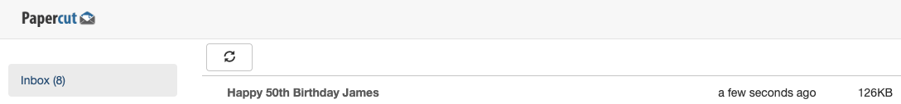
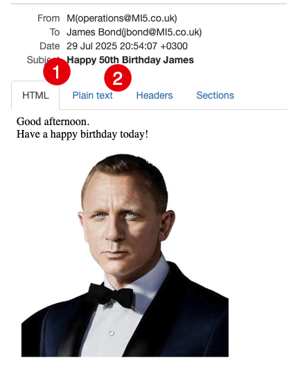
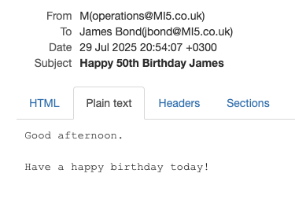
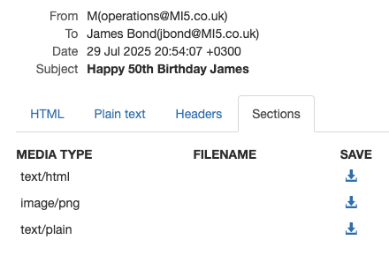

This is Part 9 of a series on sending email.

- [Sending Email in C# & .NET  - Part 1 - Introduction]()
- [Sending Email in C# & .NET - Part 2 - Delivery]()
- [Sending Email in C# & .NET - Part 3 - Using Gmail]()
- [Sending Email In C# & .NET - Part 4 - Using Office 365 & MS Graph API]()
- [Sending Email In C# & .NET - Part 5 - Using Google Cloud API]()
- [Sending Email In C# & .NET - Part 6 - Testing SMTP Locally  Using PaperCut]()
- [Sending Email In C# & .NET - Part 7 - Sending Inline Images Using SMTP]()
- [Sending Email In C# & .NET - Part 8 - Sending HTML Email Using SMTP]()
- **Sending Email In C# & .NET - Part 9 - Sending Multiple Format Email Using SMTP (This Post)**
- [Sending Email In C# & .NET - Part 10 - Sending Plain Text Email Using MailKit]()
- [Sending Email In C# & .NET - Part 11 - Sending HTML Email Using MailKit]()
- [Sending Email In C# & .NET - Part 12 - Sending Email With Attachments Using MailKit]() 
- [Sending Email In C# & .NET - Part 13 - Sending Email With Inline Attachments Using MailKit]()

In our last post, [Sending Email In C# & .NET - Part 8 - Sending HTML Email Using SMTP](), we looked at how to send **HTML email** via SMTP.

In this post, we will look at how to create an email with **multiple formats**.

The use case here is that, on paper, HTML **seems** to be the **superior** format.

1. You can **format** the text (**bold**, *italic*, <u>underline</u>).
2. You can include **images** inline.
3. You can embed **hyperlinks**.
4. You can use constructs like tables and CSS for advanced styling.
5. You can embed **video**.
6. You can **track the opening** of the email.

The reality is that HTML email can also cause problems.

1. Some **mail clients** do not support HTML email.
2. Even those that do, they support different **subsets** of the specification.
3. Even for those subsets universally supported, there are subtle **differences in the rendering**
4. **Some people do not want** to read HTML email.

To work around this issue, it is advisable always to **send a plain text version of your HTML email**.

To achieve this, we create two `AlternateViews` - one for the **HTML** content and the other for the **plain text** content.

```c#
var mail = new MailMessage();
mail.From = new MailAddress("operations@MI5.co.uk", "M");
mail.To.Add(new MailAddress("jbond@MI5.co.uk", "James Bond"));
mail.Subject = "Happy 50th Birthday James";

// HTML body with image reference to linked resource by ID
const string htmlBody = """
                        <html><body>
                        Good afternoon.
                        <br>
                        Have a happy birthday today!
                        <br>
                        <br>
                        
                        </body></html>
                        """;

// AlternateView for HTML with linked image
var htmlView = AlternateView.CreateAlternateViewFromString(htmlBody, null, MediaTypeNames.Text.Html);

// Load image and link it to the HTML view
var passPortPhoto = new LinkedResource("jamesBond.png", MediaTypeNames.Image.Png)
{
    ContentId = "Image1",
    ContentType = new ContentType(MediaTypeNames.Image.Png),
    TransferEncoding = TransferEncoding.Base64
};

htmlView.LinkedResources.Add(passPortPhoto);
mail.AlternateViews.Add(htmlView);

// Plain text view for non-html friendly situations
const string plainTextBody = """
                             Good afternoon.

                             Have a happy birthday today!


                             """;

var plainTextView = AlternateView.CreateAlternateViewFromString(plainTextBody, null, MediaTypeNames.Text.Plain);
mail.AlternateViews.Add(plainTextView);
```

If we run this code, we should see our delivered email in PaperCut.



If we open the email, we see the following:



Here we can see the two views:

1. HTML
2. Plain Text

The HTML view is the **default rendered** one by the client, and here we can see an inline image.

The plain text view looks like this:



You can also directly view the [MIME](https://datatracker.ietf.org/doc/html/rfc2045) sections:



### TLDR

**To send a multi-format email, use two `AlternateViews`.**

The code is in my [GitHub](https://github.com/conradakunga/BlogCode/tree/master/2025-07-28%20-%20AlternateViews).

Happy hacking!
