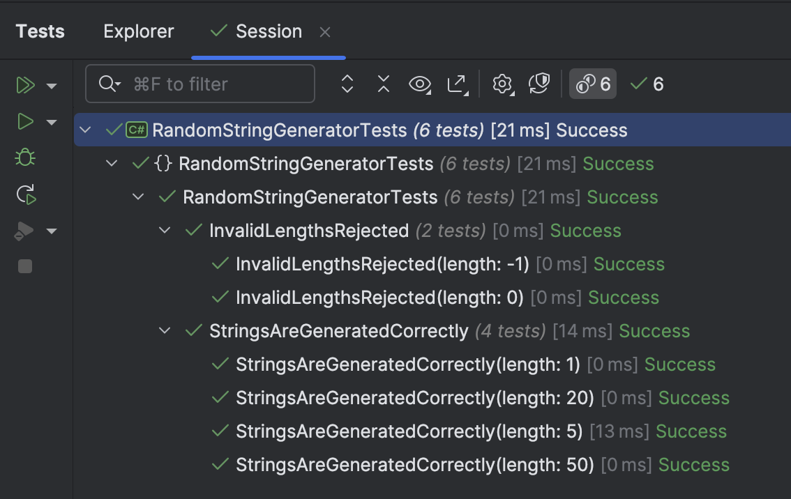

A common requirement you will run into when writing programs is the need to **generate** some sort of **random string**.

There are a number of key things to establish:

1. What is the **alphabet** of characters to use - which **characters** should be considered? They could even be **numbers**.
2. What is the **length** of the desired `string`?

With this established, we can start to write the code.

First, we create a static class to hold our alphabet as a `string` constant. This will make **unit testing easier**.

```c#
public static class Constants
{
  public const string Alphabet = "ABCDEFGHJKMNPQRSTUVWXYZabcdefghjkmnpqrstuvwxyz123456789";
}
```

Here you can see I have removed common **problematic characters** - `I`, `i`,  `J`,`j`, `0`, `O`,`o`, `1`, because I want the generated `string` to be **human-readable**.

The next step is to write the code that generates the random `string`.

`````c#
public static class RandomStringGenerator
{
    public static string GenerateRandomString(int length)
    {
        // Ensure length is at least 1
        ArgumentOutOfRangeException.ThrowIfLessThan(length, 1);

        // Generate string
        return new string(Enumerable.Range(0, length)
            .Select(_ => Constants.Alphabet[Random.Shared.Next(Constants.Alphabet.Length)])
            .ToArray());
    }
}
`````

The algorithm here is to select a **random** value from the `Alphabet` `length` times.

We can then write some **tests** to verify our code:

```c#
[Theory]
[InlineData(0)]
[InlineData(-1)]
public void InvalidLengthsRejected(int length)
{
  var ex = Record.Exception(() => RandomStringGenerator.GenerateRandomString(length));
  ex.Should().BeOfType<ArgumentOutOfRangeException>();
}

[Theory]
[InlineData(1)]
[InlineData(5)]
[InlineData(20)]
[InlineData(50)]
public void StringsAreGeneratedCorrectly(int length)
{
  var randomString = RandomStringGenerator.GenerateRandomString(length);
  randomString.Length.Should().Be(length);
  _output.WriteLine($"Generated string: {randomString} of length {length}");

  Constants.Alphabet.ToCharArray().Should().Contain(randomString);
}
```

If we run these tests, they should pass:



We should also be able to see some examples of the random `string` in the console:

```plaintext
Generated string: M of length 1
Generated string: DGCMeJafT7FFnU1NRZDe of length 20
Generated string: CE7dN of length 5
Generated string: r2zjEps7G9gVx6JCxy6VRZTwQsSJJ2PMHBA9ARwhRHkstu17wU of length 50
```

These strings are not **cryptographically random**, and therefore aren't ideal for secure situations such as generating passwords and keys, but they are good enough for casual use.

In our next post, we will look at how to create **cryptographically secure**, truly **random** strings.

### TLDR

**Using a known alphabet and the [Random](https://learn.microsoft.com/en-us/dotnet/api/system.random?view=net-9.0) class, we can generate random strings of arbitrary lengths.**

The code is in my [GitHub](https://github.com/conradakunga/BlogCode/tree/master/2025-08-02%20-%20Random%20String).

Happy hacking!
