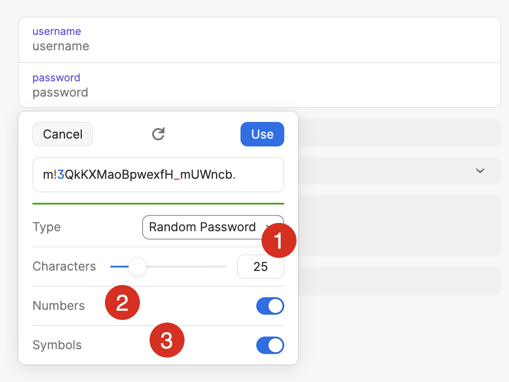

**This is Part 1 in a series in which we will build a simple password generator.**

In our last post, [Generating A Cryptographically Random String in C# & .NET](), we looked at how to generate cryptographically random strings.

In this post, we will look at how to build a **password generator**.

Currently, I am using [1Password](https://1password.com/) as my password manager.

When you want to generate a password, you get the following screen:



There are 3 things that we need to specify:

1. The password **length**
2. Whether we want  **numbers** in the password
3. Whether we want  **symbols** in the password

For our generator, we can add these features:

1. Ability to specify the number of **numbers**
2. Ability to specify the number of **symbols**
3. The generated password length must be at least **eight** characters.

The first order of business is to create our alphabets.

```c#
public static class Constants
{
    public const string NumericAlphabet = "0123456789";
    public const string CharacterAlphabet = "ABDDEFGHIJKLMNOPQRSTUVWXYZabddefghijklmnopqrstuvwxyz";
    public const string SymbolAlphabet = "~!@#$%^&*()_+{}|:\"?><;[]\\;',./";
}.
```

Finally, we write the code that generated the password.

The algorithm is as follows:

- Generate a random `string` from the alphabet `NumericAlphabet` of length `number`.
- Generate a random `string` from the alphabet  SymbolAlphabet of length `symbols`.
- Generate a random `string` from the alphabet `CharacterAlphabet` of `passwordLength` - `number` - `symbols`
- **Concatenate** these strings
- **Shuffle** them

To get a random `string`, we can use the following simple algorithm:

1. Get a random character from the alphabet
2. Repeat until you we get the required length

The extension method that gets a random character looks like this:

```c#
public static class StringExtensions
{
    public static char GetRandomCharacter(this string alphabet)
    {
        return alphabet[RandomNumberGenerator.GetInt32(alphabet.Length)];
    }
}
```

The code that does the password generation is as follows:

```c#
public static class PasswordGenerator
{
    public static string GeneratePassword(int numbers, int symbols, int passwordLength)
    {
        // Ensure the numbers and symbols are valid
        ArgumentOutOfRangeException.ThrowIfNegative(numbers);
        ArgumentOutOfRangeException.ThrowIfNegative(symbols);

        // Ensure the password lenght is legit
        ArgumentOutOfRangeException.ThrowIfLessThan(passwordLength, Constants.MinimumPasswordLength);
        // Ensure the number and symbols are congruent with requested password length
        if (numbers + symbols > passwordLength)
            throw new ArgumentException("numbers and symbols length cannot be greater than requested password length");

        var numericString = new string(Enumerable.Range(0, numbers)
            .Select(x => Constants.NumericAlphabet.GetRandomCharacter())
            .ToArray());
        Log.Debug("Numeric String {String}", numericString);

        var symbolString = new string(Enumerable.Range(0, symbols)
            .Select(x => Constants.SymbolAlphabet.GetRandomCharacter())
            .ToArray());
        Log.Debug("Symbol String: {String}", symbolString);

        var characterString = new string(Enumerable.Range(0, passwordLength - numbers - symbols)
            .Select(x => Constants.CharacterAlphabet.GetRandomCharacter())
            .ToArray());
        Log.Debug("Character String: {String}", characterString);

        var rawPassword = $"{numericString}{characterString}{symbolString}";

        Log.Debug("Raw password: {String}", rawPassword);

        return new string(rawPassword.OrderBy(x => Random.Shared.Next()).ToArray());
    }
}
```

Of interest is the following:

1. Our code uses the Serilog package to support **logging**. It is beneficial to see what is happening under the hood, and we will write log messages if the [level](https://sematext.com/blog/logging-levels/) is set to `Debug`.
2. We are using [LINQ](https://learn.microsoft.com/en-us/dotnet/csharp/linq/) to call the `GetRandomCharacter()` method the desired number of times.
3. Once we have **concatenated** the three generated `strings`, we **shuffle** the result.

We can then write some tests to make sure the generation functions as we expect:

```c#
public class PasswordGeneratorTests
{
    private readonly ITestOutputHelper _helper;

    public PasswordGeneratorTests(ITestOutputHelper helper)
    {
        _helper = helper;
        Log.Logger = new LoggerConfiguration()
            .MinimumLevel.Debug()
            .WriteTo.XunitTestOutput(helper)
            .CreateLogger();
    }

    [Theory]
    [InlineData(-1)]
    [InlineData(-2)]
    public void InvalidNumbersThrowsException(int numbers)
    {
        var ex = Record.Exception(() => _ = PasswordGenerator.GeneratePassword(numbers, 0, 10));
        ex.Should().BeOfType<ArgumentOutOfRangeException>();
    }

    [Theory]
    [InlineData(-1)]
    [InlineData(-2)]
    public void InvalidSymbolsThrowsException(int symbols)
    {
        var ex = Record.Exception(() => _ = PasswordGenerator.GeneratePassword(0, symbols, 10));
        ex.Should().BeOfType<ArgumentOutOfRangeException>();
    }

    [Theory]
    [InlineData(0)]
    [InlineData(9)]
    [InlineData(-1)]
    public void InvalidLengthThrowsException(int symbols)
    {
        var ex = Record.Exception(() => _ = PasswordGenerator.GeneratePassword(0, 0, symbols));
        ex.Should().BeOfType<ArgumentOutOfRangeException>();
    }

    [Theory]
    [InlineData(11, 0, 10)]
    [InlineData(0, 11, 10)]
    [InlineData(6, 5, 10)]
    public void SymbolsAndNumbersShouldAlignWithRequestedLength(int numbers, int symbols, int passwordLength)
    {
        var ex = Record.Exception(() => _ = PasswordGenerator.GeneratePassword(numbers, symbols, passwordLength));
        ex.Should().BeOfType<ArgumentException>();
    }

    [Theory]
    [InlineData(0, 0, 10)]
    [InlineData(1, 0, 10)]
    [InlineData(0, 1, 10)]
    [InlineData(5, 5, 50)]
    public void PasswordGeneratedSuccessfully(int numbers, int symbols, int passwordLength)
    {
        var password = PasswordGenerator.GeneratePassword(numbers, symbols, passwordLength);
        _helper.WriteLine(password);
        password.Length.Should().Be(passwordLength);
    }
}
```

In our next post, we will write a simple console UI for this tool.

The code is in my [GitHub](https://github.com/conradakunga/BlogCode/tree/master/PassGen).

Happy hacking!
