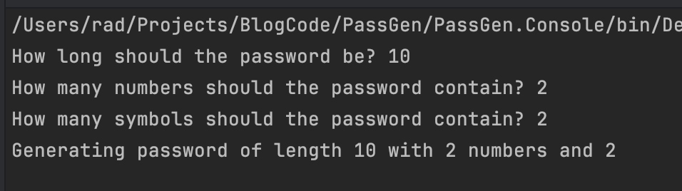
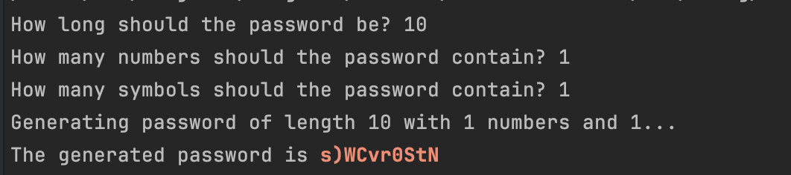
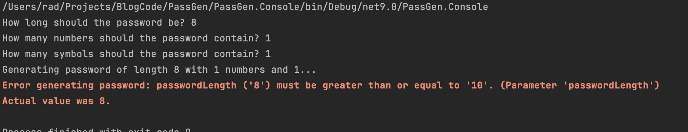

**This is Part 2 in a series in which we will build a simple password generator.**

In our last post, [Building A Simple Password Generator In C# & .NET - Part 1](), we wrote the logic for a simple **password generator**.

In this post, we will build a simple **command-line interface** for the logic.

For this, we will use the [Spectre.Console](https://spectreconsole.net/) package.

```c#
dotnet add package Spectre.Console
dotnet add package Spectre.Console.Cli
```

We will first start with a simple flow where we assume the user is a novice.

We will request all the necessary requirements from the user.

```c#
using Spectre.Console;

var passwordLength = AnsiConsole.Prompt(
    new TextPrompt<int>("How long should the password be?"));
var numbers = AnsiConsole.Prompt(
    new TextPrompt<int>("How many numbers should the password contain?"));
var symbols = AnsiConsole.Prompt(
    new TextPrompt<int>("How many symbols should the password contain?"));

AnsiConsole.WriteLine($"Generating password of length {passwordLength} with {numbers} numbers and {symbols}");
```

If we run this code, the user gets the following experience:



At this point, we can wire in the password generation:

```c#
AnsiConsole.WriteLine($"Generating password of length {passwordLength} with {numbers} numbers and {symbols}...");

var password = PasswordGenerator.GeneratePassword(numbers, symbols, passwordLength);

AnsiConsole.MarkupLineInterpolated($"The generated password is [bold red]{password}[/]");
```

Running the code should yield something like the following:



Finally, we write some code to handle edge cases:

```c#
try
{
    var password = PasswordGenerator.GeneratePassword(numbers, symbols, passwordLength);

    AnsiConsole.MarkupLineInterpolated($"The generated password is [bold red]{password}[/]");
}
catch (Exception ex)
{
    AnsiConsole.MarkupLineInterpolated($"[bold red]Error generating password: {ex.Message}[/]");
}
```



In our [next post](), we will look at how to support experienced users on the command line.

The code is in my [GitHub](https://github.com/conradakunga/BlogCode/tree/master/PassGen).

Happy hacking!
