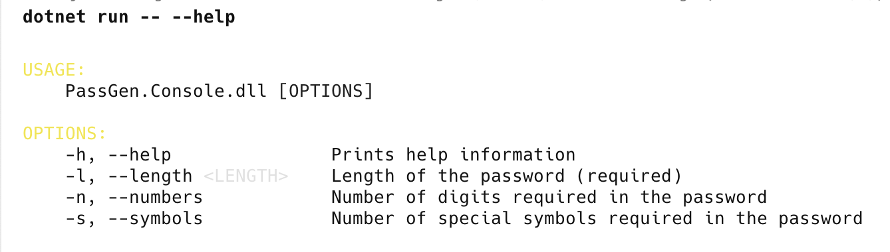
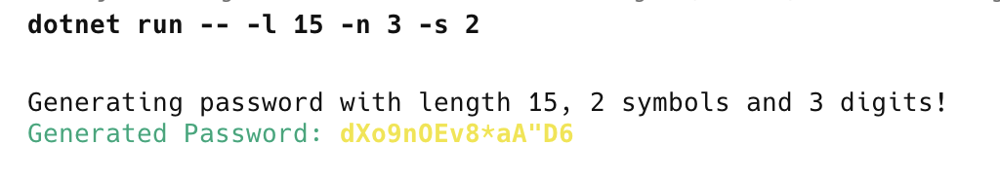
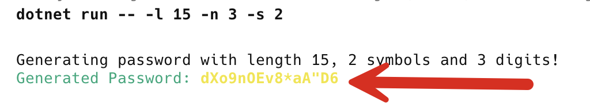

**This is Part 3 in a series in which we will build a simple password generator.**

In our last post, [Building A Simple Password Generator In C# & .NET - Part 2 - Novice UI With Spectre.Console](), we looked at how to build a **simple console UI** to allow users to generate passwords.

In this post, we will **extend** the UI to support advanced users, who will want to use **command line parameters** to specify their requirements upfront.

The parameters will be the following:

| Parameter      | Short Form | Long Form   |
| -------------- | ---------- | ----------- |
| PasswordLength | `-p`       | `--length`  |
| Numbers        | `-n`       | `--numbers` |
| Symbols        | -s         | `--symbols` |

The first step is to define a `class` to configure these:

```c#
public sealed class PasswordSettings : CommandSettings
{
    [CommandOption("-l|--length <LENGTH>")]
    [Description("Length of the password (required)")]
    public int PasswordLength { get; set; }

    [CommandOption("-n|--numbers")]
    [Description("Number of digits required in the password")]
    public int Numbers { get; set; }

    [CommandOption("-s|--symbols")]
    [Description("Number of special symbols required in the password")]
    public int Symbols { get; set; }

    public override ValidationResult Validate()
    {
        if (Symbols < 0)
            return ValidationResult.Error(
                "Symbols cannot be less than 0");

        if (Numbers < 0)
            return ValidationResult.Error(
                "Numbers cannot be less than 0");

        if (PasswordLength < Constants.MinimumPasswordLength)
            return ValidationResult.Error(
                $"Password length must be at least {Constants.MinimumPasswordLength} characters.");
        return ValidationResult.Success();
    }
}
```

Next, we define a class that will implement a `Command`

```c#
public class GeneratePasswordCommand : Command<PasswordSettings>
{
    public override int Execute(CommandContext context, PasswordSettings settings)
    {
        // Generate password
        string password =
            PasswordGenerator.GeneratePassword(settings.Numbers, settings.Symbols, settings.PasswordLength);

        AnsiConsole.MarkupLine($"[green]Generated Password:[/] [bold yellow]{password}[/]");
        return 0;
    }
```

Finally, in our entry point, we write the following code that wires up the **Console**:

```c#
var app = new CommandApp<GeneratePasswordCommand>();
return app.Run(args);
```

Now we are ready to run the application.

To get a help prompt, run the following:

```bash
dotnet run -- --help
```

Note the extra `--` this means that anything following is an argument to the **application** itself, and not the `dotnet.exe` tool.

The following will be printed:



We are now ready to run the tool.

```bash
dotnet run -- --length 15 --numbers 3 --symbols 2
```

Alternatively, we can run it like this:

```bash
dotnet run -- -l 15 -n 3 -s 2
```

You should see something like this:



Finally, as a **value add**, after password generation, you typically need to **copy** and **paste** it somewhere.

We can improve our application by **automating** this.

First, we add the package [TextCopy](https://github.com/CopyText/TextCopy).

```bash
dotnet add package TextCopy
```

Then we update our code to put the password in the clipboard.

```c#
// Copy generated password to clipboard
ClipboardService.SetText(password);
```

Now, if we run our code, all we need to do is **paste the newly generated password** wherever we need to use it.

Finally, as an additional enhancement and **security** improvement, we should **not openly display the password** that we have just generated.

In other words, we should not do this:



We can either **not show it at all** or **mask it** when outputting it.

In this case, it would be **simpler not to output it at all**.

We can update our code as follows:

```c#
// Generate password
string password =
    PasswordGenerator.GeneratePassword(settings.Numbers, settings.Symbols, settings.PasswordLength);

AnsiConsole.MarkupLine(
    $"Generating password with length {settings.PasswordLength}, {settings.Symbols} symbols and {settings.Numbers} digits!");

// Copy generated password to clipboard
ClipboardService.SetText(password);

AnsiConsole.MarkupLine($"[green]Generated Password successfully, and copied to clipboard[/]");
return 0;
```

### TLDR

**We can use `Sceptre.Console` to generate sophisticated command-line applications to expose library logic.**

The code is in my GitHub.

Happy hack
