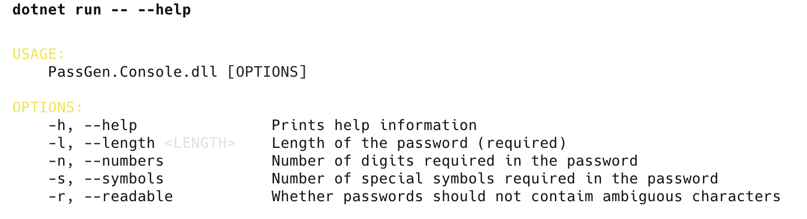
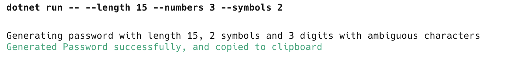
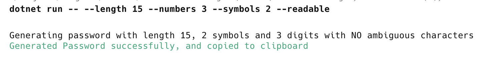

**This is Part 4 in a series in which we will build a simple password generator.**

In our last post, [Building A Simple Password Generator In C# & .NET - Part 3 - Advanced UI With Spectre.Console](), we looked at how to build a console application that allows **passing of command-line options** to generate passwords.

In this post, we will look at how to improve the password generator to generate **human-readable passwords**.

The problem we are trying to work around here is password characters that are **ambiguous** / **easily confused**.

Here are some of them:

| Letters       | Description                                                  |
| ------------- | ------------------------------------------------------------ |
| o,O and 0     | Small `o`, capital `0` and zero (`0`)                        |
| i,j,I,J and 1 | Small `i`, capital `I` , small `j` and capital J and one (`1`) |

We will update our password generator to allow specification of this.

The first thing is to build a **second set of alphabets** of ambiguous characters.

```c#
public static class Constants
{
    public const string NumericAlphabet = "0123456789";
    public const string AmbiguousNumericAlphabet = "01";
    
    public const string CharacterAlphabet = "ABCDEFGHIJKLMNOPQRSTUVWXYZabcdefghijklmnopqrstuvwxyz";
    public const string AmbiguousCharacterAlphabet = "IJOijko";
    
    public const string SymbolAlphabet = "~!@#$%^&*()_+{}|:\"?><;[]\\;',./";
    public const int MinimumPasswordLength = 10;
}
```

Next, we update our password generation code to take as a parameter whether to respect non-ambiguous characters.

```c#
public static string GeneratePassword(int numbers, int symbols, int passwordLength, bool humanReadable = false)
{
    // Ensure the numbers and symbols are valid
    ArgumentOutOfRangeException.ThrowIfNegative(numbers);
    ArgumentOutOfRangeException.ThrowIfNegative(symbols);

    // Ensure the password length is legit
    ArgumentOutOfRangeException.ThrowIfLessThan(passwordLength, Constants.MinimumPasswordLength);

    // Ensure the number and symbols are congruent with requested password length
    if (numbers + symbols > passwordLength)
        throw new ArgumentException("numbers and symbols length cannot be greater than requested password length");

    var numericAlphabet = Constants.NumericAlphabet;
    var characterAlphabet = Constants.CharacterAlphabet;
    if (humanReadable)
    {
        numericAlphabet =
            new string(Constants.NumericAlphabet.Except(Constants.AmbiguousNumericAlphabet).ToArray());
        characterAlphabet =
            new string(Constants.CharacterAlphabet.Except(Constants.AmbiguousCharacterAlphabet).ToArray());
    }

    var numericString = new string(Enumerable.Range(0, numbers)
        .Select(x => numericAlphabet.GetRandomCharacter())
        .ToArray());
    Log.Debug("Numeric String {String}", numericString);

    var symbolString = new string(Enumerable.Range(0, symbols)
        .Select(x => Constants.SymbolAlphabet.GetRandomCharacter())
        .ToArray());
    Log.Debug("Symbol String: {String}", symbolString);

    var characterString = new string(Enumerable.Range(0, passwordLength - numbers - symbols)
        .Select(x => characterAlphabet.GetRandomCharacter())
        .ToArray());
    Log.Debug("Character String: {String}", characterString);

    var rawPassword = $"{numericString}{characterString}{symbolString}";

    Log.Debug("Raw password: {String}", rawPassword);

    return new string(rawPassword.OrderBy(x => Random.Shared.Next()).ToArray());
}
```

Next, we update the command line **settings**:

```c#
public sealed class PasswordSettings : CommandSettings
{
  [CommandOption("-l|--length <LENGTH>")]
  [Description("Length of the password (required)")]
  public int PasswordLength { get; set; }

  [CommandOption("-n|--numbers")]
  [Description("Number of digits required in the password")]
  public int Numbers { get; set; }

  [CommandOption("-s|--symbols")]
  [Description("Number of special symbols required in the password")]
  public int Symbols { get; set; }

  [CommandOption("-r|--readable")]
  [Description("Whether passwords should not contaim ambiguous characters")]
  public bool HumanReadable { get; set; }

  public override ValidationResult Validate()
  {
      if (Symbols < 0)
          return ValidationResult.Error(
              "Symbols cannot be less than 0");

      if (Numbers < 0)
          return ValidationResult.Error(
              "Numbers cannot be less than 0");

      if (PasswordLength < Constants.MinimumPasswordLength)
          return ValidationResult.Error(
              $"Password length must be at least {Constants.MinimumPasswordLength} characters.");
      return ValidationResult.Success();
  }
}
```

Finally, we **update our UI** to add this new parameter.

```c#
public override int Execute(CommandContext context, PasswordSettings settings)
{
    // Generate password
    string password =
        PasswordGenerator.GeneratePassword(settings.Numbers, settings.Symbols, settings.PasswordLength,
            settings.HumanReadable);

    AnsiConsole.MarkupLine(
        $"Generating password with length {settings.PasswordLength}, {settings.Symbols} symbols and {settings.Numbers} digits with {(settings.HumanReadable ? "NO" : "")} ambiguous characters");

    // Copy generated password to clipboard
    ClipboardService.SetText(password);

    AnsiConsole.MarkupLine($"[green]Generated Password successfully, and copied to clipboard[/]");
    return 0;
}
```

If we run with the `--help` parameter, we get the following:



We can  now run our tool twice; first for the **default** (all characters)



Then, **without ambiguous characters**, passing the `--readable` argument



In our [next post](), we will look at how to generate memorable passwords.

### TLDR

**We updated our password generator to optionally generate human-readable passwords without ambiguous characters.**

The code is in my [GitHub](https://github.com/conradakunga/BlogCode/tree/master/PassGen).

Happy hacking!
