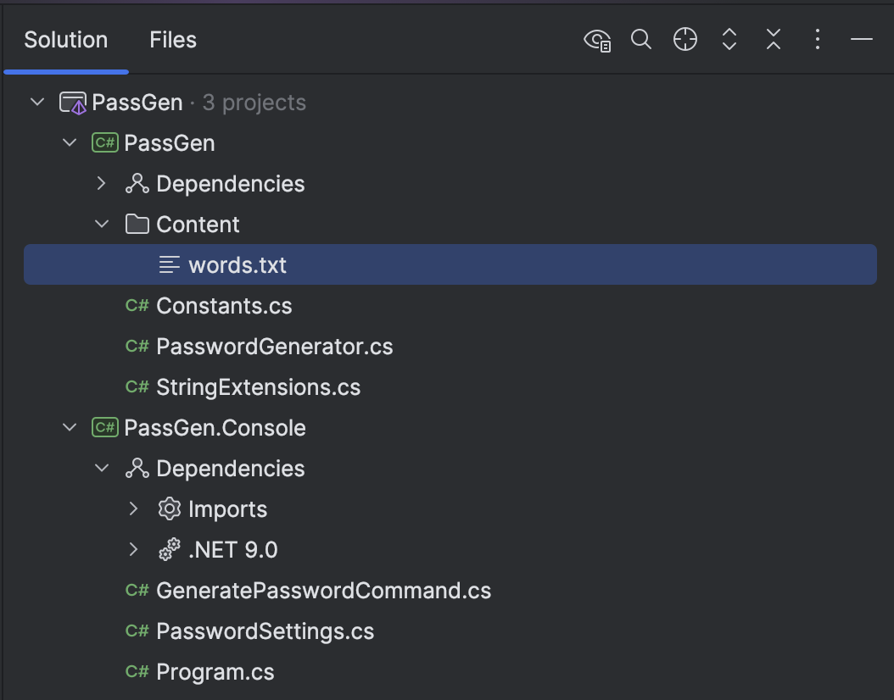

**This is Part 5 in a series in which we will build a simple password generator.**

In our last post, [Building A Simple Password Generator In C# & .NET - Part 4 - Generating Human Readable Passwords](), we looked at how to generate human-readable passwords with unambiguous characters.

In this post, we will look at how to generate **memorable passwords**.

What is a memorable password?

My interpretation is that they are **passwords that are relatively easy to remember because they are actual words**. What they lack in [entropy](https://en.wikipedia.org/wiki/Entropy_(information_theory)), they make up for in **length**.

For this, I am taking inspiration from the excellent [1Password](https://1password.com/).


The best way to demonstrate is to generate a couple.

```plaintext
busts-smartest-truce-cylinder
dine-observer-poke-models
momma-thrill-life-slap
malibu-proverb-dotted-donovan
wrinkled-topping-wacky-uber
birdie-gall-harris-specs
blow-relish-josh-stomp
plane-woe-cahill-chun
right-inherent-likely-mailed
quantum-foreplay-meddling-ginger
```

From these, we can see a pattern for each password:

- **Four** words.
- **Hyphen** separated.
- Each word is at least `3` characters long.
- Each word is at most `8` characters long.

The capitalize option generates passwords like these:

```plaintext
TAMPERED-sailing-hosted-figure
campaign-PLANNING-huntsmen-prisons
obvious-SOLD-uhm-hilton
rufus-eleanor-THEORY-riviera
peasants-mould-west-CLIMB
```

It seems to capitalize **one** of the words in the password.

This should be enough to generate a simple implementation.

The first order of business is to **find a list of words**.

From [this Git archive](https://github.com/dolph/dictionary/blob/master/popular.txt), there is a list of popular English words.

We can start by :

1. **Downloading** the file.
2. **Remove** all words **shorter** than `3` characters.
3. **Remove** all words **longer** than `8` characters.

The following code executes the above.

```c#
var client = new HttpClient();
// Download all the words	
var allText = await client.GetStringAsync("https://raw.githubusercontent.com/dolph/dictionary/refs/heads/master/popular.txt");
// Split by newline	
var allWords = allText.Split(Environment.NewLine)
// Filter by length
.Where(t => t.Length >= 3 && t.Length <= 8);
// Get a temp file name
var file = Path.GetTempFileName();
// Write to disk	
File.WriteAllLines(file, allWords);
Console.WriteLine($"Written words to {file}");
```

We can then include this file in our project, and specify in the `.csproj` that it is content.

This is my project structure:



And here is the excerpt from the `.csproj`

```xml
<ItemGroup>
  <Content Include="Content\words.txt">
   <CopyToOutputDirectory>Always</CopyToOutputDirectory>
  </Content>
</ItemGroup>
```

Now, we can add a method to the library to generate the passwords.

We will do the following:

1. Pick a r**andom number** between `3` and 8, **four** times.
2. For each of these, **randomly pick a word of corresponding length**.

Let us start by defining some additional **constants**, in case we need to adjust our code later.

```c#
public const int MemorableWordCount = 4;
public const int MinimumMemorableWordLength = 3;
public const int MaximumMemorableWordLength = 8;
public const char MemorablePasswordSeparator = '-';
```

Next, we write the code to **generate** the passwords.

```c#
public static string GenerateMemorablePassword()
{
    // Temporary list to store generated password elements
    List<string> passwords = new List<string>(Constants.MemorableWordCount);

    // Load the words from file
    var words = File.ReadAllLines("Content/words.txt");

    // Create a dictionary with 8 elements
    var wordDictionary = new Dictionary<int, string[]>(Constants.MaximumMemorableWordLength);

    // Populate the dictionary
    foreach (var wordLength in Enumerable.Range(0, Constants.MaximumMemorableWordLength))
    {
        // Check if the word length is between 3 and 8
        if (wordLength >= Constants.MinimumMemorableWordLength)
        {
            // Query the lines for words of corresponding length, and add to the
            // corresponding dictionary entry array
            wordDictionary[wordLength] = words.Where(x => x.Length == wordLength).ToArray();
        }
        else
        {
            // For 0, 1 and 2, we don't need words of this length. Empty list
            wordDictionary[wordLength] = [];
        }
    }

    foreach (var _ in Enumerable.Range(0, Constants.MemorableWordCount))
    {
        // Get a random number between 3 and 8
        var length = Random.Shared.Next(Constants.MinimumMemorableWordLength, Constants.MaximumMemorableWordLength);

        // Pick a random word with corresponding length from dictionary
        passwords.Add(wordDictionary[length][Random.Shared.Next(wordDictionary[length].Length)]);
    }

    // Join the elements and return
    return string.Join(Constants.MemorablePasswordSeparator, passwords);
}
```

Finally, we write some **tests** to verify our functionality.

```c#
public void MemorablePasswordsAreGenerated(int count)
{
    var password = PasswordGenerator.GenerateMemorablePassword();
    _output.Information("Generated password {Count} : {Password}", count, password);
    password.Length.Should().NotBe(0);
    password.Count(x => x == Constants.MemorablePasswordSeparator).Should()
        .Be(Constants.MemorableWordCount - 1);
}
```

We should see something like this in the console:

```plaintext
[17:13:15 INF] Generated password 0 : native-bisque-goat-cussing
[17:13:15 INF] Generated password 1 : savvy-vote-tat-trio
[17:13:15 INF] Generated password 2 : hoe-hotshot-jag-goober
[17:13:15 INF] Generated password 3 : fury-lithium-were-ess
[17:13:15 INF] Generated password 4 : period-credo-polls-crease
[17:13:15 INF] Generated password 5 : oval-artery-beads-famine
[17:13:15 INF] Generated password 6 : manor-frat-fag-condo
[17:13:15 INF] Generated password 7 : acetate-light-assign-liar
[17:13:15 INF] Generated password 8 : venue-roses-hint-alt
[17:13:15 INF] Generated password 9 : crimson-news-top-outfits
```

Next, we add support for the **capitalization** of one of the words, starting by adding a **parameter** to the `GenerateMemorablePassword` method.

```c#
 public static string GenerateMemorablePassword(bool capitalize = false)
 {
   // Snipped body here
 }
```

Next, the code to **capitalize** one of the words at random.

```c#
// Check if we are capitalizing
if (capitalize)
{
  // Pick a random element to capitalize
  var index = Random.Shared.Next(0, passwords.Count);
  passwords[index] = passwords[index].ToUpper();
}
```

Finally, some **tests** to verify our behaviour.

```c#
public void MemorablePasswordsAreGenerated(int count)
{
    var password = PasswordGenerator.GenerateMemorablePassword();
    _output.Information("Generated password {Count} : {Password}", count, password);
    password.Length.Should().NotBe(0);
    // Check for the separators to be one less than the words
    password.Count(x => x == Constants.MemorablePasswordSeparator).Should()
        .Be(Constants.MemorableWordCount - 1);
    // The password should not have upper case
    HasUpperCaseRegex().Match(password).Success.Should().BeFalse();
}

[Theory]
[Repeat(10)]
public void MemorableCapitalizedPasswordsAreGenerated(int count)
{
    var password = PasswordGenerator.GenerateMemorablePassword(true);
    _output.Information("Generated password {Count} : {Password}", count, password);
    password.Length.Should().NotBe(0);
    // Check for the separators to be one less than the words
    password.Count(x => x == Constants.MemorablePasswordSeparator).Should()
        .Be(Constants.MemorableWordCount - 1);
    // The password should have upper case
    HasUpperCaseRegex().Match(password).Success.Should().BeTrue();
}

// Regex to check string contains upper case characters
[GeneratedRegex("[A-Z]")]
private static partial Regex HasUpperCaseRegex();
```

Now, if we run our tests for capitalized passwords, we should get results like this:

```plaintext
[17:23:15 INF] Generated password 0 : crusts-accept-SMOOCHY-gush
[17:23:15 INF] Generated password 1 : HORSES-nam-offers-undue
[17:23:15 INF] Generated password 2 : SOY-carcass-book-gib
[17:23:15 INF] Generated password 3 : WAD-panties-shatter-woo
[17:23:15 INF] Generated password 4 : bails-DITCH-arc-trials
[17:23:15 INF] Generated password 5 : eight-hymn-AMAZE-him
[17:23:15 INF] Generated password 6 : zest-POOFY-capital-royally
[17:23:15 INF] Generated password 7 : calls-boggles-SCORING-wiggle
[17:23:15 INF] Generated password 8 : vampire-paw-MOM-tonight
[17:23:15 INF] Generated password 9 : hope-knew-fresh-HANDOFF
```

We can see one word is being capitalized at random.

You may find of interest one of the decisions here - to perform I/O whenever this `GenerateMemorablePassword` is called.

Here, there are two main options:

1. Have the **logic to load the words from disk within the library**, and perform this whenever a memorable password is required
2. Have **the calling application** (say, the console UI) **perform the I/O and pass the data** to the library.

**For now, I decided to keep the logic in the library so that it can be used directly without a host application.**

How secure are these passwords?

Try this [utility](https://www.grc.com/haystack.htm) from [Gibson Research](https://www.grc.com)


I think we can conclude that these passwords are **pretty secure**.

In our next post, we will look at **how to wire this implementation to the console application**.

### TLDR

**In this post, we have added support for generating memorable passwords.**

The code is in my [GitHub](https://github.com/conradakunga/BlogCode/tree/master/PassGen).

Happy hacking!
