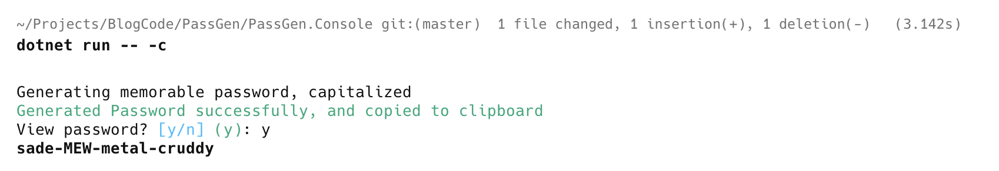
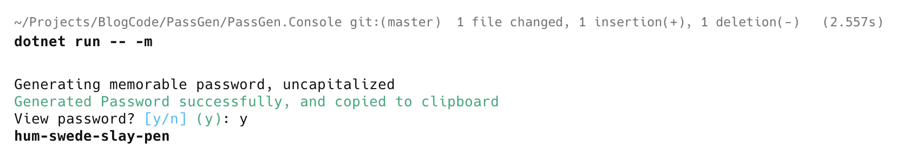

**This is Part 6 in a series in which we will build a simple password generator.**

In our last post, [Building A Simple Password Generator In C# & .NET - Part 5 - Generating Memorable Passwords](), we looked at how to generate **memorable passwords** in the form below:

```plaintext
even-camp-jab-spying
morse-bruises-stack-progeny
soaps-toughen-bee-gateway
wine-sooner-funnies-dub
```

In this post, we will update our console UI to support this.

We support two types of memorable passwords:

1. Normal, **uncapitalized** ones, in the form `bye-porch-urchin-caddy`
2. **Capitalized** ones, in the form `vroom-poach-war-vee`

The first step is updating our PasswordSettings class to add switches to support this.

First, the **normal** case:

```c#
[CommandOption("-m|--memorable")]
[Description("Whether passwords generated should be memorable, no capitalization")]
public bool MemorableUncapitalized { get; set; }
```

Next, the **Capitalized** case:

```c#
[CommandOption("-c|--memorableCapitalized")]
[Description("Whether passwords generated should be memorable and capitalized")]
public bool MemorableCapitalized { get; set; }
```

Finally, we update the `GeneratePasswordCommand` to handle the three cases:

1. **Memorable** passwords (**normal**)
2. **Memorable** passwords (**capitalized**)
3. **Human-readable** passwords
4. **Generic** passwords

```c#
public sealed class GeneratePasswordCommand : Command<PasswordSettings>
{
  public override int Execute(CommandContext context, PasswordSettings settings)
  {
      string password;
      if (settings.MemorableUncapitalized)
      {
          //Generate memorable password
          password = PasswordGenerator.GenerateMemorablePassword();

          AnsiConsole.MarkupLine(
              "Generating memorable password, uncapitalized");
      }
      else if (settings.MemorableCapitalized)
      {
          password = PasswordGenerator.GenerateMemorablePassword(true);

          AnsiConsole.MarkupLine(
              "Generating memorable password, capitalized");
      }
      else
      {
          // Generate password
          password =
              PasswordGenerator.GeneratePassword(settings.Numbers, settings.Symbols, settings.PasswordLength,
                  settings.HumanReadable);

          AnsiConsole.MarkupLine(
              $"Generating password with length {settings.PasswordLength}, {settings.Symbols} symbols and {settings.Numbers} digits with {(settings.HumanReadable ? "NO " : "")}ambiguous characters");
      }

      // Copy generated password to clipboard
      ClipboardService.SetText(password);
      AnsiConsole.MarkupLine($"[green]Generated Password successfully, and copied to clipboard[/]");

      // Ask the user to confirm password display
      var viewPassword = AnsiConsole.Prompt(
          new ConfirmationPrompt("View password?"));

      // If user said yes, print the password
      if (viewPassword)
          AnsiConsole.MarkupLine($"[bold]{Markup.Escape(password)}[/]");
      return 0;
  }
```

We can then run our console as follows, for **capitalized** memorable passwords:

```bash
dotnet run -- -c
```

This should print something like this:



We can then also run it for **uncapitalized** memorable passwords:

```bash
dotnet run -- -m
```

This should print something like this:



In our [next post](), we will look at how to add support for this to the console UI.

### TLDR

**In this post, we have added support for generating memorable passwords (capitalized and otherwise) to the console application.**

The code is in my [GitHub](https://github.com/conradakunga/BlogCode/tree/master/PassGen).

Happy hacking!
