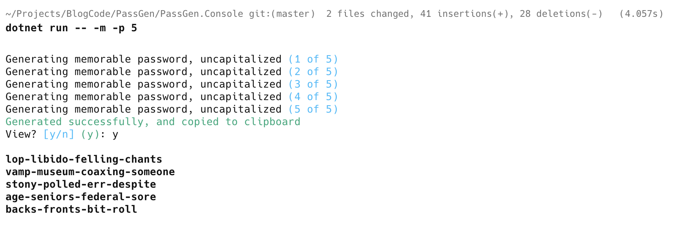
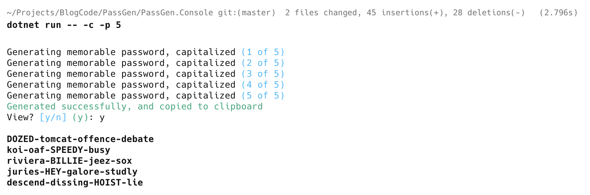
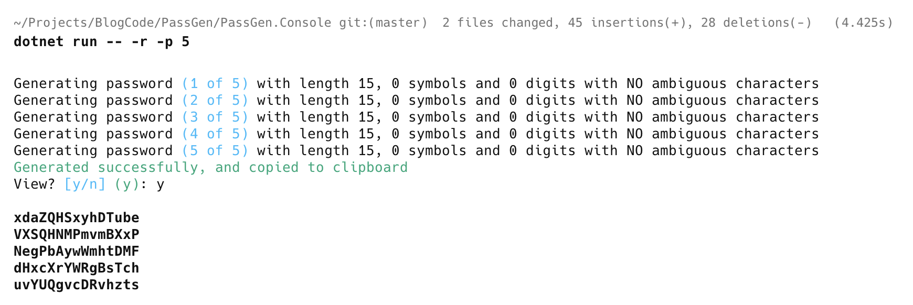
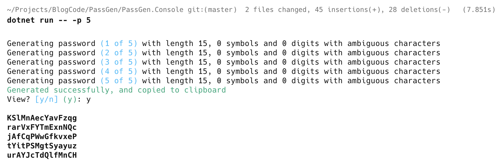

**This is Part 7 in a series in which we will build a simple password generator.**

In our last post, [Building A Simple Password Generator In C# & .NET - Part 6 - Updating Console UI For Memorable Password Generation](), we updated our console application to generate memorable passwords.

Our password generator currently generates **one password at a time**.

It would be an idea if we could tell it how many to generate as a **command line argument**, and it generates the specified number. 

Naturally, the default will be `0`.

We start by updating our `PasswordSettings` as follows:

```c#
[CommandOption("-p|--passwordCount")]
[Description("The number of passwords to generate")]
[DefaultValue(1)]
public int PasswordCount { get; set; }
```

Next, we update our `GeneratePasswordCommand` to factor in the passed count.

```c#
public sealed class GeneratePasswordCommand : Command<PasswordSettings>
{
  public override int Execute(CommandContext context, PasswordSettings settings)
  {
      // Temporary list  to store number of generated passwords
      var passwordList = new List<string>(settings.PasswordCount);
      for (var i = 0; i < settings.PasswordCount; i++)
      {
          string password;
          if (settings.MemorableUncapitalized)
          {
              //Generate memorable password
              password = PasswordGenerator.GenerateMemorablePassword();

              AnsiConsole.MarkupLine(
                  $"Generating memorable password, uncapitalized [blue]({i + 1} of {settings.PasswordCount})[/]");
          }
          else if (settings.MemorableCapitalized)
          {
              password = PasswordGenerator.GenerateMemorablePassword(true);

              AnsiConsole.MarkupLine(
                  $"Generating memorable password, capitalized [blue]({i + 1} of {settings.PasswordCount})[/]");
          }
          else
          {
              // Generate password
              password =
                  PasswordGenerator.GeneratePassword(settings.Numbers, settings.Symbols, settings.PasswordLength,
                      settings.HumanReadable);

              AnsiConsole.MarkupLine(
                  $"Generating password [blue]({i + 1} of {settings.PasswordCount})[/] with length {settings.PasswordLength}, {settings.Symbols} symbols and {settings.Numbers} digits with {(settings.HumanReadable ? "NO " : "")}ambiguous characters");
          }

          passwordList.Add(password);
      }

      var finalPassword = string.Join(Environment.NewLine, passwordList);
      // Copy generated password to clipboard
      ClipboardService.SetText(finalPassword);
      AnsiConsole.MarkupLine($"[green]Generated successfully, and copied to clipboard[/]");

      // Ask the user to confirm password display
      var viewPassword = AnsiConsole.Prompt(
          new ConfirmationPrompt("View?"));

      // If user said yes, print the password
      if (viewPassword)
          AnsiConsole.MarkupLine($"[bold]{Markup.Escape(finalPassword)}[/]");
      return 0;
  }
}
```

Here we are simply generating the passwords in a loop and appending them to a [generic List](https://learn.microsoft.com/en-us/dotnet/api/system.collections.generic.list-1?view=net-9.0) of `string`.

Once done, we join the `List` into a new `string`, separated by a [NewLine](https://learn.microsoft.com/en-us/dotnet/api/system.environment.newline?view=net-9.0#system-environment-newline).

We can now run the console application and see what it produces.

**Memorable** (**uncapitalized**) passwords:

```bash
dotnet run -- -m -p 5
```



**Memorable Capitalized** passwords:

```bash
dotnet run -- -c -p 5
```



**Human-readable** passwords:

```bash
dotnet run -- -r -p 5
```



**Normal** passwords:

```bash
dotnet run -- -p 5
```



### TLDR

**In this post, we updated the password generator to generate multiple passwords.**

The code is in my [GitHub](https://github.com/conradakunga/BlogCode/tree/master/PassGen).

Happy hacking!
