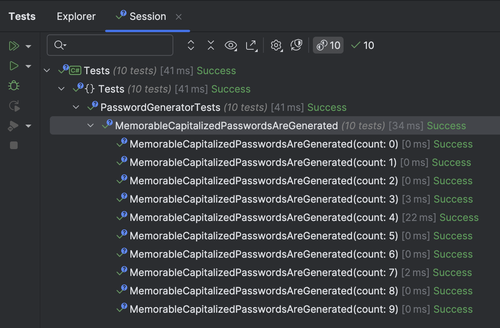

Over the last week, we have been building a **password generator**.

While working on the tests, I ran into a situation where I needed to run a test **multiple times**.

There does not need to be an [xUnit](https://xunit.net/?tabs=cs) attribute to support that directly.

In xUnit, tests can either be a `Fact` or a `Theory`.

The difference here is that `Theory` attributes support the passing of **parameters**, whereas `Fact` does not.

The issue here is not so much the passing of the parameter, but the **support for the test runner**.

The base class for the `DataAttribute` that applies to the `Theory` is as follows:

`````c#
namespace Xunit.Sdk
{
    /// <summary>
    /// Abstract attribute which represents a data source for a data theory.
    /// Data source providers derive from this attribute and implement GetData
    /// to return the data for the theory.
    /// Caution: the property is completely enumerated by .ToList() before any test is run. Hence it should return independent object sets.
    /// </summary>
    [DataDiscoverer("Xunit.Sdk.DataDiscoverer", "xunit.core")]
    [AttributeUsage(AttributeTargets.Method, AllowMultiple = true, Inherited = true)]
    public abstract class DataAttribute : Attribute
    {
        /// <summary>
        /// Returns the data to be used to test the theory.
        /// </summary>
        /// <param name="testMethod">The method that is being tested</param>
        /// <returns>One or more sets of theory data. Each invocation of the test method
        /// is represented by a single object array.</returns>
        public abstract IEnumerable<object[]> GetData(MethodInfo testMethod);

        /// <summary>
        /// Marks all test cases generated by this data source as skipped.
        /// </summary>
        public virtual string Skip { get; set; }
    }
}
`````

This looked like a good place to base an implementation of the proposed `Repeat` attribute.

It should be used as follows:

```c#
[Theory]
[Repeat(10)]
public void MemorableCapitalizedPasswordsAreGenerated(int count)
{
  // Snip test code
}
```

It takes as an argument a `Count`, the number of times to run the test.

The implementation is as follows:

```c#
/// <summary>
/// Runs tests multiple times
/// </summary>
public sealed class RepeatAttribute : DataAttribute
{
  private readonly int _count;

  /// <summary>
  /// Number of times to run the tests
  /// </summary>
  /// <param name="count"></param>
  /// <exception cref="ArgumentOutOfRangeException"></exception>
  public RepeatAttribute(int count)
  {
      if (count < 1)
      {
          throw new ArgumentOutOfRangeException(nameof(count), "Repeat count must be greater than 0."
          );
      }

      _count = count;
  }

  /// <summary>
  /// Returns an enumerable to be used by the test runner
  /// </summary>
  /// <param name="_"></param>
  /// <returns></returns>
  public override IEnumerable<object[]> GetData(MethodInfo _)
  {
      foreach (var iteration in Enumerable.Range(0, _count))
      {
          yield return [iteration];
      }
  }
}
```

Here is the Repeat attribute in operation:

```c#
[Theory]
[Repeat(10)]
public void MemorableCapitalizedPasswordsAreGenerated(int count)
{
    var password = PasswordGenerator.GenerateMemorablePassword(true);
    _output.Information("Generated password {Count} : {Password}", count, password);
    password.Length.Should().NotBe(0);
    // Check for the separators to be one less than the words
    password.Count(x => x == Constants.MemorablePasswordSeparator).Should()
        .Be(Constants.MemorableWordCount - 1);
    // The password should have upper case
    HasUpperCaseRegex().Match(password).Success.Should().BeTrue();
}
```

The test runner will look like this:



### TLDR

**We have created a `Repeat` attribute for the xUnit `Theory`, which allows running a test multiple times.**

Happy hacking!
