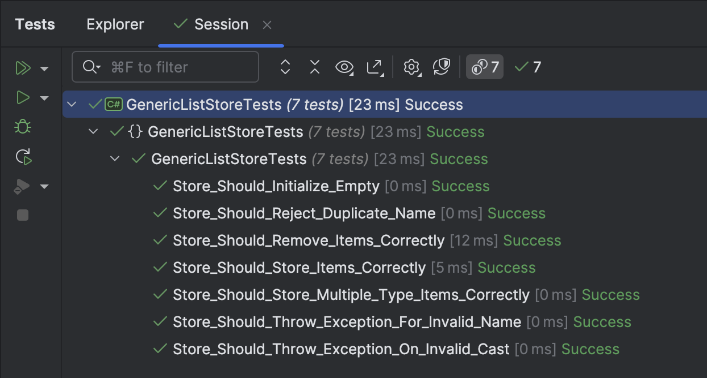

A project I'm working on led me down a path where I needed the following:

- An **in-memory** data structure
- That stored a number of generic `List` objects
- Each of these has a **name**
- **No duplicate** names were allowed

It was critical for the data structure to leverage generics so that there was no need to remember to cast objects to the correct type.

The design of this class is as follows:

- The basis for this would be a [Dictionary](https://learn.microsoft.com/en-us/dotnet/api/system.collections.generic.dictionary-2?view=net-9.0), with a `string` **key** and a `List` of `object` **value**.
- The class would have a generic `Add` method that would validate the `List` being passed for addition.
- The class would have a generic `Get` method that would cast the `List` of `objects` to the correct type.
- The class would validate that all added `Lists` have a **unique name**.
- The class would have a `Remove` method to remove a `List` by name.

The first iteration looks like this:

```c#
public sealed class GenericListStore
{
    private readonly Dictionary<string, object> _dictLists;

    /// <summary>
    /// Lists held
    /// </summary>
    public int Count => _dictLists.Count;

    /// <summary>
    /// Constructs a new GenericListStore
    /// </summary>
    public GenericListStore()
    {
        // We want the name to be case-insensitive
        _dictLists = new Dictionary<string, object>(StringComparer.OrdinalIgnoreCase);
    }

    /// <summary>
    /// Add a list to the collection
    /// </summary>
    /// <param name="name"></param>
    /// <param name="list"></param>
    /// <typeparam name="T"></typeparam>
    /// <exception cref="ArgumentException"></exception>
    public void Add<T>(string name, List<T> list)
    {
        ArgumentException.ThrowIfNullOrWhiteSpace(nameof(list));

        if (!_dictLists.TryAdd(name, list))
            throw new ArgumentException($"A list with the name '{name}' already exists.", nameof(name));
    }

    /// <summary>
    /// Get the list with the correct type
    /// </summary>
    /// <param name="name"></param>
    /// <typeparam name="T"></typeparam>
    /// <returns></returns>
    /// <exception cref="KeyNotFoundException"></exception>
    /// <exception cref="InvalidCastException"></exception>
    public List<T> Get<T>(string name)
    {
        if (!_dictLists.TryGetValue(name, out var list))
            throw new KeyNotFoundException($"No list found with the name '{name}'.");

        if (list is List<T> typedList)
            return typedList;

        throw new InvalidCastException($"List '{name}' does not store {typeof(T).Name} items");
    }
}
```

Sample usage would be like this:

```c#
List<string> items = ["one", "two", "three"];
var store = new GenericListStore();
store.Add("strings", items);
// Fetch items
var returned = store.Get<string>("strings");
```

Naturally, some tests to verify that all is well.

```c#
[Fact]
public void Store_Should_Initialize_Empty()
{
    var store = new GenericListStore();
    store.Count.Should().Be(0);
}

[Fact]
public void Store_Should_Store_Items_Correctly()
{
    List<string> items = ["one", "two", "three"];
    var store = new GenericListStore();
    store.Add("strings", items);
    // Fetch items
    var returned = store.Get<string>("strings");
    returned.Should().BeEquivalentTo(items);
}

[Fact]
public void Store_Should_Store_Multiple_Type_Items_Correctly()
{
    List<string> stringItems = ["one", "two", "three"];
    List<int> intItems = [1, 2, 3, 4];

    var store = new GenericListStore();

    const string stringKey = "strings";
    const string intKey = "ints";

    store.Add(stringKey, stringItems);
    store.Add(intKey, intItems);

    // Fetch items
    var returnedStrings = store.Get<string>(stringKey);
    var returnedInts = store.Get<int>(intKey);
    returnedStrings.Should().BeEquivalentTo(stringItems);
    returnedInts.Should().BeEquivalentTo(intItems);
}

[Fact]
public void Store_Should_Reject_Duplicate_Name()
{
    List<string> first = ["one", "two", "three"];
    List<string> second = ["four", "five", "six"];

    var store = new GenericListStore();
    store.Add("strings", first);
    var ex = Record.Exception(() => store.Add("strings", second));
    ex.Should().BeOfType<ArgumentException>();
}

[Fact]
public void Store_Should_Throw_Exception_On_Invalid_Cast()
{
    List<string> first = ["one", "two", "three"];

    var store = new GenericListStore();
    store.Add("strings", first);

    var ex = Record.Exception(() => store.Get<int>("strings"));
    ex.Should().BeOfType<InvalidCastException>();
}

[Fact]
public void Store_Should_Throw_Exception_For_Invalid_Name()
{
    List<string> first = ["one", "two", "three"];

    var store = new GenericListStore();
    store.Add("strings", first);

    var ex = Record.Exception(() => store.Get<int>("DOESNOTEXIST"));
    ex.Should().BeOfType<KeyNotFoundException>();
}

[Fact]
public void Store_Should_Remove_Items_Correctly()
{
    List<string> items = ["one", "two", "three"];
    var store = new GenericListStore();
    store.Count.Should().Be(0);
    store.Add("strings", items);
    store.Count.Should().Be(1);
    store.Remove("strings");
    store.Count.Should().Be(0);
}
```

Running the tests shows everything works as expected:



### TLDR

**We have built a component that can store and retrieve a generic `Lists` identified by name.**

The code is in my [GitHub](https://github.com/conradakunga/BlogCode/tree/master/GenericListStore).

Happy hacking!
