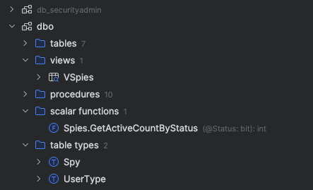

[Jetbrains](https://www.jetbrains.com/)  are the makers of the famous [IntelliJ IDEA](https://www.jetbrains.com/idea/) Java IDE, which is also the IDE that [Android Studio](https://developer.android.com/studio) is based on. 

They also make my IDE of choice, [Rider](https://www.jetbrains.com/rider/).

They also make a tool, [DataGrip](https://www.jetbrains.com/datagrip/) that is a tool that can connect to and allow for **querying and manipulation of various DBMS**.

Here is my current database drivers setup:

And continuing ..

Once you have connected to a database, you can see the following:

If, for some reason, you find you cannot see any objects and you know that they exist, go to the top of the **Database Explorer** and click this icon.

In the resulting menu, click Filter.

You should see a list of objects. Check them as appropriate so that **DataGrip** will show them.

The objects should now appear.

Happy hacking!
