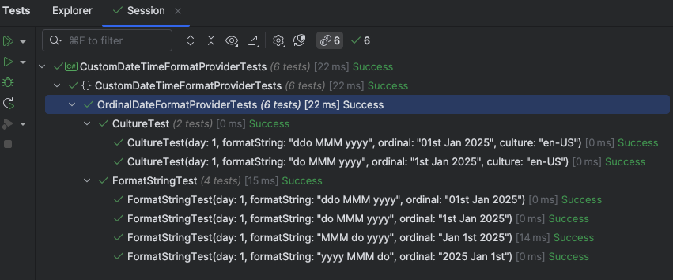

In the last two posts, we looked at how to handle the display of ordinal numbers in C# & .NET.

As a recap, the following code:

```c#
foreach (var date in dates)
{
  Console.WriteLine($"- {date.Day.Ordinalize()} {date:MMM} {date:yyyy}");
}
```

Produces the following output.

```plaintext
- 1st Aug 2025
- 2nd Aug 2025
- 3rd Aug 2025
- 4th Aug 2025
```

This is a bit clunky, so Humanizer has an extension method directly on the DateTime - `ToOrdinalWords()`

Given our sample data is made up of DateOnly types, we must first convert them to DateTime.

```c#
DateOnly[] dates = [
  new DateOnly(2025, 8, 1),
  new DateOnly(2025, 8, 2),
  new DateOnly(2025, 8, 3),
  new DateOnly(2025, 8, 4)
];
	foreach (var date in dates)
	{
		Console.WriteLine($"- {date.ToDateTime(TimeOnly.MinValue).ToOrdinalWords()}");
	}
```

This will print the following:

```plaintext
- 1st August 2025
- 2nd August 2025
- 3rd August 2025
- 4th August 2025
```

This is fine, but this is locale aware, and my current locale happens to be en-KE, which is loosely based on en-GB.

If we run the code under the en-US culture:

```c#
// Change culture to en-US
CultureInfo.CurrentUICulture = new CultureInfo("en-US");
foreach (var date in dates)
{
  Console.WriteLine($"- {date.ToDateTime(TimeOnly.MinValue).ToOrdinalWords()}");
}
```

The results now look like this:

```plaintext
- August 1st, 2025
- August 2nd, 2025
- August 3rd, 2025
- August 4th, 2025
```

Note this is different from the previous display.

You might want to control where exactly the ordinal appears in the output.

Basically, the challenge here is that using the `Humanizer` `ToOrdinalWords()` method, the **control of the ordinal day display is out of your hands**.

To get around this problem you have two options:

- **Format the day component yourself**, as we did in the previous posts
- Create a **custom format provider**

The latter option is more **flexible**, as you can place the ordinal wherever you want in the resulting `string`.

To create a custom format provider, you implement two interfaces,  [IFormatProvider](https://learn.microsoft.com/en-us/dotnet/api/system.iformatprovider?view=net-9.0) and [ICustomFormatter](https://learn.microsoft.com/en-us/dotnet/api/system.icustomformatter?view=net-9.0)

These will require the implementation of two methods, Format and GetFormat, and we will bake in support for [DateOnly](https://learn.microsoft.com/en-us/dotnet/api/system.dateonly?view=net-9.0) and [DateTime](https://learn.microsoft.com/en-us/dotnet/api/system.datetime?view=net-9.0).

The resulting implementation will look like this:

```c#
using System;
using System.Globalization;

public class OrdinalDateFormatProvider : IFormatProvider, ICustomFormatter
{
  private readonly IFormatProvider _baseProvider;

  public OrdinalDateFormatProvider() : this(CultureInfo.CurrentCulture)
  {
  }

  public OrdinalDateFormatProvider(IFormatProvider baseProvider)
  {
      _baseProvider = baseProvider;
  }

  public object GetFormat(Type? formatType)
  {
      ArgumentNullException.ThrowIfNull(formatType);

      if (formatType == typeof(ICustomFormatter)) return this;

      return _baseProvider.GetFormat(formatType)!;
  }

  public string Format(string? format, object? arg, IFormatProvider? formatProvider)
  {
      return arg switch
      {
          DateTime dt => FormatDate(dt, format),
          DateOnly dOnly => FormatDate(dOnly, format),
          _ => arg is IFormattable f ? f.ToString(format, _baseProvider) : arg?.ToString() ?? string.Empty
      };
  }

  private string FormatDate<T>(T date, string? format) where T : IFormattable
  {
      format ??= "G";

      if (format.Contains('o'))
      {
          int day = date switch
          {
              DateTime dt => dt.Day,
              DateOnly dOnly => dOnly.Day,
              _ => throw new InvalidOperationException()
          };

          var daySuffix = day.GetDaySuffix();
          var innerFormat = format.Replace("o", $"'{daySuffix}'");
          return date.ToString(innerFormat, _baseProvider);
      }

      return date.ToString(format, _baseProvider);
  }
}
```

With this in place, we can write format strings like this:

| Format String | Result |
| ------------- | ------ |
| do MMM yyyy | 1st Jan 2025 |
| MMM do yyyy | Jan 1st 2025 |
| yyyy MMM do | 2025 Jan 1st |
| ddo MMM yyyy | 01st Jan 2025 |

The `o` here is the format string we have introduced for ordinal.

We can then write some tests to verify everything works well.

```c#
[Theory]
[InlineData(1, "do MMM yyyy", "1st Jan 2025")]
[InlineData(1, "MMM do yyyy", "Jan 1st 2025")]
[InlineData(1, "yyyy MMM do", "2025 Jan 1st")]
[InlineData(1, "ddo MMM yyyy", "01st Jan 2025")]
public void FormatStringTest(int day, string formatString, string ordinal)
{
    var date = new DateOnly(2025, 1, day);
    var result = string.Format(new OrdinalDateFormatProvider(),
        $"{{0:{formatString}}}", date);
    result.Should().Be(ordinal);
}

[Theory]
[InlineData(1, "do MMM yyyy", "1st Jan 2025", "en-US")]
[InlineData(1, "ddo MMM yyyy", "01st Jan 2025", "en-US")]
public void CultureTest(int day, string formatString, string ordinal, string culture)
{
    var date = new DateOnly(2025, 1, day);
    var result = string.Format(new OrdinalDateFormatProvider(new CultureInfo(culture)),
        $"{{0:{formatString}}}",
        date);
    result.Should().Be(ordinal);
}
```

These should pass successfully.



### TLDR

**We have implemented a custom formatter to allow specification of ordinals in `DateOnly` and `DateTime`.**

The code is in my [GitHub](https://learn.microsoft.com/en-us/dotnet/api/system.datetime?view=net-9.0).

Happy hacking!
