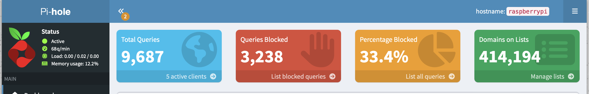
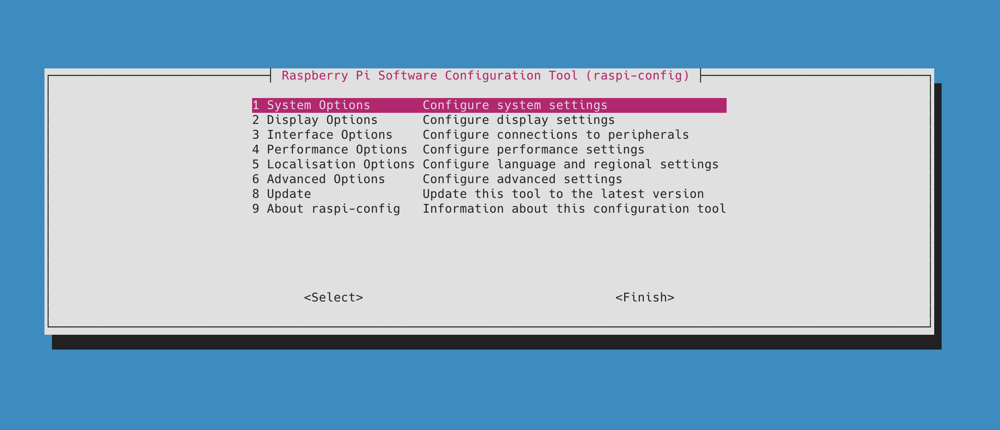
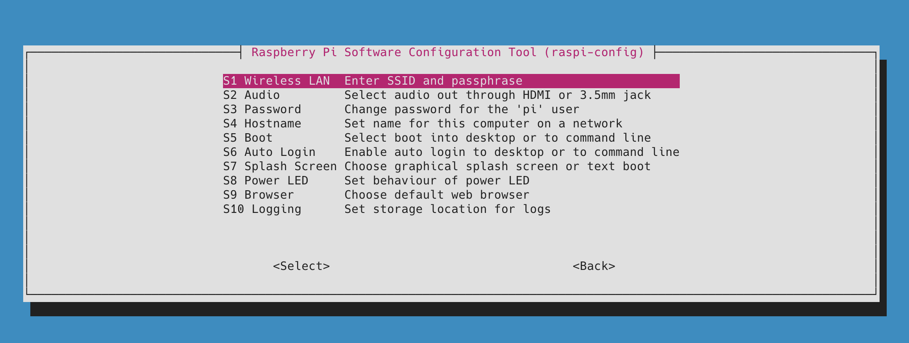
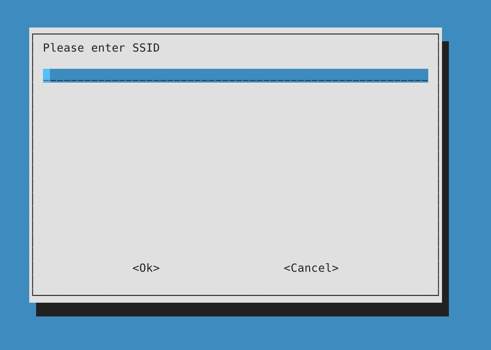

For many years, I have been a proud owner and user of a [Raspberry PI](https://www.raspberrypi.com/), and in particular, a [Model 4](https://www.raspberrypi.com/products/raspberry-pi-4-model-b/).

I use it to run a bunch of [Docker](https://www.docker.com/) containers, one of which is the excellent PiHole that keeps the traffic within my network ad-free.



Recently, I wanted to change the WiFi network it was operating on and found, to my consternation, that the mouse had died.

How then could I get the device to join a network?

The terminal to the rescue!

Run this command

```bash
sudo raspi-config
```

This will launch [raspi-config](https://github.com/RPi-Distro/raspi-config), a utility to configure various options on the device.



Select 1, System Options.



Next, S1, Wireless LAN.



You can now key in the SSID and access key.

### TLDR

**The `raspi-config` tool allows you to configure various aspects of your Raspberry Pi.**

Happy hacking!
