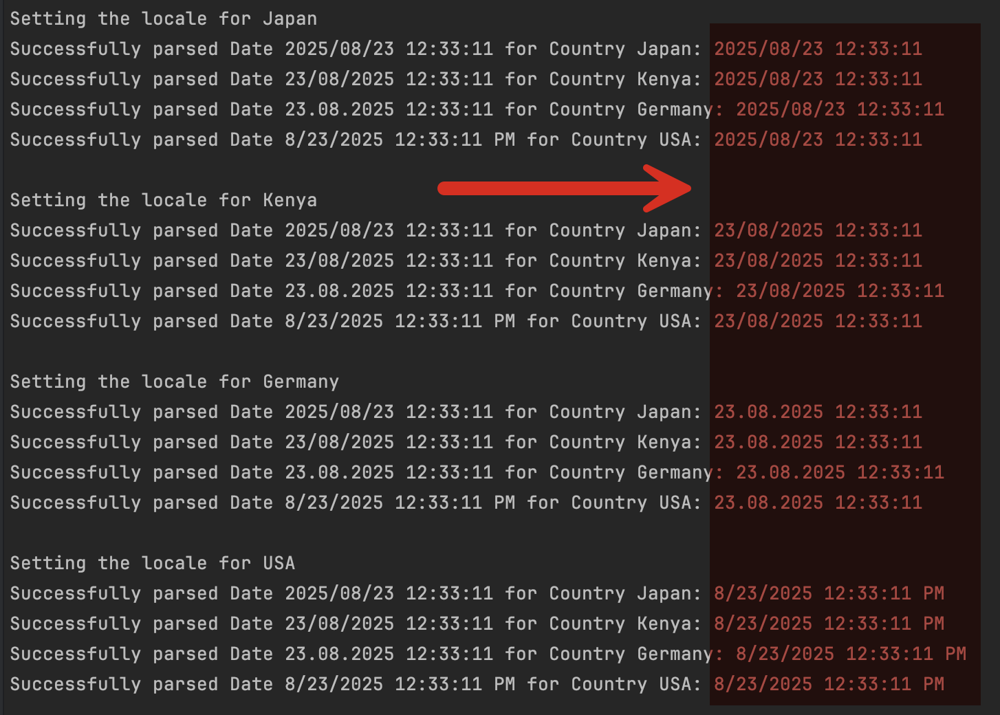

In a previous post, [Locale Considerations When Parsing Dates](), I discussed how **locale considerations have a heavy influence on how data gets parsed**.

The example I used was as follows:

```c#
// Japan
Thread.CurrentThread.CurrentCulture = new CultureInfo("ja-JP");
Console.WriteLine(DateTime.Now);
// Kenya (English)
Thread.CurrentThread.CurrentCulture = new CultureInfo("en-KE");
Console.WriteLine(DateTime.Now);
// German
Thread.CurrentThread.CurrentCulture = new CultureInfo("de-DE");
Console.WriteLine(DateTime.Now);
// USA (English)
Thread.CurrentThread.CurrentCulture = new CultureInfo("en-US");
Console.WriteLine(DateTime.Now);
```

That printed the following:

```plaintext
2025/06/16 21:32:29
16/06/2025 21:32:29
16.06.2025 21:32:29
6/16/2025 9:32:29 PM
```

You might have noticed that to change locales at runtime, I actually **changed the locale of the running thread**.

This may work fine if the aim is for the **user's locale** to be detected and used.

It's not ideal if you need to do the work using dates from **different locales at the same time**.

To achieve this, we create a [CultureInfo](https://learn.microsoft.com/en-us/dotnet/api/system.globalization.cultureinfo?view=net-9.0) object and pass it as an overload to the [DateTime.ToString()](https://learn.microsoft.com/en-us/dotnet/api/system.datetime.tostring?view=net-9.0) method.

I can re-write the example to work the same as follows:

```c#
// Japan
Console.WriteLine(DateTime.Now.ToString(new CultureInfo("ja-JP")));
// Kenya (English)
Console.WriteLine(DateTime.Now.ToString(new CultureInfo("en-KE")));
// German
Console.WriteLine(DateTime.Now.ToString(new CultureInfo("de-DE")));
// USA (English)
Console.WriteLine(DateTime.Now.ToString(new CultureInfo("en-US")));
```

This will print the following:

```plaintext
2025/08/23 12:33:11
23/08/2025 12:33:11
23.08.2025 12:33:11
8/23/2025 12:33:11 PM
```

Similarly, we can achieve the same result when parsing.

Assume that we have the dates and the corresponding formats in a database.

| Date                  | Country |
| --------------------- | ------- |
| 2025/08/23 12:33:11   | Japan   |
| 23/08/2025 12:33:11   | Kenya   |
| 23.08.2025 12:33:11   | Germany |
| 8/23/2025 12:33:11 PM | USA     |

The challenge is to parse all these date strings into the **current locale's** date format.

**WARNING: Don't store `DateTime` as `string` in the database!**

For this, we will build a simple record type to store the information.

```c#
internal record DateEntry(string DateTime, string Country);
```

Then, a helper [local function](https://learn.microsoft.com/en-us/dotnet/csharp/programming-guide/classes-and-structs/local-functions) that returns a [CultureInfo](https://learn.microsoft.com/en-us/dotnet/api/system.globalization.cultureinfo?view=net-9.0) object given a country `Name`.

```c#
CultureInfo GetCultureInfo(string country)
{
  return country switch
  {
    "Japan" => new CultureInfo("ja-JP"),
    "Kenya" => new CultureInfo("en-KE"),
    "Germany" => new CultureInfo("de-DE"),
    "USA" => new CultureInfo("en-US"),
    // Default if unrecognizable
    _ => CultureInfo.InvariantCulture
  };
}
```

Finally, the actual code.

```c#
using System.Globalization;

var entries = new DateEntry[]
{
    new("2025/08/23 12:33:11", "Japan"),
    new("23/08/2025 12:33:11", "Kenya"),
    new("23.08.2025 12:33:11", "Germany"),
    new("8/23/2025 12:33:11 PM", "USA"),
};

foreach (var entry in entries)
{
    if (DateTime.TryParse(entry.DateTime, GetCultureInfo(entry.Country), out var date))
    {
        // Parsing was successful
        Console.WriteLine($"Successfully parsed Date {entry.DateTime} for Country {entry.Country}: {date}");
    }
    else
    {
        // Parsing failed
        Console.WriteLine($"Failed to parse Date {entry.DateTime}");
    }
}
```

This will print the following:

```
Successfully parsed Date 2025/08/23 12:33:11 for Country Japan: 23/08/2025 12:33:11
Successfully parsed Date 23/08/2025 12:33:11 for Country Kenya: 23/08/2025 12:33:11
Successfully parsed Date 23.08.2025 12:33:11 for Country Germany: 23/08/2025 12:33:11
Successfully parsed Date 8/23/2025 12:33:11 PM for Country USA: 23/08/2025 12:33:11
```

The awesomeness of this is that, although the dates were stored in completely **different formats**, we were able to parse them into a `DateTime` that is **understood by the current locale**.

We can prove this by rewriting the code to run against 4 **different** cultures.

```c#

var entries = new DateEntry[]
{
    new("2025/08/23 12:33:11", "Japan"),
    new("23/08/2025 12:33:11", "Kenya"),
    new("23.08.2025 12:33:11", "Germany"),
    new("8/23/2025 12:33:11 PM", "USA"),
};


foreach (var country in entries)
{
    Console.WriteLine($"Setting the locale for {country.Country}");
    Thread.CurrentThread.CurrentCulture = GetCultureInfo(country.Country);
    foreach (var entry in entries)
    {
        if (DateTime.TryParse(entry.DateTime, GetCultureInfo(entry.Country), out var date))
        {
            // Parsing was successful
            Console.WriteLine($"Successfully parsed Date {entry.DateTime} for Country {entry.Country}: {date}");
        }
        else
        {
            // Parsing failed
            Console.WriteLine($"Failed to parse Date {entry.DateTime}");
        }
    }

    Console.WriteLine();
}
```

This prints the following:



We can see here that the locales are all **different** (as evidenced by the default output for the dates as highlighted), but the parsing **always succeeded**.

### TLDR

**It is possible to work with locale-specific data by using the `CultureInfo` object for parsing and display.**

The code is in my GitHub.

Happy hacking!
