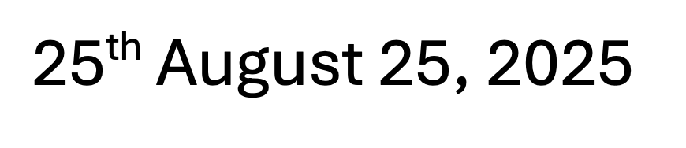
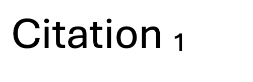

Is it possible to represent [superscript and subscript](https://en.wikipedia.org/wiki/Subscript_and_superscript) in [Jekyll](https://jekyllrb.com/)?

It is.

And this is not an issue with **Jekyll** alone, per se, but the [Markdown](https://www.markdownguide.org/) format.

If you want to display the following:



You would key it in like this:

```html
25<sup>th</sup> August 25, 2025
```

This will, hopefully, display as expected

**25<sup>th</sup> August 25, 2025**

Similarly, for **subscript**, if we wished to display the following:



We would key it in like this:

```html
Citation<sub>1</sub>
```

Which, hopefully, displays as expected:

**Citation<sub>1</sub>**

Happy hacking!
