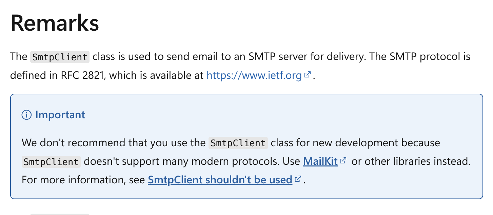
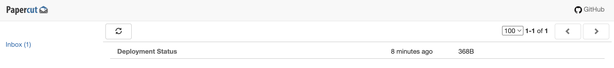
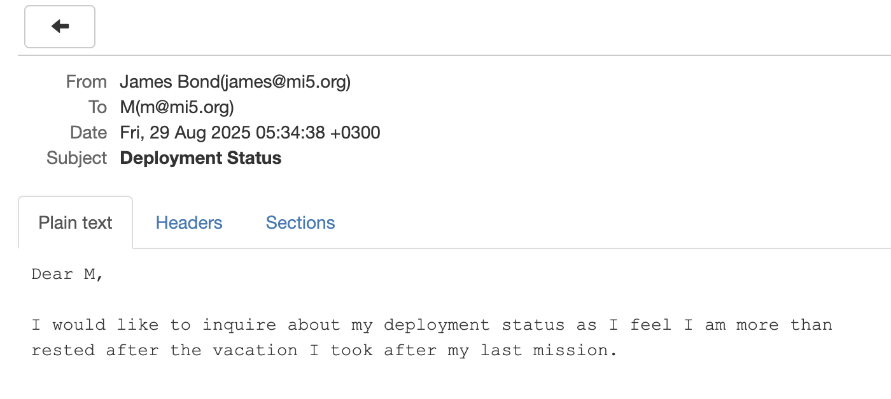

This is Part 10 of a series on sending email.

- [Sending Email in C# & .NET - Part 1 - Introduction]()
- [Sending Email in C# & .NET - Part 2 - Delivery]()
- [Sending Email in C# & .NET - Part 3 - Using Gmail]()
- [Sending Email In C# & .NET - Part 4 - Using Office 365 & MS Graph API]()
- [Sending Email In C# & .NET - Part 5 - Using Google Cloud API]()
- [Sending Email In C# & .NET - Part 6 - Testing SMTP Locally  Using PaperCut]()
- [Sending Email In C# & .NET - Part 7 - Sending Inline Images Using SMTP]()
- [Sending Email In C# & .NET - Part 8 - Sending HTML Email Using SMTP]()
- [Sending Email In C# & .NET - Part 9 - Sending Multiple Format Email Using SMTP]()
- **Sending Email In C# & .NET - Part 10 - Sending Plain Text Email Using MailKit (This Post)**
- [Sending Email In C# & .NET - Part 11 - Sending HTML Email Using MailKit]()
- [Sending Email In C# & .NET - Part 12 - Sending Email With Attachments Using MailKit]() 
- [Sending Email In C# & .NET - Part 13 - Sending Email With Inline Attachments Using MailKit]()
- [Sending Email In C# & .NET - Part 14 - Sending Multiple Format Email Using MailKit]()
- [Sending Email In C# & .NET - Part 15 - Sending Calendar Invites Using MailKit]()
- [Sending Email In C# & .NET - Part 16 - Testing SMTP Locally Using Mailpit]()

In the previous post in this series, "[Sending Email In C# & .NET - Part 9 - Sending Multiple Format Email Using SMTP]()," we explored how to send emails in multiple formats—plain text and HTML — using SMTP.

In this post, we will explore how to send email using a more **modern**, feature-rich library: [MailKit](https://www.nuget.org/packages/mailkit/).

In the documentation for Microsoft's [SmtpClient](https://learn.microsoft.com/en-us/dotnet/api/system.net.mail.smtpclient?view=net-9.0) is this section:



> Important
>
> We don't recommend that you use the `SmtpClient` class for new development because `SmtpClient` doesn't support many modern protocols. Use [MailKit](https://github.com/jstedfast/MailKit) or other libraries instead. For more information, see [SmtpClient shouldn't be used](https://github.com/dotnet/platform-compat/blob/master/docs/DE0005.md).

Interesting.

To send an email using `MailKit`, the following are the steps:

1. Create a `MimeMessage`
2. Create one (or more) `MailboxAddress` for the recipients and add to the `To` collection of the `MimeMessage`
3. Create one `MailboxAddress` for the sender and add it to the `From` collection of the `MimeMessage`
4. Set  the `Subject` of the `MimeMessage`
5. Set the `Body` of the `MimeMessage`
6. Send the message using the `SmtpClient`. This is the `SmtpClient` from `MailKit`, not the one in [System.Net](https://learn.microsoft.com/en-us/dotnet/api/system.net.mail.smtpclient?view=net-9.0).

Before we write our code, we first run our **local SMTP server**, [PaperCut](https://github.com/ChangemakerStudios/Papercut-SMTP), via [Docker](https://www.docker.com/). We have discussed this before in the post [Sending Email In C# & .NET - Part 6 - Testing SMTP Locally Using PaperCut]()

```c#
docker run -d -p 8080:80 -p 25:25 changemakerstudiosus/papercut-smtp:latest
```

The code is as follows:

```c#
using MailKit.Net.Smtp;
using MimeKit;
using Serilog;

// Configure logging to the console
Log.Logger = new LoggerConfiguration()
    .WriteTo.Console()
    .CreateLogger();

// Create the email
var message = new MimeMessage();
// Add the sender
message.From.Add(new MailboxAddress("James Bond", "james@mi5.org"));
// Set the recipient
message.To.Add(new MailboxAddress("M", "m@mi5.org"));
// Set the email subject
message.Subject = "Deployment Status";

var textBody = new TextPart("plain")
{
    Text = """
           Dear M,

           I would like to inquire about my deployment status as I feel I am more than
           rested after the vacation I took after my last mission.
           """
};

message.Body = textBody;

// Now send the email
using (var client = new SmtpClient())
{
    Log.Information("Connecting to smtp server...");
    await client.ConnectAsync("localhost", 25, false);
    // Typically, authenticate here. But we are using PaperCut 
    //await client.AuthenticateAsync("username", "password");
    await client.SendAsync(message);
    Log.Information("Sent message");
    await client.DisconnectAsync(true);
    Log.Information("Disconnected from server");
}
```

If we run this, we should see the following:

```plaintext
[05:34:38 INF] Connecting to smtp server...
[05:34:38 INF] Sent message
[05:34:38 INF] Disconnected from server
```

If we check our **PaperCut** inbox:





### TLDR

**In this post, we looked at how to send email using `MailKit`, which is the recommended way to send email going forward.**

The code is in my [GitHub](https://github.com/conradakunga/BlogCode/tree/master/2025-08-25%20-%20MailKit%20Email).

Happy hacking!
