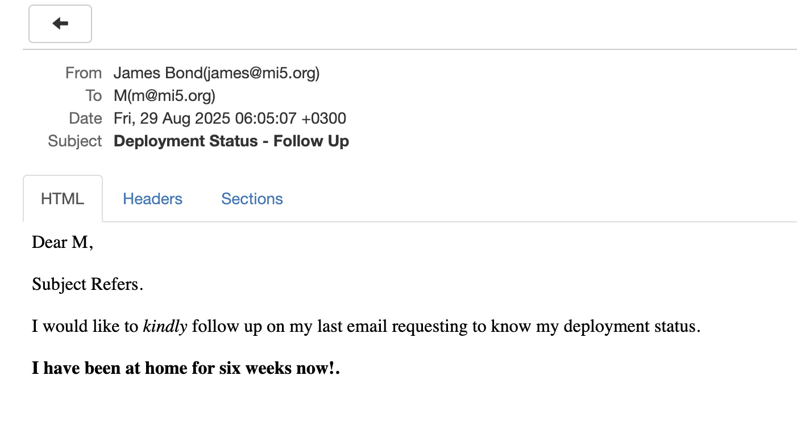

This is Part 11 of a series on sending email.

- [Sending Email in C# & .NET  - Part 1 - Introduction]()
- [Sending Email in C# & .NET - Part 2 - Delivery]()
- [Sending Email in C# & .NET - Part 3 - Using Gmail]()
- [Sending Email In C# & .NET - Part 4 - Using Office 365 & MS Graph API]()
- [Sending Email In C# & .NET - Part 5 - Using Google Cloud API]()
- [Sending Email In C# & .NET - Part 6 - Testing SMTP Locally  Using PaperCut]()
- [Sending Email In C# & .NET - Part 7 - Sending Inline Images Using SMTP]()
- [Sending Email In C# & .NET - Part 8 - Sending HTML Email Using SMTP]()
- [Sending Email In C# & .NET - Part 9 - Sending Multiple Format Email Using SMTP]()
- [Sending Email In C# & .NET - Part 10 - Sending Plain Text Email Using MailKit]()
- **Sending Email In C# & .NET - Part 11 - Sending HTML Email Using MailKit (This post)**
- [Sending Email In C# & .NET - Part 12 - Sending Email With Attachments Using MailKit]() 
- [Sending Email In C# & .NET - Part 13 - Sending Email With Inline Attachments Using MailKit]()

Our last post, "[Sending Email In C# & .NET - Part 10 - Sending Plain Text Email Using MailKit]()", looked at how to send plain text email using [MailKit](https://github.com/jstedfast/MailKit).

In this post, we will look at how to send an **HTML** email.

The process is **exactly the same as before**:

1. Create a `MimeMessage`
2. Create one (or more) `MailboxAddress` for the recipients and add to the `To` collection of the `MimeMessage`
3. Create one `MailboxAddress` for the sender and add it to the `From` collection of the `MimeMessage`
4. Set  the `Subject` of the `MimeMessage`
5. Set the `Body` of the `MimeMessage`
6. Send the message using the `SmtpClient`. This is the `SmtpClient` from `MailKit`, not the one in [System.Net](https://learn.microsoft.com/en-us/dotnet/api/system.net.mail.smtpclient?view=net-9.0).

The difference is how the `Body` is set.

```c#
using MailKit.Net.Smtp;
using MimeKit;
using Serilog;

// Configure logging to the console
Log.Logger = new LoggerConfiguration()
    .WriteTo.Console()
    .CreateLogger();

// Create the email
var message = new MimeMessage();
// Add the sender
message.From.Add(new MailboxAddress("James Bond", "james@mi5.org"));
// Set the recipient
message.To.Add(new MailboxAddress("M", "m@mi5.org"));
// Set the email subject
message.Subject = "Deployment Status - Follow Up";

var textBody = new TextPart("html")
{
    Text = """
           Dear M,
           <br/>
           <br/>
           Subject Refers.
           <br/>
           <br/>
           I would like to <i>kindly</i> follow up on my last email requesting to know my deployment
           status.
           <br/>
           <br/>
           <b>I have been at home for six weeks now!<b>.
           """
};

message.Body = textBody;

// Now send the email
using (var client = new SmtpClient())
{
    Log.Information("Connecting to smtp server...");
    await client.ConnectAsync("localhost", 25, false);
    // Typically, authenticate here. But we are using PaperCut 
    //await client.AuthenticateAsync("username", "password");
    await client.SendAsync(message);
    Log.Information("Sent message");
    await client.DisconnectAsync(true);
    Log.Information("Disconnected from server");
}
```

The magic is happening here, where we construct the `TextPart`.

```c#
var textBody = new TextPart("html")
{
    Text = """
           Dear M,
           <br/>
           <br/>
           Subject Refers.
           <br/>
           <br/>
           I would like to <i>kindly</i> follow up on my last email requesting to know my deployment
           status.
           <br/>
           <br/>
           <b>I have been at home for six weeks now!<b>.
           """
};
```

The argument value `"html"` is what is used to construct the **HTML body** for the email.

If we run this code to send the email, it will appear as follows at the client:



We can see here that the email is sent in `HTML` format.

### TLDR

**In this post, we looked at how to send HTML email using `MailKit`, where we create a `TextPart` and pass `"html"` as the argument.**

The code is in my [GitHub](https://github.com/conradakunga/BlogCode/tree/master/2025-08-26%20-%20MailKit%20HTMLEmail).

Happy hacking!
