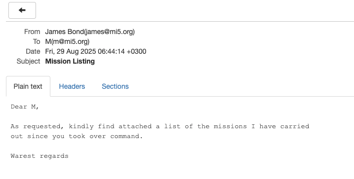
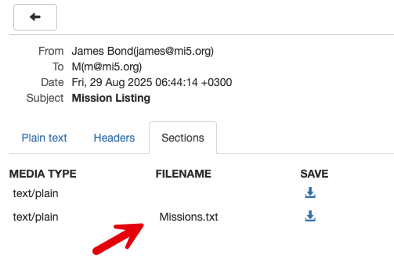

This is Part 12 of a series on sending email.

- [Sending Email in C# & .NET  - Part 1 - Introduction]()
- [Sending Email in C# & .NET - Part 2 - Delivery]()
- [Sending Email in C# & .NET - Part 3 - Using Gmail]()
- [Sending Email In C# & .NET - Part 4 - Using Office 365 & MS Graph API]()
- [Sending Email In C# & .NET - Part 5 - Using Google Cloud API]()
- [Sending Email In C# & .NET - Part 6 - Testing SMTP Locally  Using PaperCut]()
- [Sending Email In C# & .NET - Part 7 - Sending Inline Images Using SMTP]()
- [Sending Email In C# & .NET - Part 8 - Sending HTML Email Using SMTP]()
- [Sending Email In C# & .NET - Part 9 - Sending Multiple Format Email Using SMTP]()
- [Sending Email In C# & .NET - Part 10 - Sending Plain Text Email Using MailKit]()
- [Sending Email In C# & .NET - Part 11 - Sending HTML Email Using MailKit]()
- **Sending Email In C# & .NET - Part 12 - Sending Email With Attachments Using MailKit (This post)**

Our last post, "[Sending Email In C# & .NET - Part 11 - Sending HTML Email Using MailKit]()", looked at how to send HTML email using `MailKit`.

In this post, we will look at how to send an email with **attachments**.

The process is as follows:

1. Create a `MimeMessage`
2. Create one (or more) `MailboxAddress` for the recipients and add to the `To` collection of the `MimeMessage`
3. Create one `MailboxAddress` for the sender and add it to the `From` collection of the `MimeMessage`
4. Set  the `Subject` of the `MimeMessage`
5. Create a `TextPart` for the email body.
6. Create a `MimePart` for the attachment
7. Create a `Multipart` (mixed), to which we add the `TextPart` and the `MimePart`.
8. Set the message `Body` to be the `Multipart`.
9. Send the message using the `SmtpClient`. This is the `SmtpClient` from `MailKit`, not the one in [System.Net](https://learn.microsoft.com/en-us/dotnet/api/system.net.mail.smtpclient?view=net-9.0).

The code is as follows:

```c#
using MailKit.Net.Smtp;
using MimeKit;
using Serilog;

// Configure logging to the console
Log.Logger = new LoggerConfiguration()
    .WriteTo.Console()
    .CreateLogger();

// Create the email
var message = new MimeMessage();
// Add the sender
message.From.Add(new MailboxAddress("James Bond", "james@mi5.org"));
// Set the recipient
message.To.Add(new MailboxAddress("M", "m@mi5.org"));
// Set the email subject
message.Subject = "Mission Listing";

// Create the text body
var textBody = new TextPart("plain")
{
    Text = """
           Dear M,

           As requested, kindly find attached a list of the missions I have carried
           out since you took over command.

           Warest regards
           """
};

// create the attachment
var attachment = new MimePart("text", "plain")
{
    Content = new MimeContent(File.OpenRead("Missions.txt")),
    ContentDisposition = new ContentDisposition(ContentDisposition.Attachment),
    ContentTransferEncoding = ContentEncoding.Base64,
    FileName = "Missions.txt"
};

// Create a container for the body text & attachment
var parts = new Multipart("mixed");
parts.Add(textBody);
parts.Add(attachment);

// Set the body
message.Body = parts;

// Now send the email
using (var client = new SmtpClient())
{
    Log.Information("Connecting to smtp server...");
    await client.ConnectAsync("localhost", 25, false);
    // Typically, authenticate here. But we are using PaperCut 
    //await client.AuthenticateAsync("username", "password");
    await client.SendAsync(message);
    Log.Information("Sent message");
    await client.DisconnectAsync(true);
    Log.Information("Disconnected from server");
}
```

If we run this code, the email will look like this:





### TLDR

**In this post, we looked at how to send an email with attachments using `MailKit`.**

The code is in my GitHub.

Happy hacking!
