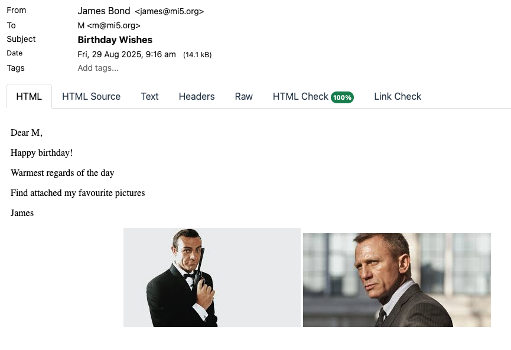

This is part 13 of a series on sending Email

- [Sending Email in C# & .NET - Part 1 - Introduction]()
- [Sending Email in C# & .NET - Part 2 - Delivery]()
- [Sending Email in C# & .NET - Part 3 - Using Gmail]()
- [Sending Email In C# & .NET - Part 4 - Using Office 365 & MS Graph API]()
- [Sending Email In C# & .NET - Part 5 - Using Google Cloud API]()
- [Sending Email In C# & .NET - Part 6 - Testing SMTP Locally  Using PaperCut]()
- [Sending Email In C# & .NET - Part 7 - Sending Inline Images Using SMTP]()
- [Sending Email In C# & .NET - Part 8 - Sending HTML Email Using SMTP]()
- [Sending Email In C# & .NET - Part 9 - Sending Multiple Format Email Using SMTP]()
- [Sending Email In C# & .NET - Part 10 - Sending Plain Text Email Using MailKit]()
- [Sending Email In C# & .NET - Part 11 - Sending HTML Email Using MailKit]()
- [Sending Email In C# & .NET - Part 12 - Sending Email With Attachments Using MailKit]() 
- **Sending Email In C# & .NET - Part 13 - Sending Email With Inline Attachments Using MailKit (This post)**
- [Sending Email In C# & .NET - Part 14 - Sending Multiple Format Email Using MailKit]()
- [Sending Email In C# & .NET - Part 15 - Sending Calendar Invites Using MailKit]()
- [Sending Email In C# & .NET - Part 16 - Testing SMTP Locally Using Mailpit]()

In our last post, "[Sending Email In C# & .NET - Part 12 - Sending Email With Attachments Using MailKit]()", we looked at how to send email with attachments using [MailKit](https://github.com/jstedfast/MailKit).

In this post, we will look at how to send email with **inline attachments** (images).

The process is as follows:

1. Create a `MimeMessage`
2. Create one (or more) `MailboxAddress` for the recipients and add to the `To` collection of the `MimeMessage`
3. Create one `MailboxAddress` for the sender and add it to the `From` collection of the `MimeMessage`
4. Set  the `Subject` of the `MimeMessage`
5. Create a `BodyBuilder`
6. Add one or more `LinkedResources` to the `BodyBuilder`
7. Set the body text from the `BodyBuilder`
8. Send the message using the `SmtpClient`. This is the `SmtpClient` from `MailKit`, not the one in [System.Net](https://learn.microsoft.com/en-us/dotnet/api/system.net.mail.smtpclient?view=net-9.0).

The code is as follows:

```c#
using MailKit.Net.Smtp;
using MimeKit;
using MimeKit.Utils;
using Serilog;

// Configure logging to the console
Log.Logger = new LoggerConfiguration()
    .WriteTo.Console()
    .CreateLogger();

// Create the email
var message = new MimeMessage();
// Add the sender
message.From.Add(new MailboxAddress("James Bond", "james@mi5.org"));
// Set the recipient
message.To.Add(new MailboxAddress("M", "m@mi5.org"));
// Set the email subject
message.Subject = "Birthday Wishes";

var builder = new BodyBuilder();

// Create a LinkedResource with the image
var image1 = builder.LinkedResources.Add("Bond1.jpeg");
// Generate an ID for use in linkage
image1.ContentId = MimeUtils.GenerateMessageId();
// Generate a second ID for use in linkage
var image2 = builder.LinkedResources.Add("Bond2.jpeg");
image2.ContentId = MimeUtils.GenerateMessageId();

// Build the html version of the message text using the IDs
var body = $"""
            <p>Dear M,<br>
            <p>Happy birthday!<br>
            <p>Warmest regards of the day<br>
            <p>Find attached my favourite pictures<br>
            <p>-- Joey<br>
            <center>
            
            
            </center>
            """;
// Set the html body
builder.HtmlBody = body;

// Set the message body 
message.Body = builder.ToMessageBody();

// Now send the email
using (var client = new SmtpClient())
{
    Log.Information("Connecting to smtp server...");
    await client.ConnectAsync("localhost", 25, false);
    // Typically, authenticate here. But we are using PaperCut 
    //await client.AuthenticateAsync("username", "password");
    await client.SendAsync(message);
    Log.Information("Sent message");
    await client.DisconnectAsync(true);
    Log.Information("Disconnected from server");
}
```

The `BodyBuilder` class here is much easier to use than directly manipulating the `TextPart` and `MimePart` objects.

If we run this code, the email will look like this:



Naturally, **inline** images are only supported for **HTML** email.

### TLDR

**`MimeKit` supports sending of inline images for HTML using the `BodyBuilder` object.**

The code is in my [GitHub](https://github.com/conradakunga/BlogCode/tree/master/2025-08-28%20-%20MailKit%20Inline%20Attachments).

Happy hacking!
