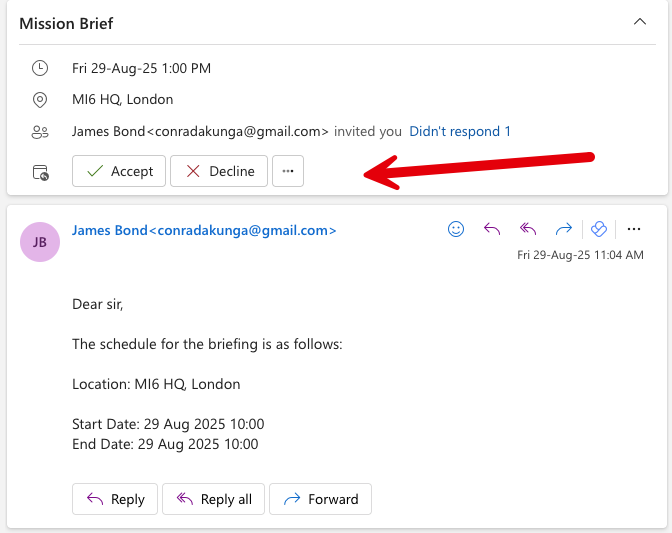

This is part 15 of a series on sending Email

- [Sending Email in C# & .NET - Part 1 - Introduction]()
- [Sending Email in C# & .NET - Part 2 - Delivery]()
- [Sending Email in C# & .NET - Part 3 - Using Gmail]()
- [Sending Email In C# & .NET - Part 4 - Using Office 365 & MS Graph API]()
- [Sending Email In C# & .NET - Part 5 - Using Google Cloud API]()
- [Sending Email In C# & .NET - Part 6 - Testing SMTP Locally  Using PaperCut]()
- [Sending Email In C# & .NET - Part 7 - Sending Inline Images Using SMTP]()
- [Sending Email In C# & .NET - Part 8 - Sending HTML Email Using SMTP]()
- [Sending Email In C# & .NET - Part 9 - Sending Multiple Format Email Using SMTP]()
- [Sending Email In C# & .NET - Part 10 - Sending Plain Text Email Using MailKit]()
- [Sending Email In C# & .NET - Part 11 - Sending HTML Email Using MailKit]()
- [Sending Email In C# & .NET - Part 12 - Sending Email With Attachments Using MailKit]() 
- [Sending Email In C# & .NET - Part 13 - Sending Email With Inline Attachments Using MailKit]()
- [Sending Email In C# & .NET - Part 14 - Sending Multiple Format Email Using MailKit]({ post_url 2025-08-29-sending-email-in-c-net-part-14-sending-multiple-format-email-using-mailkit })
- **Sending Email In C# & .NET - Part 15 - Sending Calendar Invites Using MailKit (This post)**
- [Sending Email In C# & .NET - Part 16 - Testing SMTP Locally Using Mailpit]()

Our last post, "[Sending Email In C# & .NET - Part 14 - Sending Multiple Format Email Using MailKit]()", looked at how to send multiple-format email.

In this post, we will explore how to **generate** and **send** **calendar invitations** using the [iCalendar](https://datatracker.ietf.org/doc/html/rfc5545) standard.

In `MailKit`, we are almost always working with the `TextPart` object.

This usually takes as a parameter either "`plain"` or `"html"`.

It can also take  `"calendar"` as a parameter.

Sophisticated email clients can render this natively with a UI for the user to accept or decline.

The process is as follows:

1. Create a `MimeMessage`
2. Create one (or more) `MailboxAddress` for the recipients and add to the `To` collection of the `MimeMessage`
3. Create one `MailboxAddress` for the sender and add it to the `From` collection of the `MimeMessage`
4. Set  the `Subject` of the `MimeMessage`
5. Create a `TextPart` that will have the plain text for the less sophisticated clients.
6. Create a `TextPart` that will have the calendar text for the more sophisticated clients. This should be rendered **inline**.
7. Finally, create a `MultiPart` for both `TextPart`, and set that to the `MessageBody`.
8. Send the message using the `SmtpClient`. This is the `SmtpClient` from `MailKit`, not the one in [System.Net](https://learn.microsoft.com/en-us/dotnet/api/system.net.mail.smtpclient?view=net-9.0).

The code would look like this:

```c#
using MailKit.Net.Smtp;
using MimeKit;
using MimeKit.Text;
using MimeKit.Utils;
using Serilog;

// Configure logging to the console
Log.Logger = new LoggerConfiguration()
    .WriteTo.Console()
    .CreateLogger();

const string fromAddress = "conradakunga@gmail.com";
const string toAddress = "cakunga@innova.co.ke";
const string fromPassword = "<YOUR APP PASSWORD HERE>";

// Create the email
var message = new MimeMessage();
// Add the sender
message.From.Add(new MailboxAddress("James Bond", fromAddress));
// Set the recipient
message.To.Add(new MailboxAddress("M", toAddress));
// Set the email subject
message.Subject = "Mission Brief";

var briefStart = new DateTime(2025, 8, 29, 10, 0, 0);
var briefEnd = new DateTime(2025, 8, 29, 10, 0, 0);
const string briefLocation = "MI6 HQ, London";

var plainText = $"""
                 Dear sir,

                 The schedule for the briefing is as follows:

                 Location: {briefLocation}

                 Start Date: {briefStart:d MMM yyyy HH:mm}
                 End Date: {briefEnd:d MMM yyyy HH:mm}
                 """;


var plainTextPart = new TextPart(TextFormat.Plain)
{
    Text = plainText
};

// Build the iCalendar content
var calendarText = $"""
                    BEGIN:VCALENDAR
                    PRODID:-//MI6//Mission Briefing//EN
                    VERSION:2.0
                    METHOD:REQUEST
                    BEGIN:VEVENT
                    UID:{Guid.NewGuid()}
                    DTSTAMP:{DateTime.UtcNow:yyyyMMddTHHmmssZ}
                    DTSTART:{briefStart:yyyyMMddTHHmmssZ}
                    DTEND:{briefEnd:yyyyMMddTHHmmssZ}
                    SUMMARY:Mission Briefing
                    DESCRIPTION:Briefing on the upcoming mission.
                    LOCATION:{briefLocation}
                    STATUS:CONFIRMED
                    SEQUENCE:0
                    BEGIN:VALARM
                    TRIGGER:-PT15M
                    ACTION:DISPLAY
                    DESCRIPTION:Reminder
                    END:VALARM
                    END:VEVENT
                    END:VCALENDAR
                    """;

// Create the calendar part
var calendarPart = new TextPart("calendar")
{
    Text = calendarText,
    ContentTransferEncoding = ContentEncoding.Base64,
    ContentDisposition = new ContentDisposition(ContentDisposition.Inline)
    {
        FileName = "invite.ics"
    }
};

// Set the method and name parameter values
calendarPart.ContentType.Parameters.Add("method", "REQUEST");

// Create multipart/alternative so clients can pick plain text or calendar
var alternativePart = new Multipart("alternative");
alternativePart.Add(plainTextPart);
alternativePart.Add(calendarPart);

// Set message body
message.Body = alternativePart;

// Now send the email
using (var client = new SmtpClient())
{
    Log.Information("Connecting to smtp server...");
    await client.ConnectAsync("smtp.gmail.com", 587, false);
    await client.AuthenticateAsync(fromAddress, fromPassword);
    await client.SendAsync(message);
    Log.Information("Sent message");
    await client.DisconnectAsync(true);
    Log.Information("Disconnected from server");
}
```

In this example, I am using the Gmail SMTP server to send the email to my Office 365 account.

When I run the code, I see the following in my Office 365 inbox, rendered by Outlook.



We can see here that [Outlook](https://www.microsoft.com/en-us/microsoft-365/outlook/outlook-for-windows) has rendered action buttons that will merge the invite into my calendar if I accept.

### TLDR

**`MailKit` can send calendar invites that can be rendered inline by sophisticated email clients.**

The code is in my GitHub.

Happy hacking!
