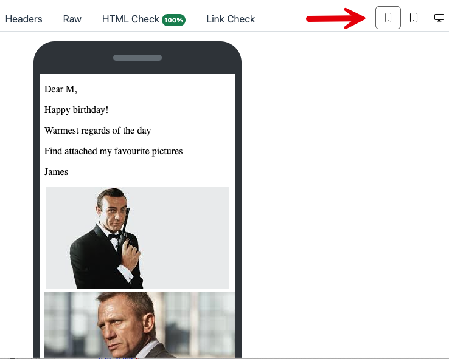
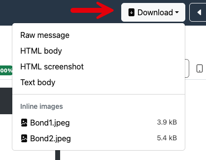

This is part 16 of a series on sending Email

- [Sending Email in C# & .NET - Part 1 - Introduction]()
- [Sending Email in C# & .NET - Part 2 - Delivery]()
- [Sending Email in C# & .NET - Part 3 - Using Gmail]()
- [Sending Email In C# & .NET - Part 4 - Using Office 365 & MS Graph API]()
- [Sending Email In C# & .NET - Part 5 - Using Google Cloud API]()
- [Sending Email In C# & .NET - Part 6 - Testing SMTP Locally  Using PaperCut]()
- [Sending Email In C# & .NET - Part 7 - Sending Inline Images Using SMTP]()
- [Sending Email In C# & .NET - Part 8 - Sending HTML Email Using SMTP]()
- [Sending Email In C# & .NET - Part 9 - Sending Multiple Format Email Using SMTP]()
- [Sending Email In C# & .NET - Part 10 - Sending Plain Text Email Using MailKit]()
- [Sending Email In C# & .NET - Part 11 - Sending HTML Email Using MailKit]()
- [Sending Email In C# & .NET - Part 12 - Sending Email With Attachments Using MailKit]() 
- [Sending Email In C# & .NET - Part 13 - Sending Email With Inline Attachments Using MailKit]()
- [Sending Email In C# & .NET - Part 14 - Sending Multiple Format Email Using MailKit]({ post_url 2025-08-29-sending-email-in-c-net-part-14-sending-multiple-format-email-using-mailkit })
- [Sending Email In C# & .NET - Part 15 - Sending Calendar Invites Using MailKit]()
- **Sending Email In C# & .NET - Part 16 - Testing SMTP Locally Using Mailpit (This post)**

In a past post in this series, "[Sending Email In C# & .NET - Part 6 - Testing SMTP Locally Using PaperCut]()", we discussed how to use [PaperCut](https://github.com/ChangemakerStudios/Papercut-SMTP) as a local SMTP server to make it easier to test sending and visualizing sent email.

By this, I mean the ability for your application to send **real emails**, but to have something **intercept** them and allow you to **view and inspect them**, without risking the actual delivery of the email.

I have used this tool for many years, and it has proven to be very useful.

I have recently come across a tool that, I feel, is even better - [Mailpit](https://mailpit.axllent.org/).

It works in exactly the same way, except that it uses **different default ports**. Which, naturally, you can change.

You can [install](https://mailpit.axllent.org/docs/install/) it on your development environment (or anywhere, really), or you can use it as a Docker](https://www.docker.com/) container.

Without hesitation, I recommend the latter.

```bash
docker run -d --name mailpit -p 25:1025 -p 8080:8025 axllent/mailpit
```

Here, the container will use port `25` as the SMTP port and `8080` as the port for the mail client, which is what I used to use for **PaperCut**.

Everything should work seamlessly.

Why am I switching to this over **PaperCut** for testing email sending? A number of reasons.

1. Ability to **persist** email (useful for multi-session development and debugging)
2. Email is **searchable**
3. The [Docker](https://www.docker.com/) image is only **39.5 MB**, as opposed to PaperCut's **269 MB** (Though in the larger scheme of things, does the size really matter for a one-off download?)

Note: I am making comparisons here against the **PaperCut** **web UI**, not the **desktop application**.

In addition to this, there are a number of **UI improvements**

## Message Notifications

When email is delivered, you get a **notification** (browser-generated)


## Cleaner, Polished Interface

The interface is cleaner and a lot more polished than the web email client for PaperCut.


## Search Functionality

You can **search** your delivered email.


## Attachments Indicator

When viewing your inbox, there is an indicator for an email with **attachments**.


## Delete All Emails

You can **delete all** your email with one click.


## HTML Source Viewer

You can view the **HTML source** of the generated email


## HTML Check

Building on the ability to view source, Mailpit can also verify the **compatibility** of the HTML against modern viewers.


## Headers Viewer

There is a clean viewer for all the email **headers**.


## Raw Message Viewer

You can also view the entirety of the email in its **raw source** format.


## Link Check

Mailpit has functionality to allow you to **verify any URL links** within the email.


Clicking the button will verify the links.


You can also configure Mailpit to **auto-check** all links on opened emails. Naturally there are some security and web traffic implications to turning this on.


## Inline Image Counter

Mailpit has a counter that shows the **number of any inline images**.


## Attachments Counter

Mailpit has a counter that shows the number of any **attachments**.


## Device Viewer

You can also visualize how your email will **appear in different devices**.

### Computer


### Tablet


### Phone



## Download Any Aspect Of The Email

You can **download** any aspect of the email.



## Mark As Unread

You can **mark email as unread**.


**PaperCut** served me well, but time to move on to a more capable replacement.

**Fare thee well, PaperCut.**

Happy hacking!
